# SendAGift Database Schema

Every table, every column, every primary and foreign key, and an ER diagram per connected
section plus one for the whole database. Companion to `API_REFERENCE.md`, which covers the
routes that read and write these tables.

Diagram entity names use underscores because Mermaid does not allow dots, so
`core_countries` on a diagram is the table `core.countries`.

- [1. Schemas at a glance](#1-schemas-at-a-glance)
- [2. Conventions](#2-conventions)
- [3. Whole-database ER diagram](#3-whole-database-er-diagram)
- [4. Section: platform core](#4-section-platform-core)
- [5. Section: admin](#5-section-admin)
- [6. Section: customer identity](#6-section-customer-identity)
- [7. Section: recipients](#7-section-recipients)
- [8. Section: sellers and shops](#8-section-sellers-and-shops)
- [9. Section: catalogue and wishlist](#9-section-catalogue-and-wishlist)
- [10. Section: orders](#10-section-orders)
- [10a. Section: product reviews](#10a-section-product-reviews)
- [11. Section: shipping](#11-section-shipping)
- [12. Section: media](#12-section-media)
- [13. Section: reels](#13-section-reels)
- [14. Full foreign key matrix](#14-full-foreign-key-matrix)
- [15. Soft links with no foreign key](#15-soft-links-with-no-foreign-key)
- [16. Delete and cascade behaviour](#16-delete-and-cascade-behaviour)
- [17. Status value reference](#17-status-value-reference)
- [18. Index reference](#18-index-reference)
- [19. Migration history](#19-migration-history)
- [20. Table to endpoint map](#20-table-to-endpoint-map)

---

## 1. Schemas at a glance

| Schema | Purpose | Tables |
| --- | --- | --- |
| `core` | platform reference data and cross-cutting infrastructure | `countries`, `country_capabilities`, `country_payment_providers`, `idempotency_keys` |
| `admin` | platform staff accounts | `admin_users` |
| `customer` | buyer identity, their address book, gift recipients, wishlist | `customers`, `customer_addresses`, `recipients`, `recipient_addresses`, `saved_gifts` |
| `seller` | merchant identity, storefronts, catalogue, reels | `sellers`, `seller_addresses`, `shops`, `products`, `inventory`, `reels`, `reel_media` |
| `marketplace` | transactions + reviews | `orders`, `order_items`, `shipments`, `product_reviews`, `product_review_media`, `product_review_votes` |
| `media` | one row per stored file, whatever owns it | `media_assets` |
| `public` | migration bookkeeping only | `schema_migrations` |

Three extensions are required and created by migration `000001`: `citext` (case-insensitive
email), `pgcrypto` (`gen_random_uuid()`), and — implicitly used by `gin` indexes on arrays —
nothing extra.

`schema_migrations (version text PRIMARY KEY, applied_at timestamptz)` is created by
`internal/database/migrate.go`, not by an SQL file. Starting the API applies any `*.up.sql`
not yet listed there, each in its own transaction.

---

## 2. Conventions

**Primary keys.** Every table has `id uuid PRIMARY KEY DEFAULT gen_random_uuid()`. There
are no composite primary keys and no serial/bigint surrogate keys anywhere.

**Foreign keys.** Always `<parent_table_singular>_id uuid`, e.g. `customer_id`,
`shop_id`, `order_item_id`. A nullable FK genuinely means optional.

**Timestamps.** `created_at` and `updated_at` are `timestamptz NOT NULL DEFAULT now()`.
There are no triggers — `updated_at` is set explicitly by repository SQL (`updated_at = now()`).
`customer.inventory`-style tables that only ever change through the API carry
`updated_at` alone.

**Money.** Integer minor units with a sibling `currency text`. There is no `numeric` money
column, and no currency table — the ISO code is validated in Go.

**Booleans.** `NOT NULL DEFAULT` with an explicit default, never nullable.

**JSON.** `jsonb NOT NULL DEFAULT '{}'::jsonb` for structured extras
(`recipients.preferences`, `media_assets.metadata`, `shipments.provider_metadata`) and
plain nullable `jsonb` where absence is meaningful (`shipments.parcel_details`,
`shipments.customs_declaration`).

**Arrays.** `text[] NOT NULL DEFAULT '{}'` (`products.occasion_tags`, `reels.hashtags`)
and `date[]` (`inventory.unavailable_dates`).

**Enums are CHECK constraints, not Postgres enum types**, so adding a value is a plain
migration. See [section 17](#17-status-value-reference) for every allowed value.

**Soft delete is inconsistent by design of the current code:** `customer.customers` has
`deleted_at` plus `status = 'deleted'`; `seller.sellers` only flips `status`; every other
table is hard-deleted.

---

## 3. Whole-database ER diagram

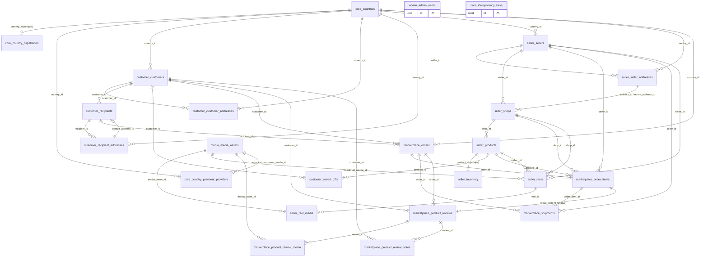

`admin.admin_users` and `core.idempotency_keys` are intentionally islands — no table
references them and they reference nothing.

---

## 4. Section: platform core

Countries are the root of almost everything: currency, timezone, and how much of the
product is switched on in that market. Capabilities are a 1:1 feature-flag row.

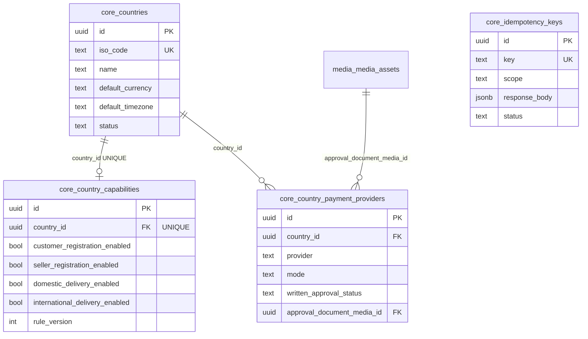

### `core.countries`

| Column | Type | Key / constraint | Notes |
| --- | --- | --- | --- |
| `id` | uuid | PK, `gen_random_uuid()` | referenced by 8 tables |
| `iso_code` | text | UNIQUE index `countries_iso_code_uq` | 2-letter code, validated in Go |
| `name` | text | NOT NULL | |
| `default_currency` | text | NOT NULL | ISO 4217, validated in Go |
| `default_timezone` | text | NOT NULL | IANA name |
| `status` | text | NOT NULL DEFAULT `full`, CHECK | `full`, `marketplace`, `customer_only`, `browse_only`, `blocked` |
| `created_at`, `updated_at` | timestamptz | NOT NULL DEFAULT now() | |

### `core.country_capabilities`

| Column | Type | Key / constraint | Notes |
| --- | --- | --- | --- |
| `id` | uuid | PK | the API never uses it — routes are keyed by `country_id` |
| `country_id` | uuid | **FK → `core.countries(id)`**, UNIQUE | one row per country |
| `customer_registration_enabled` | boolean | NOT NULL DEFAULT true | gates `POST /customers/register` |
| `seller_registration_enabled` | boolean | NOT NULL DEFAULT true | gates `POST /sellers/register` |
| `seller_payouts_enabled` | boolean | NOT NULL DEFAULT true | not enforced yet |
| `domestic_delivery_enabled` | boolean | NOT NULL DEFAULT true | not enforced yet |
| `international_delivery_enabled` | boolean | NOT NULL DEFAULT true | not enforced yet |
| `memberships_enabled` | boolean | NOT NULL DEFAULT true | not enforced yet |
| `points_earning_enabled` | boolean | NOT NULL DEFAULT true | not enforced yet |
| `points_usage_enabled` | boolean | NOT NULL DEFAULT true | not enforced yet |
| `skill_competitions_enabled` | boolean | NOT NULL DEFAULT false | not enforced yet |
| `app_store_available` | boolean | NOT NULL DEFAULT true | not enforced yet |
| `rule_version` | integer | NOT NULL DEFAULT 1 | bump when flag semantics change |
| `created_at`, `updated_at` | timestamptz | NOT NULL | |

No `ON DELETE` clause, so deleting a country with a capability row fails with a FK
violation. Delete the capability first.

### `core.country_payment_providers`

Present in the schema, not yet used by any endpoint.

| Column | Type | Key / constraint |
| --- | --- | --- |
| `id` | uuid | PK |
| `country_id` | uuid | **FK → `core.countries(id)`** |
| `provider` | text | NOT NULL; UNIQUE together with `country_id` |
| `mode` | text | DEFAULT `test`, CHECK `test`/`live`/`paused` |
| `seller_onboarding_enabled` | boolean | DEFAULT false |
| `seller_payouts_enabled` | boolean | DEFAULT false |
| `written_approval_status` | text | DEFAULT `missing`, CHECK `missing`/`requested`/`approved`/`rejected` |
| `approval_document_media_id` | uuid | **FK → `media.media_assets(id)`**, nullable |
| `created_at`, `updated_at` | timestamptz | NOT NULL |

### `core.idempotency_keys`

| Column | Type | Key / constraint | Notes |
| --- | --- | --- | --- |
| `id` | uuid | PK | |
| `key` | text | NOT NULL UNIQUE | the client's `idempotency_key` |
| `scope` | text | NOT NULL | currently only the label-purchase scope |
| `request_hash` | text | nullable | reserved; not written today |
| `response_code` | integer | nullable | reserved |
| `response_body` | jsonb | nullable | the serialized `models.Shipment` replayed on retry |
| `status` | text | DEFAULT `processing`, CHECK `processing`/`completed`/`failed` | |
| `expires_at` | timestamptz | nullable, partial index | no cleanup job exists yet |
| `created_at`, `updated_at` | timestamptz | NOT NULL | |

No FK to orders or shipments — the scope string plus key is the only link.

---

## 5. Section: admin

Standalone table. Admins have no country, no addresses, and no relationship to any other
row; the JWT `sub` claim is the only thing connecting a request to it.

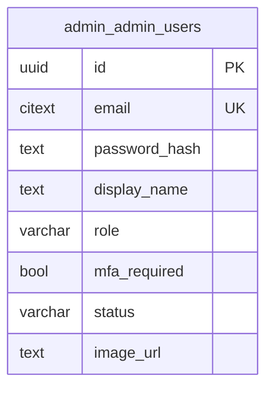

| Column | Type | Key / constraint | Notes |
| --- | --- | --- | --- |
| `id` | uuid | PK | JWT subject for admin tokens |
| `email` | citext | NOT NULL UNIQUE | case-insensitive |
| `password_hash` | text | NOT NULL | bcrypt; never serialized |
| `display_name` | text | nullable | |
| `role` | varchar(20) | NOT NULL DEFAULT `superadmin` | goes into the JWT `role` claim |
| `mfa_required` | boolean | NOT NULL DEFAULT false | not enforced yet |
| `status` | varchar(20) | NOT NULL DEFAULT `active` | indexed |
| `image_url` | text | nullable (added by `000008`) | S3 public URL |
| `created_at`, `updated_at` | timestamptz | NOT NULL | |

---

## 6. Section: customer identity

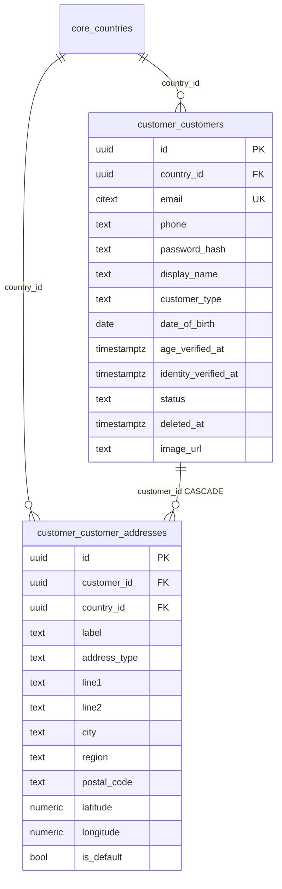

### `customer.customers`

| Column | Type | Key / constraint | Notes |
| --- | --- | --- | --- |
| `id` | uuid | PK | JWT subject for customer tokens |
| `country_id` | uuid | **FK → `core.countries(id)`**, NOT NULL, indexed | drives capability checks |
| `email` | citext | NOT NULL UNIQUE | |
| `phone` | text | nullable (added by `000005`) | |
| `password_hash` | text | NOT NULL | |
| `display_name` | text | nullable | |
| `customer_type` | text | NOT NULL DEFAULT `individual` | no CHECK; not the same field as `orders.customer_type` |
| `date_of_birth` | date | nullable (added by `000005`) | |
| `age_verified_at` | timestamptz | nullable | never written today |
| `identity_verified_at` | timestamptz | nullable | never written today |
| `status` | text | NOT NULL DEFAULT `active`, indexed | set to `deleted` on soft delete |
| `deleted_at` | timestamptz | nullable | set on soft delete |
| `image_url` | text | nullable (added by `000008`) | |
| `created_at`, `updated_at` | timestamptz | NOT NULL | |

### `customer.customer_addresses`

| Column | Type | Key / constraint | Notes |
| --- | --- | --- | --- |
| `id` | uuid | PK | |
| `customer_id` | uuid | **FK → `customer.customers(id)` ON DELETE CASCADE**, indexed | |
| `country_id` | uuid | **FK → `core.countries(id)`**, NOT NULL | |
| `label` | text | nullable | "Home", "Office" |
| `address_type` | text | NOT NULL DEFAULT `shipping` | no CHECK here |
| `line1` | text | NOT NULL | |
| `line2`, `region`, `postal_code` | text | nullable | |
| `city` | text | NOT NULL | |
| `latitude`, `longitude` | numeric | nullable (added by `000005`) | from Google Places |
| `is_default` | boolean | NOT NULL DEFAULT false | repository clears the previous default in the same transaction |
| `created_at`, `updated_at` | timestamptz | NOT NULL | |

Note the soft delete gap: deleting a customer flips flags but leaves these address rows in
place, because `CASCADE` only fires on a real row delete.

---

## 7. Section: recipients

The one place with a **circular reference**: a recipient points at its default address,
and every address points back at the recipient.

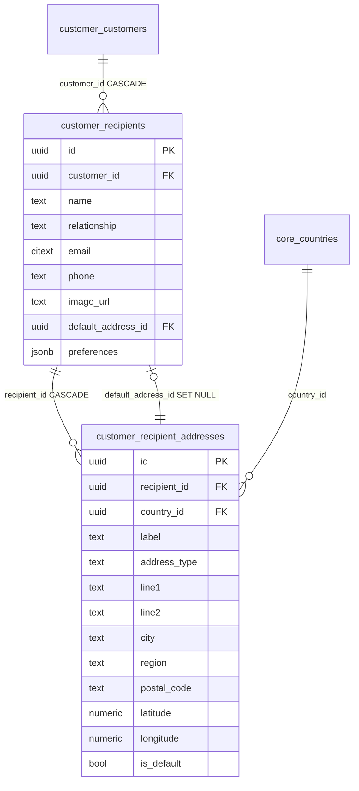

### `customer.recipients`

| Column | Type | Key / constraint | Notes |
| --- | --- | --- | --- |
| `id` | uuid | PK | referenced by `marketplace.orders.recipient_id` |
| `customer_id` | uuid | **FK → `customer.customers(id)` ON DELETE CASCADE**, indexed | |
| `name` | text | NOT NULL | used as the Shippo ship-to name |
| `relationship` | text | nullable | "sister", "colleague" |
| `email` | citext | nullable | |
| `phone` | text | nullable | |
| `image_url` | text | nullable | |
| `default_address_id` | uuid | **FK → `customer.recipient_addresses(id)` ON DELETE SET NULL** | added as a named constraint after both tables exist |
| `preferences` | jsonb | NOT NULL DEFAULT `{}` | free-form likes/allergies |
| `created_at`, `updated_at` | timestamptz | NOT NULL | |

Because the FK is added after the fact, the insert order is: recipient → addresses → set
`default_address_id`. That is exactly what `CreateRecipient` does.

### `customer.recipient_addresses`

Same column list as `customer_addresses`, with `recipient_id` (**FK → `customer.recipients(id)`
ON DELETE CASCADE**, indexed) in place of `customer_id`. Shipping reads the recipient's
default address, or failing that the row with `is_default` first and oldest `created_at`
next, as the ship-to.

---

## 8. Section: sellers and shops

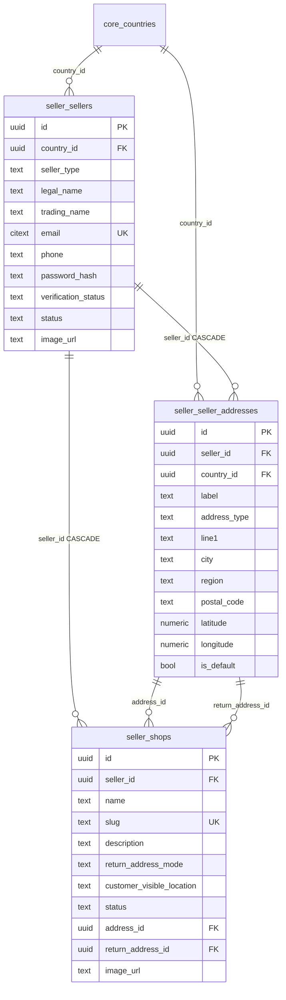

### `seller.sellers`

| Column | Type | Key / constraint | Notes |
| --- | --- | --- | --- |
| `id` | uuid | PK | JWT subject for seller tokens |
| `country_id` | uuid | **FK → `core.countries(id)`**, NOT NULL | |
| `seller_type` | text | NOT NULL DEFAULT `individual` | no CHECK |
| `legal_name` | text | NOT NULL | ship-from fallback name |
| `trading_name` | text | nullable | preferred ship-from name |
| `email` | citext | NOT NULL UNIQUE | |
| `phone` | text | nullable | |
| `password_hash` | text | NOT NULL | |
| `verification_status` | text | NOT NULL DEFAULT `unverified` | never advanced today |
| `status` | text | NOT NULL DEFAULT `active` | `deleted` on soft delete |
| `image_url` | text | nullable (added by `000008`) | |
| `created_at`, `updated_at` | timestamptz | NOT NULL | |

### `seller.seller_addresses`

Same shape as the customer address tables, except `address_type` is constrained:
`CHECK (address_type IN ('pickup','return','both'))`, default `both`.
`seller_id` is **FK → `seller.sellers(id)` ON DELETE CASCADE** and indexed.

### `seller.shops`

| Column | Type | Key / constraint | Notes |
| --- | --- | --- | --- |
| `id` | uuid | PK | referenced by products, order_items, reels |
| `seller_id` | uuid | **FK → `seller.sellers(id)` ON DELETE CASCADE**, indexed | |
| `name` | text | NOT NULL | |
| `slug` | text | NOT NULL **UNIQUE globally** | not per seller — two sellers cannot share a slug |
| `description` | text | nullable | |
| `return_address_mode` | text | NOT NULL DEFAULT `shop` | in the schema, not exposed by the API |
| `customer_visible_location` | text | nullable | shown on the storefront |
| `status` | text | NOT NULL DEFAULT `active` | only `active` is publicly listed |
| `address_id` | uuid | **FK → `seller.seller_addresses(id)`**, nullable | ship-from |
| `return_address_id` | uuid | **FK → `seller.seller_addresses(id)`**, nullable (added by `000011`) | overrides ship-from for returns |
| `image_url` | text | nullable (added by `000008`) | |
| `created_at`, `updated_at` | timestamptz | NOT NULL | |

Shipping resolves ship-from as `COALESCE(return_address_id, address_id)`. A shop with
neither set cannot get rates.

---

## 9. Section: catalogue and wishlist

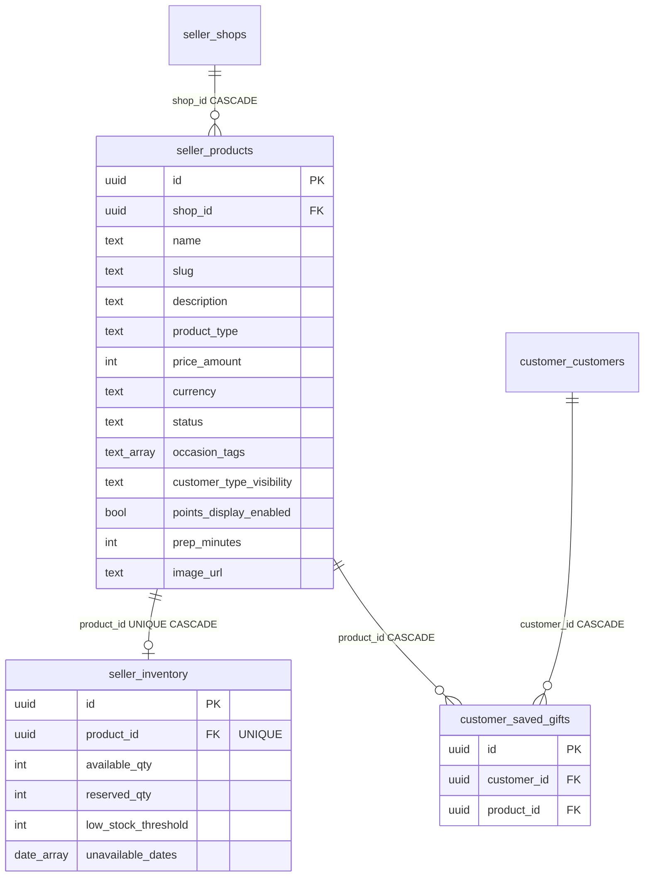

### `seller.products`

| Column | Type | Key / constraint | Notes |
| --- | --- | --- | --- |
| `id` | uuid | PK | referenced by inventory, saved_gifts, order_items, reels |
| `shop_id` | uuid | **FK → `seller.shops(id)` ON DELETE CASCADE** | |
| `name` | text | NOT NULL | |
| `slug` | text | NOT NULL, **UNIQUE (shop_id, slug)** | unique per shop, not globally |
| `description` | text | nullable | |
| `product_type` | text | NOT NULL DEFAULT `gift` | no CHECK |
| `price_amount` | integer | NOT NULL CHECK ≥ 0 | minor units |
| `currency` | text | NOT NULL | all items on one order must match |
| `status` | text | DEFAULT `draft`, CHECK | `draft`, `published`, `paused`, `rejected` |
| `occasion_tags` | text[] | NOT NULL DEFAULT `{}` | GIN indexed |
| `customer_type_visibility` | text | DEFAULT `both`, CHECK | `personal`, `corporate`, `both` |
| `points_display_enabled` | boolean | NOT NULL DEFAULT false | |
| `prep_minutes` | integer | NOT NULL DEFAULT 0 CHECK ≥ 0 | lead time |
| `image_url` | text | nullable (added by `000008`) | |
| `created_at`, `updated_at` | timestamptz | NOT NULL | |

Migration `000021` **removed** the shipping columns that briefly lived here
(`weight_grams`, `length_cm`, `width_cm`, `height_cm`, `hs_tariff_code`,
`origin_country_iso`) — parcel and customs data now lives on the shipment, because it is a
per-parcel fact, not a per-product one.

### `seller.inventory`

| Column | Type | Key / constraint | Notes |
| --- | --- | --- | --- |
| `id` | uuid | PK | |
| `product_id` | uuid | **FK → `seller.products(id)` ON DELETE CASCADE**, **UNIQUE** | strict 1:1 |
| `available_qty` | integer | NOT NULL DEFAULT 0 CHECK ≥ 0 | not decremented at checkout today |
| `reserved_qty` | integer | NOT NULL DEFAULT 0 CHECK ≥ 0 | never written today |
| `low_stock_threshold` | integer | NOT NULL DEFAULT 0 CHECK ≥ 0 | no alerting yet |
| `unavailable_dates` | date[] | NOT NULL DEFAULT `{}` | blackout dates, not enforced at checkout |
| `updated_at` | timestamptz | NOT NULL | no `created_at` on this table |

### `customer.saved_gifts`

| Column | Type | Key / constraint |
| --- | --- | --- |
| `id` | uuid | PK — this is the id used by `DELETE /customers/me/saved-gifts/{id}` |
| `customer_id` | uuid | **FK → `customer.customers(id)` ON DELETE CASCADE**, indexed |
| `product_id` | uuid | **FK → `seller.products(id)` ON DELETE CASCADE**, indexed |
| `created_at` | timestamptz | NOT NULL |
| — | — | **UNIQUE (customer_id, product_id)** → `409 product already saved` |

A pure join table, which is why the API has no update: change means delete then insert.

---

## 10. Section: orders

The fan-out point of the whole model: one order header, one line per seller product, so a
single gift can involve several sellers who never see each other's lines.

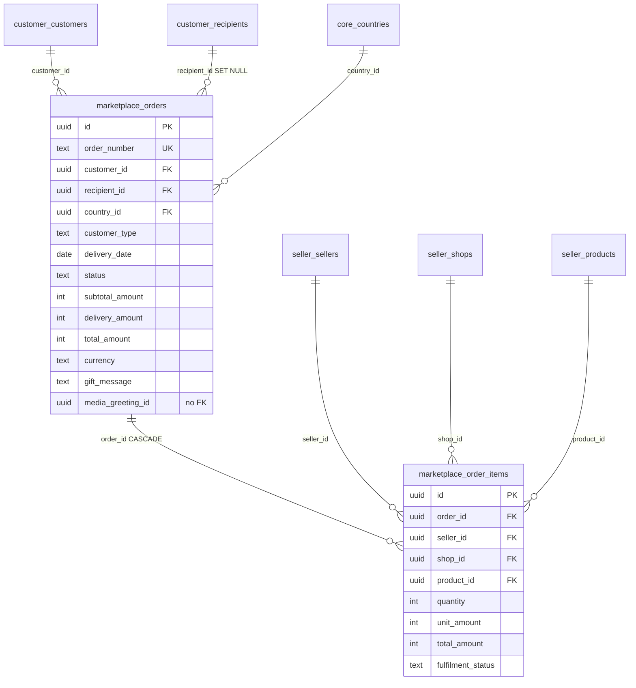

### `marketplace.orders`

| Column | Type | Key / constraint | Notes |
| --- | --- | --- | --- |
| `id` | uuid | PK | |
| `order_number` | text | NOT NULL UNIQUE | `SAG-YYYYMMDD-XXXXXXXX`, generated in Go with a retry on collision |
| `customer_id` | uuid | **FK → `customer.customers(id)`**, NOT NULL, indexed | no cascade — customers are soft-deleted |
| `recipient_id` | uuid | **FK → `customer.recipients(id)` ON DELETE SET NULL**, nullable, indexed | the order survives losing the recipient |
| `country_id` | uuid | **FK → `core.countries(id)`**, NOT NULL | |
| `customer_type` | text | DEFAULT `personal`, CHECK `personal`/`corporate` | filters product visibility at checkout |
| `delivery_date` | date | NOT NULL | requested delivery day |
| `status` | text | DEFAULT `draft`, CHECK, indexed | see [17](#17-status-value-reference) |
| `subtotal_amount` | integer | NOT NULL DEFAULT 0 CHECK ≥ 0 | sum of line totals, computed server-side |
| `delivery_amount` | integer | NOT NULL DEFAULT 0 CHECK ≥ 0 | posted by the client today |
| `total_amount` | integer | NOT NULL DEFAULT 0 CHECK ≥ 0 | subtotal + delivery |
| `currency` | text | NOT NULL | taken from the items, which must agree |
| `gift_message` | text | nullable | printed on the card |
| `media_greeting_id` | uuid | **nullable, no FK** | intended to point at `media.media_assets`; never validated |
| `created_at`, `updated_at` | timestamptz | NOT NULL | |

### `marketplace.order_items`

| Column | Type | Key / constraint | Notes |
| --- | --- | --- | --- |
| `id` | uuid | PK | **the id sellers work with** — accept, rates, labels |
| `order_id` | uuid | **FK → `marketplace.orders(id)` ON DELETE CASCADE**, indexed | |
| `seller_id` | uuid | **FK → `seller.sellers(id)`**, NOT NULL, indexed | denormalized from the shop so seller queries stay flat |
| `shop_id` | uuid | **FK → `seller.shops(id)`**, NOT NULL, indexed | |
| `product_id` | uuid | **FK → `seller.products(id)`**, NOT NULL, indexed | |
| `quantity` | integer | NOT NULL CHECK > 0 | |
| `unit_amount` | integer | NOT NULL CHECK ≥ 0 | **price snapshot** — later product edits don't change it |
| `total_amount` | integer | NOT NULL CHECK ≥ 0 | `unit_amount × quantity` |
| `fulfilment_status` | text | DEFAULT `pending`, CHECK | `pending`, `accepted`, `preparing`, `ready`, `dispatched`, `delivered`, `cancelled` |
| `created_at`, `updated_at` | timestamptz | NOT NULL | |

Two status levels matter here: `orders.status` is the customer's view of the whole
checkout, `order_items.fulfilment_status` is one seller's line. The order header only
becomes `delivered` when every line is `delivered` or `cancelled`.

Because `product_id` has no `ON DELETE` clause, a product that appears on any order cannot
be deleted — `DELETE /sellers/me/products/{id}` fails with a FK violation on sold products.

---

## 10a. Section: product reviews

AliExpress-style verified-purchase reviews (migration `000027_create_product_reviews`).
One review per delivered `order_item`, overall + breakdown stars, optional photos, seller
reply, and helpful votes. Photos reuse `media.media_assets` (same pattern as
`seller.reel_media`).

### ER diagram

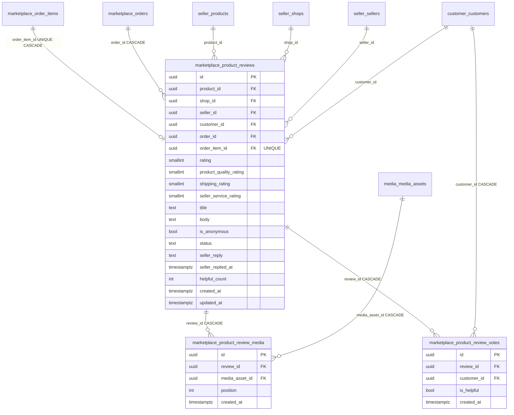

### Foreign keys (child → parent)

| Child column | Parent | On delete | Why |
| --- | --- | --- | --- |
| `product_reviews.product_id` | `seller.products.id` | restrict | product on a review cannot be hard-deleted |
| `product_reviews.shop_id` | `seller.shops.id` | restrict | denormalized shop for listing |
| `product_reviews.seller_id` | `seller.sellers.id` | restrict | denormalized seller for listing / reply auth |
| `product_reviews.customer_id` | `customer.customers.id` | restrict | reviewer; customers soft-delete |
| `product_reviews.order_id` | `marketplace.orders.id` | **CASCADE** | deleting order removes its reviews |
| `product_reviews.order_item_id` | `marketplace.order_items.id` | **CASCADE** + **UNIQUE** | one review per purchased line |
| `product_review_media.review_id` | `product_reviews.id` | **CASCADE** | deleting review removes photo links |
| `product_review_media.media_asset_id` | `media.media_assets.id` | **CASCADE** | deleting file row clears the link |
| `product_review_votes.review_id` | `product_reviews.id` | **CASCADE** | deleting review removes votes |
| `product_review_votes.customer_id` | `customer.customers.id` | **CASCADE** | hard-deleting voter removes their vote |

### CREATE TABLE (migration `000027`)

```sql
CREATE TABLE marketplace.product_reviews (
    id                       uuid PRIMARY KEY DEFAULT gen_random_uuid(),
    product_id               uuid NOT NULL REFERENCES seller.products (id),
    shop_id                  uuid NOT NULL REFERENCES seller.shops (id),
    seller_id                uuid NOT NULL REFERENCES seller.sellers (id),
    customer_id              uuid NOT NULL REFERENCES customer.customers (id),
    order_id                 uuid NOT NULL REFERENCES marketplace.orders (id) ON DELETE CASCADE,
    order_item_id            uuid NOT NULL UNIQUE REFERENCES marketplace.order_items (id) ON DELETE CASCADE,
    rating                   smallint NOT NULL CHECK (rating BETWEEN 1 AND 5),
    product_quality_rating   smallint NOT NULL CHECK (product_quality_rating BETWEEN 1 AND 5),
    shipping_rating          smallint NOT NULL CHECK (shipping_rating BETWEEN 1 AND 5),
    seller_service_rating    smallint NOT NULL CHECK (seller_service_rating BETWEEN 1 AND 5),
    title                    text,
    body                     text,
    is_anonymous             boolean NOT NULL DEFAULT false,
    status                   text NOT NULL DEFAULT 'published'
                             CHECK (status IN ('pending', 'published', 'hidden', 'rejected')),
    seller_reply             text,
    seller_replied_at        timestamptz,
    helpful_count            integer NOT NULL DEFAULT 0 CHECK (helpful_count >= 0),
    created_at               timestamptz NOT NULL DEFAULT now(),
    updated_at               timestamptz NOT NULL DEFAULT now()
);

CREATE TABLE marketplace.product_review_media (
    id              uuid PRIMARY KEY DEFAULT gen_random_uuid(),
    review_id       uuid NOT NULL REFERENCES marketplace.product_reviews (id) ON DELETE CASCADE,
    media_asset_id  uuid NOT NULL REFERENCES media.media_assets (id) ON DELETE CASCADE,
    position        integer NOT NULL DEFAULT 0 CHECK (position >= 0),
    created_at      timestamptz NOT NULL DEFAULT now(),
    UNIQUE (review_id, position),
    UNIQUE (review_id, media_asset_id)
);

CREATE TABLE marketplace.product_review_votes (
    id           uuid PRIMARY KEY DEFAULT gen_random_uuid(),
    review_id    uuid NOT NULL REFERENCES marketplace.product_reviews (id) ON DELETE CASCADE,
    customer_id  uuid NOT NULL REFERENCES customer.customers (id) ON DELETE CASCADE,
    is_helpful   boolean NOT NULL,
    created_at   timestamptz NOT NULL DEFAULT now(),
    UNIQUE (review_id, customer_id)
);
```

### `marketplace.product_reviews` — columns

| Column | Type | Key / constraint | Notes |
| --- | --- | --- | --- |
| `id` | uuid | PK | |
| `product_id` | uuid | **FK → `seller.products(id)`**, NOT NULL | product being reviewed |
| `shop_id` | uuid | **FK → `seller.shops(id)`**, NOT NULL | denormalized for shop rating queries |
| `seller_id` | uuid | **FK → `seller.sellers(id)`**, NOT NULL | denormalized; seller list/reply auth |
| `customer_id` | uuid | **FK → `customer.customers(id)`**, NOT NULL, indexed | reviewer |
| `order_id` | uuid | **FK → `marketplace.orders(id)` ON DELETE CASCADE**, NOT NULL, indexed | purchase proof |
| `order_item_id` | uuid | **FK → `marketplace.order_items(id)` ON DELETE CASCADE**, NOT NULL **UNIQUE** | one review per line |
| `rating` | smallint | NOT NULL CHECK 1–5 | overall stars on the product card |
| `product_quality_rating` | smallint | NOT NULL CHECK 1–5 | item quality |
| `shipping_rating` | smallint | NOT NULL CHECK 1–5 | delivery experience |
| `seller_service_rating` | smallint | NOT NULL CHECK 1–5 | seller communication / service |
| `title` | text | nullable | short headline |
| `body` | text | nullable | review text |
| `is_anonymous` | boolean | NOT NULL DEFAULT false | hide name on storefront |
| `status` | text | DEFAULT `published`, CHECK | `pending`, `published`, `hidden`, `rejected` |
| `seller_reply` | text | nullable | optional seller response |
| `seller_replied_at` | timestamptz | nullable | |
| `helpful_count` | integer | NOT NULL DEFAULT 0 CHECK ≥ 0 | denormalized count of `is_helpful = true` votes |
| `created_at`, `updated_at` | timestamptz | NOT NULL | |

API only allows create when the line’s `fulfilment_status = 'delivered'`.

### `marketplace.product_review_media` — columns

| Column | Type | Key / constraint | Notes |
| --- | --- | --- | --- |
| `id` | uuid | PK | |
| `review_id` | uuid | **FK → `marketplace.product_reviews(id)` ON DELETE CASCADE**, indexed | |
| `media_asset_id` | uuid | **FK → `media.media_assets(id)` ON DELETE CASCADE** | image/video file |
| `position` | integer | NOT NULL DEFAULT 0 CHECK ≥ 0 | carousel order |
| `created_at` | timestamptz | NOT NULL | |
| — | — | **UNIQUE (review_id, position)** | |
| — | — | **UNIQUE (review_id, media_asset_id)** | |

### `marketplace.product_review_votes` — columns

| Column | Type | Key / constraint | Notes |
| --- | --- | --- | --- |
| `id` | uuid | PK | |
| `review_id` | uuid | **FK → `marketplace.product_reviews(id)` ON DELETE CASCADE**, indexed | |
| `customer_id` | uuid | **FK → `customer.customers(id)` ON DELETE CASCADE** | voter |
| `is_helpful` | boolean | NOT NULL | true = helpful, false = not helpful |
| `created_at` | timestamptz | NOT NULL | |
| — | — | **UNIQUE (review_id, customer_id)** | one vote per customer per review |

### Example rows (how FKs link)

Assume these existing ids:

| Role | Table | Example id |
| --- | --- | --- |
| Customer (reviewer) | `customer.customers` | `9c2f1111-aaaa-bbbb-cccc-ddddeeeeffff` |
| Customer (voter) | `customer.customers` | `aaaa2222-bbbb-cccc-dddd-eeeeffff0000` |
| Seller | `seller.sellers` | `77aa1111-2222-3333-4444-555566667777` |
| Shop | `seller.shops` | `d40b1111-2222-3333-4444-555566667777` |
| Product | `seller.products` | `317ae580-aaaa-bbbb-cccc-ddddeeeeffff` |
| Order | `marketplace.orders` | `c7f9a1b2-1111-2222-3333-444455556666` |
| Order item (delivered) | `marketplace.order_items` | `60fca39c-9818-456a-a0a0-8c753c39182b` |
| Media file | `media.media_assets` | `m1111111-2222-3333-4444-555566667777` |

**`marketplace.product_reviews` (1 row)**

| Column | Value |
| --- | --- |
| `id` | `a1b2c3d4-1111-2222-3333-444455556666` |
| `product_id` | `317ae580-aaaa-bbbb-cccc-ddddeeeeffff` → products |
| `shop_id` | `d40b1111-2222-3333-4444-555566667777` → shops |
| `seller_id` | `77aa1111-2222-3333-4444-555566667777` → sellers |
| `customer_id` | `9c2f1111-aaaa-bbbb-cccc-ddddeeeeffff` → customers |
| `order_id` | `c7f9a1b2-1111-2222-3333-444455556666` → orders |
| `order_item_id` | `60fca39c-9818-456a-a0a0-8c753c39182b` → order_items (**unique**) |
| `rating` | `5` |
| `product_quality_rating` | `5` |
| `shipping_rating` | `4` |
| `seller_service_rating` | `5` |
| `title` | `Great gift` |
| `body` | `Arrived on time` |
| `is_anonymous` | `false` |
| `status` | `published` |
| `seller_reply` | `null` |
| `helpful_count` | `1` |

**`marketplace.product_review_media` (1 row)**

| Column | Value |
| --- | --- |
| `id` | `rm111111-2222-3333-4444-555566667777` |
| `review_id` | `a1b2c3d4-1111-2222-3333-444455556666` → product_reviews |
| `media_asset_id` | `m1111111-2222-3333-4444-555566667777` → media_assets |
| `position` | `0` |

**`marketplace.product_review_votes` (1 row)**

| Column | Value |
| --- | --- |
| `id` | `v1111111-2222-3333-4444-555566667777` |
| `review_id` | `a1b2c3d4-1111-2222-3333-444455556666` → product_reviews |
| `customer_id` | `aaaa2222-bbbb-cccc-dddd-eeeeffff0000` → customers |
| `is_helpful` | `true` |

```
order_item (delivered)
    └── product_reviews          (1:1 via order_item_id)
            ├── product_review_media[]  → media_assets
            └── product_review_votes[]  → customers (voters)
```

### How a review resolves in the API

```
GET /products/{productId}/reviews
  → marketplace.product_reviews   WHERE product_id AND status='published'
  → marketplace.product_review_media  ON review_id  (order by position)
  → media.media_assets               ON media_asset_id  → cdn_url
  → customer.customers               ON customer_id     → display_name (or "Anonymous")

GET /sellers/me/reviews
  → marketplace.product_reviews   WHERE seller_id = JWT subject

PUT /sellers/me/reviews/{id}/reply
  → UPDATE product_reviews SET seller_reply=… WHERE id AND seller_id = JWT

PUT /reviews/{id}/vote
  → UPSERT product_review_votes (review_id, customer_id)
  → recount helpful_count on product_reviews
```

---

## 11. Section: shipping

One row per parcel, created as a `pending` quote by `/shipping/rates` and completed in
place by `/shipping/labels`.

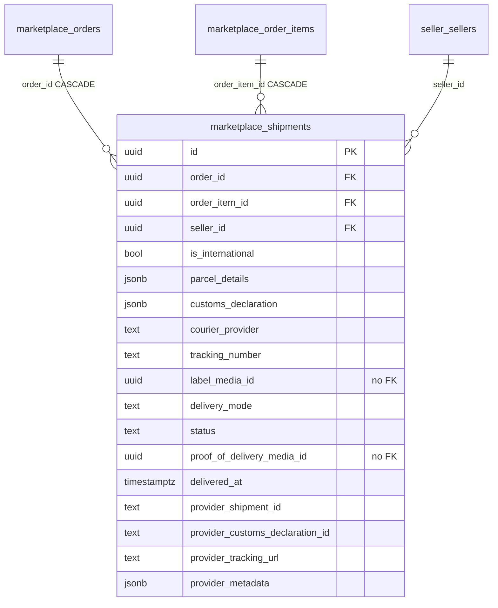

| Column | Type | Key / constraint | Notes |
| --- | --- | --- | --- |
| `id` | uuid | PK | |
| `order_id` | uuid | **FK → `marketplace.orders(id)` ON DELETE CASCADE**, NOT NULL, indexed | |
| `order_item_id` | uuid | **FK → `marketplace.order_items(id)` ON DELETE CASCADE**, nullable, indexed (added by `000021`) | which seller's line this parcel is for |
| `seller_id` | uuid | **FK → `seller.sellers(id)`**, NOT NULL, indexed | |
| `is_international` | boolean | NOT NULL DEFAULT false | derived by comparing ship-from/ship-to ISO2 |
| `parcel_details` | jsonb | nullable | the seller's posted `parcel` object |
| `customs_declaration` | jsonb | nullable | the seller's posted customs form; international only |
| `courier_provider` | text | nullable | `USPS`, `DHL Express`, … |
| `tracking_number` | text | nullable, indexed | the webhook's lookup key |
| `label_media_id` | uuid | nullable, **no FK** | points at the `asset_type='label'` row in `media.media_assets` |
| `delivery_mode` | text | NOT NULL CHECK `courier`/`seller_managed`/`pickup` | always `courier` today |
| `status` | text | DEFAULT `pending`, CHECK, indexed | `pending`, `label_created`, `collected`, `in_transit`, `delivered`, `failed`, `returned` |
| `proof_of_delivery_media_id` | uuid | nullable, **no FK** | never written today |
| `delivered_at` | timestamptz | nullable | from the webhook's `status_date` |
| `provider_shipment_id` | text | nullable, indexed | Shippo shipment, then transaction id |
| `provider_customs_declaration_id` | text | nullable (added by `000021`) | Shippo customs declaration id |
| `provider_tracking_url` | text | nullable | carrier tracking page |
| `provider_metadata` | jsonb | NOT NULL DEFAULT `{}` | quoted rates, then the raw transaction |
| `created_at`, `updated_at` | timestamptz | NOT NULL | |

Two indexes carry rules rather than just speed:

- `idx_shipments_pending_order_item` — **UNIQUE on `order_item_id` WHERE status = 'pending'**.
  One open quote per line, so repeated `/shipping/rates` calls update instead of piling up.
- `idx_shipments_tracking_number` — the webhook path, which only knows a tracking number.

---

## 12. Section: media

One row per stored file regardless of who owns it. Ownership is polymorphic
(`owner_type` + `owner_id`), so there is **no** FK from a media asset back to a seller or
customer — that is the deliberate trade for having one file table.

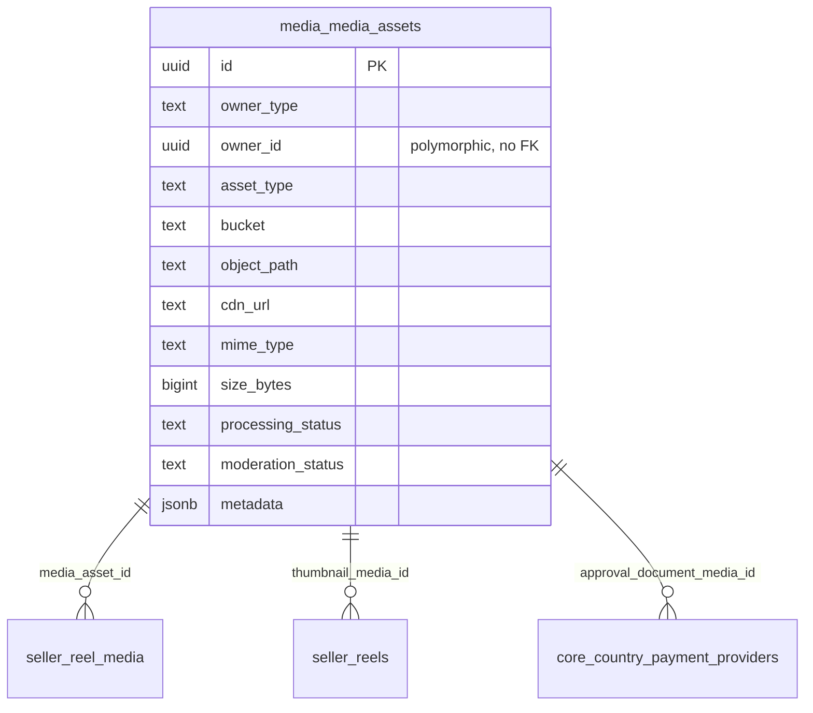

| Column | Type | Key / constraint | Notes |
| --- | --- | --- | --- |
| `id` | uuid | PK | referenced by `reel_media`, `reels.thumbnail_media_id`, `country_payment_providers`, and softly by `shipments.label_media_id` / `orders.media_greeting_id` |
| `owner_type` | text | NOT NULL CHECK `customer`/`seller`/`admin`/`system` | reel files are `seller`, label PDFs are `system` |
| `owner_id` | uuid | nullable, **no FK** | the seller id for reels; null for system files |
| `asset_type` | text | NOT NULL CHECK `image`/`video`/`audio`/`document`/`label` | derived from the MIME type for reels |
| `bucket` | text | NOT NULL | `S3_BUCKET` for reels, `SHIPPO_LABEL_BUCKET` for labels |
| `object_path` | text | NOT NULL | the S3 key from `/media/presign-upload` |
| `cdn_url` | text | nullable | filled only for `public/` keys; a private object stays null and is read through `GET /media/url` |
| `mime_type` | text | NOT NULL | |
| `size_bytes` | bigint | NOT NULL DEFAULT 0 CHECK ≥ 0 | reported by the client |
| `processing_status` | text | DEFAULT `uploaded`, CHECK `uploaded`/`processing`/`ready`/`failed`/`rejected` | server sets `ready` for reels; no transcoding pipeline exists |
| `moderation_status` | text | DEFAULT `pending`, CHECK `pending`/`approved`/`rejected` | server sets `approved` for reels; no review queue exists |
| `metadata` | jsonb | NOT NULL DEFAULT `{}` | width, height, duration |
| `created_at`, `updated_at` | timestamptz | NOT NULL | |

Indexed on `(owner_type, owner_id)` and on `asset_type`.

Neither status column is settable through any endpoint — they are outputs, and the reel
`PUT` cannot change them.

---

## 13. Section: reels

The post/file split: `seller.reels` is the post, `media.media_assets` holds the files, and
`seller.reel_media` is the ordered many-to-many between them. A thumbnail skips the join
table and hangs directly off the reel.

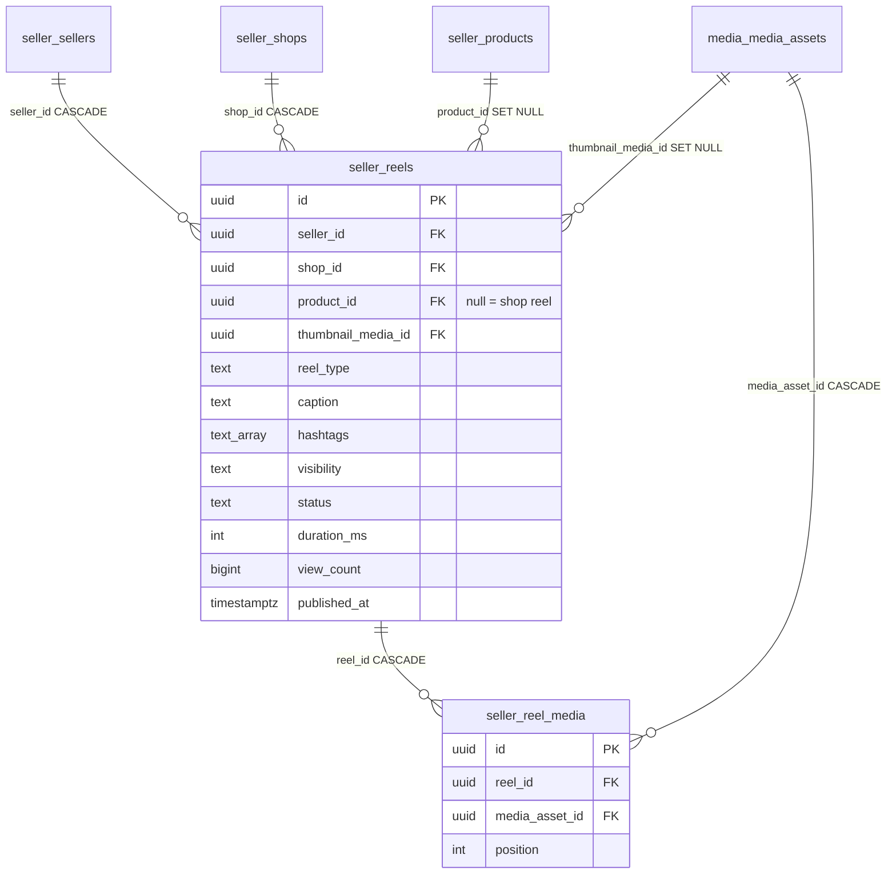

### `seller.reels`

| Column | Type | Key / constraint | Notes |
| --- | --- | --- | --- |
| `id` | uuid | PK | |
| `seller_id` | uuid | **FK → `seller.sellers(id)` ON DELETE CASCADE**, NOT NULL | denormalized so ownership checks skip the shop join |
| `shop_id` | uuid | **FK → `seller.shops(id)` ON DELETE CASCADE**, NOT NULL | a reel always belongs to a shop |
| `product_id` | uuid | **FK → `seller.products(id)` ON DELETE SET NULL**, nullable | **null = shop reel, set = product reel**; deleting the product demotes the reel instead of destroying it |
| `thumbnail_media_id` | uuid | **FK → `media.media_assets(id)` ON DELETE SET NULL**, nullable | cover image |
| `reel_type` | text | DEFAULT `video`, CHECK `video`/`photo` | derived: any video file ⇒ `video` |
| `caption` | text | nullable | trimmed; empty becomes null |
| `hashtags` | text[] | NOT NULL DEFAULT `{}` | lowercased, `#` stripped, de-duplicated |
| `visibility` | text | DEFAULT `public`, CHECK `public`/`private` | |
| `status` | text | DEFAULT `draft`, CHECK `draft`/`published`/`archived` | |
| `duration_ms` | integer | nullable CHECK ≥ 0 | |
| `view_count` | bigint | NOT NULL DEFAULT 0 CHECK ≥ 0 | **this is where views live** — incremented by `GET /reels/{id}` only, unthrottled and not de-duplicated per viewer |
| `published_at` | timestamptz | nullable | stamped once on first publish; drives feed ordering |
| `created_at`, `updated_at` | timestamptz | NOT NULL | |

### `seller.reel_media`

| Column | Type | Key / constraint | Notes |
| --- | --- | --- | --- |
| `id` | uuid | PK | deliberately **not** exposed in the API |
| `reel_id` | uuid | **FK → `seller.reels(id)` ON DELETE CASCADE**, NOT NULL | |
| `media_asset_id` | uuid | **FK → `media.media_assets(id)` ON DELETE CASCADE**, NOT NULL | the API's `media[].media_asset_id` |
| `position` | integer | NOT NULL DEFAULT 0 CHECK ≥ 0 | carousel order, ascending |
| `created_at` | timestamptz | NOT NULL | |
| — | — | **UNIQUE (reel_id, position)** | no two files in the same slot |
| — | — | **UNIQUE (reel_id, media_asset_id)** | no file twice on one reel |

Replacing media deletes the old `media_assets` rows, and the cascade clears these link
rows for free.

### How a reel resolves to a playable URL

```
GET /reels/{id}
  → seller.reels                       (post: caption, status, view_count)
  → seller.reel_media    ON reel_id    (order by position)
  → media.media_assets   ON media_asset_id
       cdn_url  ──► the URL the player uses
       object_path ──► the S3 key, for GET /media/url if the object were private
  → seller.shops         ON shop_id     (shop summary in the feed)
  → seller.products      ON product_id  (tappable product, when tagged)
```

The feed index `idx_reels_feed` is partial — `(published_at DESC, id DESC) WHERE status = 'published'
AND visibility = 'public'` — which is exactly the keyset the cursor pages through.

---

## 14. Full foreign key matrix

Every real FK in the database, child → parent.

| # | Child table.column | Parent | On delete |
| --- | --- | --- | --- |
| 1 | `core.country_capabilities.country_id` (UNIQUE) | `core.countries.id` | restrict (default) |
| 2 | `core.country_payment_providers.country_id` | `core.countries.id` | restrict |
| 3 | `core.country_payment_providers.approval_document_media_id` | `media.media_assets.id` | restrict |
| 4 | `customer.customers.country_id` | `core.countries.id` | restrict |
| 5 | `customer.customer_addresses.customer_id` | `customer.customers.id` | CASCADE |
| 6 | `customer.customer_addresses.country_id` | `core.countries.id` | restrict |
| 7 | `customer.recipients.customer_id` | `customer.customers.id` | CASCADE |
| 8 | `customer.recipients.default_address_id` | `customer.recipient_addresses.id` | SET NULL |
| 9 | `customer.recipient_addresses.recipient_id` | `customer.recipients.id` | CASCADE |
| 10 | `customer.recipient_addresses.country_id` | `core.countries.id` | restrict |
| 11 | `customer.saved_gifts.customer_id` | `customer.customers.id` | CASCADE |
| 12 | `customer.saved_gifts.product_id` | `seller.products.id` | CASCADE |
| 13 | `seller.sellers.country_id` | `core.countries.id` | restrict |
| 14 | `seller.seller_addresses.seller_id` | `seller.sellers.id` | CASCADE |
| 15 | `seller.seller_addresses.country_id` | `core.countries.id` | restrict |
| 16 | `seller.shops.seller_id` | `seller.sellers.id` | CASCADE |
| 17 | `seller.shops.address_id` | `seller.seller_addresses.id` | restrict |
| 18 | `seller.shops.return_address_id` | `seller.seller_addresses.id` | restrict |
| 19 | `seller.products.shop_id` | `seller.shops.id` | CASCADE |
| 20 | `seller.inventory.product_id` (UNIQUE) | `seller.products.id` | CASCADE |
| 21 | `marketplace.orders.customer_id` | `customer.customers.id` | restrict |
| 22 | `marketplace.orders.recipient_id` | `customer.recipients.id` | SET NULL |
| 23 | `marketplace.orders.country_id` | `core.countries.id` | restrict |
| 24 | `marketplace.order_items.order_id` | `marketplace.orders.id` | CASCADE |
| 25 | `marketplace.order_items.seller_id` | `seller.sellers.id` | restrict |
| 26 | `marketplace.order_items.shop_id` | `seller.shops.id` | restrict |
| 27 | `marketplace.order_items.product_id` | `seller.products.id` | restrict |
| 28 | `marketplace.shipments.order_id` | `marketplace.orders.id` | CASCADE |
| 29 | `marketplace.shipments.order_item_id` | `marketplace.order_items.id` | CASCADE |
| 30 | `marketplace.shipments.seller_id` | `seller.sellers.id` | restrict |
| 31 | `seller.reels.seller_id` | `seller.sellers.id` | CASCADE |
| 32 | `seller.reels.shop_id` | `seller.shops.id` | CASCADE |
| 33 | `seller.reels.product_id` | `seller.products.id` | SET NULL |
| 34 | `seller.reels.thumbnail_media_id` | `media.media_assets.id` | SET NULL |
| 35 | `seller.reel_media.reel_id` | `seller.reels.id` | CASCADE |
| 36 | `seller.reel_media.media_asset_id` | `media.media_assets.id` | CASCADE |
| 37 | `marketplace.product_reviews.product_id` | `seller.products.id` | restrict |
| 38 | `marketplace.product_reviews.shop_id` | `seller.shops.id` | restrict |
| 39 | `marketplace.product_reviews.seller_id` | `seller.sellers.id` | restrict |
| 40 | `marketplace.product_reviews.customer_id` | `customer.customers.id` | restrict |
| 41 | `marketplace.product_reviews.order_id` | `marketplace.orders.id` | CASCADE |
| 42 | `marketplace.product_reviews.order_item_id` (UNIQUE) | `marketplace.order_items.id` | CASCADE |
| 43 | `marketplace.product_review_media.review_id` | `marketplace.product_reviews.id` | CASCADE |
| 44 | `marketplace.product_review_media.media_asset_id` | `media.media_assets.id` | CASCADE |
| 45 | `marketplace.product_review_votes.review_id` | `marketplace.product_reviews.id` | CASCADE |
| 46 | `marketplace.product_review_votes.customer_id` | `customer.customers.id` | CASCADE |

"restrict" means no `ON DELETE` clause was declared, so Postgres uses `NO ACTION` and the
delete fails while children exist.

---

## 15. Soft links with no foreign key

Columns that hold another table's id but are not constrained. Nothing stops a bad value.

| Column | Intended parent | Why unconstrained |
| --- | --- | --- |
| `marketplace.orders.media_greeting_id` | `media.media_assets.id` | `orders` (migration `000012`) predates `media_assets` (`000017`); the FK was noted as a TODO and never added |
| `marketplace.shipments.label_media_id` | `media.media_assets.id` | same ordering problem; written by the label purchase |
| `marketplace.shipments.proof_of_delivery_media_id` | `media.media_assets.id` | same; never written today |
| `media.media_assets.owner_id` | `customers` / `sellers` / `admin_users` | polymorphic by design — the parent depends on `owner_type` |

The first three are safe to convert to real FKs today, since the parent table now exists.

---

## 16. Delete and cascade behaviour

What actually disappears when a row goes.

| Delete | Cascades to | Survives |
| --- | --- | --- |
| `core.countries` | nothing | **fails** if any customer, seller, address, order, or capability references it |
| `customer.customers` (hard) | `customer_addresses`, `recipients` → `recipient_addresses`, `saved_gifts`, `product_review_votes` | **fails** if the customer has orders or authored `product_reviews` (`customer_id` restrict) |
| `customer.customers` (API soft delete) | nothing | everything, including their addresses and orders |
| `customer.recipients` | `recipient_addresses` | orders keep the line, `recipient_id` becomes null |
| `seller.sellers` (hard) | `seller_addresses`, `shops` → `products` → `inventory`, `reels` → `reel_media` | **fails** if the seller has order items, shipments, or `product_reviews` |
| `seller.sellers` (API soft delete) | nothing | everything, including `active` shops still shown publicly |
| `seller.shops` | `products` → `inventory`, `reels` → `reel_media` | **fails** if any product is on an order item or `product_reviews` |
| `seller.products` | `inventory`, `saved_gifts` rows; `reels.product_id` → null | **fails** if the product is on an order item or `product_reviews` |
| `seller.reels` | `reel_media`; the S3 objects are deleted best-effort by the service | the `media_assets` rows are deleted explicitly by the repository |
| `media.media_assets` | `reel_media` rows; `product_review_media` rows; `reels.thumbnail_media_id` → null | `shipments.label_media_id` and `orders.media_greeting_id` become dangling (no FK) |
| `marketplace.orders` | `order_items` → `shipments`; `product_reviews` → media links + votes | — |
| `marketplace.order_items` | `shipments` for that line; `product_reviews` for that line (CASCADE) | the order header |
| `marketplace.product_reviews` | `product_review_media`, `product_review_votes`; service also deletes linked `media_assets` | — |

---

## 17. Status value reference

Every CHECK-constrained value in one place.

| Table.column | Allowed values | Default |
| --- | --- | --- |
| `core.countries.status` | `full`, `marketplace`, `customer_only`, `browse_only`, `blocked` | `full` |
| `core.country_payment_providers.mode` | `test`, `live`, `paused` | `test` |
| `core.country_payment_providers.written_approval_status` | `missing`, `requested`, `approved`, `rejected` | `missing` |
| `core.idempotency_keys.status` | `processing`, `completed`, `failed` | `processing` |
| `seller.seller_addresses.address_type` | `pickup`, `return`, `both` | `both` |
| `seller.products.status` | `draft`, `published`, `paused`, `rejected` | `draft` |
| `seller.products.customer_type_visibility` | `personal`, `corporate`, `both` | `both` |
| `seller.reels.reel_type` | `video`, `photo` | `video` |
| `seller.reels.visibility` | `public`, `private` | `public` |
| `seller.reels.status` | `draft`, `published`, `archived` | `draft` |
| `marketplace.orders.customer_type` | `personal`, `corporate` | `personal` |
| `marketplace.orders.status` | `draft`, `pending_payment`, `paid`, `accepted`, `preparing`, `dispatched`, `delivered`, `cancelled`, `refunded` | `draft` (the API always creates `pending_payment`) |
| `marketplace.order_items.fulfilment_status` | `pending`, `accepted`, `preparing`, `ready`, `dispatched`, `delivered`, `cancelled` | `pending` |
| `marketplace.product_reviews.status` | `pending`, `published`, `hidden`, `rejected` | `published` |
| `marketplace.shipments.delivery_mode` | `courier`, `seller_managed`, `pickup` | none — NOT NULL, always `courier` today |
| `marketplace.shipments.status` | `pending`, `label_created`, `collected`, `in_transit`, `delivered`, `failed`, `returned` | `pending` |
| `media.media_assets.owner_type` | `customer`, `seller`, `admin`, `system` | none — NOT NULL |
| `media.media_assets.asset_type` | `image`, `video`, `audio`, `document`, `label` | none — NOT NULL |
| `media.media_assets.processing_status` | `uploaded`, `processing`, `ready`, `failed`, `rejected` | `uploaded` |
| `media.media_assets.moderation_status` | `pending`, `approved`, `rejected` | `pending` |

Columns with **no** CHECK, so any string is accepted: `customers.customer_type`,
`customers.status`, `customer_addresses.address_type`,
`recipient_addresses.address_type`, `sellers.seller_type`, `sellers.verification_status`,
`sellers.status`, `shops.status`, `shops.return_address_mode`, `products.product_type`,
`admin_users.role`, `admin_users.status`.

Notably `shops.status` is unconstrained even though the public listing depends on the exact
string `active`.

---

## 18. Index reference

Beyond the implicit primary-key and unique-constraint indexes.

| Index | Table | Definition | Serves |
| --- | --- | --- | --- |
| `countries_iso_code_uq` | `core.countries` | UNIQUE (`iso_code`) | ISO lookup |
| `countries_status_idx` | `core.countries` | (`status`) | active-market filters |
| `idx_idempotency_keys_scope_status` | `core.idempotency_keys` | (`scope`, `status`) | key claim |
| `idx_idempotency_keys_expires_at` | `core.idempotency_keys` | (`expires_at`) WHERE NOT NULL | future cleanup |
| `idx_admin_users_status` | `admin.admin_users` | (`status`) | admin lists |
| `idx_customers_country_id` | `customer.customers` | (`country_id`) | per-market queries |
| `idx_customers_status` | `customer.customers` | (`status`) | excluding deleted |
| `idx_customer_addresses_customer_id` | `customer.customer_addresses` | (`customer_id`) | profile load |
| `idx_recipients_customer_id` | `customer.recipients` | (`customer_id`) | recipient list |
| `idx_recipient_addresses_recipient_id` | `customer.recipient_addresses` | (`recipient_id`) | recipient detail, ship-to |
| `saved_gifts_customer_id_idx` | `customer.saved_gifts` | (`customer_id`) | wishlist |
| `saved_gifts_product_id_idx` | `customer.saved_gifts` | (`product_id`) | reverse lookup |
| `idx_seller_addresses_seller_id` | `seller.seller_addresses` | (`seller_id`) | profile load |
| `idx_shops_seller_id` | `seller.shops` | (`seller_id`) | `GET /sellers/me/shops` |
| `products_shop_status_idx` | `seller.products` | (`shop_id`, `status`) | published-per-shop listing |
| `products_occasion_tags_gin` | `seller.products` | GIN (`occasion_tags`) | tag search (no endpoint yet) |
| `inventory_product_id_idx` | `seller.inventory` | (`product_id`) | redundant with the UNIQUE |
| `idx_orders_customer_id` | `marketplace.orders` | (`customer_id`) | order history |
| `idx_orders_recipient_id` | `marketplace.orders` | (`recipient_id`) | gifts per recipient |
| `idx_orders_status` | `marketplace.orders` | (`status`) | ops queries |
| `idx_order_items_order_id` | `marketplace.order_items` | (`order_id`) | order detail |
| `idx_order_items_seller_id` | `marketplace.order_items` | (`seller_id`) | seller dashboard |
| `idx_order_items_shop_id` | `marketplace.order_items` | (`shop_id`) | per-shop reporting |
| `idx_order_items_product_id` | `marketplace.order_items` | (`product_id`) | product sales |
| `idx_product_reviews_product` | `marketplace.product_reviews` | (`product_id`, `created_at DESC`) WHERE `status='published'` | product review list |
| `idx_product_reviews_shop` | `marketplace.product_reviews` | (`shop_id`, `created_at DESC`) WHERE `status='published'` | shop review list |
| `idx_product_reviews_seller` | `marketplace.product_reviews` | (`seller_id`, `created_at DESC`) | seller dashboard |
| `idx_product_reviews_customer` | `marketplace.product_reviews` | (`customer_id`, `created_at DESC`) | my reviews |
| `idx_product_reviews_order` | `marketplace.product_reviews` | (`order_id`) | reviews for an order |
| `idx_product_review_media_review_id` | `marketplace.product_review_media` | (`review_id`, `position`) | review photo carousel |
| `idx_product_review_votes_review_id` | `marketplace.product_review_votes` | (`review_id`) | vote tally |
| `idx_shipments_order_id` | `marketplace.shipments` | (`order_id`) | order shipments |
| `idx_shipments_order_item_id` | `marketplace.shipments` | (`order_item_id`) | line shipment |
| `idx_shipments_pending_order_item` | `marketplace.shipments` | **UNIQUE** (`order_item_id`) WHERE `status='pending'` | one open quote per line |
| `idx_shipments_seller_id` | `marketplace.shipments` | (`seller_id`) | seller shipments |
| `idx_shipments_status` | `marketplace.shipments` | (`status`) | ops queries |
| `idx_shipments_provider_shipment_id` | `marketplace.shipments` | (`provider_shipment_id`) | Shippo reconciliation |
| `idx_shipments_tracking_number` | `marketplace.shipments` | (`tracking_number`) | webhook lookup |
| `idx_media_assets_owner` | `media.media_assets` | (`owner_type`, `owner_id`) | a seller's files |
| `idx_media_assets_asset_type` | `media.media_assets` | (`asset_type`) | labels vs media |
| `idx_reels_seller_id` | `seller.reels` | (`seller_id`, `created_at DESC`) | `GET /sellers/me/reels` |
| `idx_reels_shop_id` | `seller.reels` | (`shop_id`, `created_at DESC`) | shop reels |
| `idx_reels_product_id` | `seller.reels` | (`product_id`) | product reels |
| `idx_reels_feed` | `seller.reels` | (`published_at DESC`, `id DESC`) WHERE published AND public | the public feed keyset |
| `idx_reel_media_reel_id` | `seller.reel_media` | (`reel_id`, `position`) | ordered media fetch |

---

## 19. Migration history

Applied in filename order, tracked in `schema_migrations`. Numbering has gaps — `000015`,
`000016`, `000019`, `000020` were removed during development, and `000021` cleans up what
`000019`/`000020` had added, so a fresh database and an older one converge.

| Version | What it does |
| --- | --- |
| `000001_create_admin_users` | `citext` + `pgcrypto` extensions, `admin` schema, `admin.admin_users` |
| `000002_create_countries` | `core` schema, `core.countries`, and `core.idempotency_keys` |
| `000003_create_customers` | `customer` schema, `customers`, `customer_addresses` |
| `000004_create_seller_addresses` | **no-op** (`SELECT 1`) — the tables moved into `000006`; kept so applied histories stay valid |
| `000005_align_customer_columns` | adds `customers.phone`, `customers.date_of_birth`, address lat/long for databases created outside migrations |
| `000006_create_sellers_shops` | `seller` schema, `sellers`, `seller_addresses`, `shops` (+ `shops.address_id`) |
| `000007_create_products_inventory` | `seller.products`, `seller.inventory` |
| `000008_add_image_url` | `image_url` on admins, customers, sellers, shops, products |
| `000009_create_saved_gifts` | `customer.saved_gifts` |
| `000010_create_recipients` | `recipients`, `recipient_addresses`, and the circular `default_address_id` FK |
| `000011_add_shop_return_address` | `shops.return_address_id` |
| `000012_create_orders` | `marketplace` schema, `orders`, `order_items` |
| `000013_create_country_capabilities` | `core.country_capabilities` |
| `000014_create_shipments` | `marketplace.shipments` |
| `000017_create_media_assets` | `media` schema, `media.media_assets`, `core.country_payment_providers` |
| `000018_create_idempotency_keys` | re-creates `core.idempotency_keys` for databases that ran `000002` before it was merged in |
| `000021_shipment_shipping_details` | drops the product-level shipping columns and order-item shipping JSON; adds `shipments.order_item_id`, `is_international`, `parcel_details`, `customs_declaration`, `provider_customs_declaration_id`, and the pending-quote unique index |
| `000022_create_seller_reels` | `seller.reels`, `seller.reel_media`, and the partial feed index |
| `000027_create_product_reviews` | `marketplace.product_reviews`, `product_review_media`, `product_review_votes` (AliExpress-style ratings + photos + helpful votes) |

Every file is written to be re-runnable (`IF NOT EXISTS`, `ADD COLUMN IF NOT EXISTS`), so
a partially migrated database can catch up. Down files exist for each version but are not
applied automatically.

---

## 20. Table to endpoint map

Which routes touch which tables — handy when you change a column.

| Table | Read by | Written by |
| --- | --- | --- |
| `admin.admin_users` | `POST /auth/login`, `GET /admin/me` | `POST /admin/register`, `PUT /admin/me` |
| `core.countries` | `GET /countries`, `GET /countries/{id}`, every register/order validation | `POST/PUT/DELETE /admin/countries` |
| `core.country_capabilities` | `GET /admin/country-capabilities`, `GET /admin/countries/{id}/capabilities`, customer + seller register | `POST/PUT/DELETE /admin/countries/{id}/capabilities` |
| `core.country_payment_providers` | — | — (schema only) |
| `core.idempotency_keys` | `POST …/shipping/labels` | `POST …/shipping/labels` |
| `customer.customers` | login, `GET /customers/me`, order create | `POST /customers/register`, `PUT/DELETE /customers/me` |
| `customer.customer_addresses` | `GET /customers/me` | `POST /customers/me/addresses`, `DELETE …/{id}` |
| `customer.recipients` | `GET /customers/me/recipients`, order create, shipping ship-to | `POST/PUT/DELETE /customers/me/recipients` |
| `customer.recipient_addresses` | `GET /customers/me/recipients/{id}`, `GET /sellers/me/order-items/{id}`, shipping | recipient address routes |
| `customer.saved_gifts` | `GET /customers/me/saved-gifts` | `POST`/`DELETE /customers/me/saved-gifts` |
| `seller.sellers` | login, `GET /sellers/me`, shipping ship-from name | `POST /sellers/register`, `PUT/DELETE /sellers/me` |
| `seller.seller_addresses` | `GET /sellers/me`, shipping ship-from | `/sellers/me/addresses` routes |
| `seller.shops` | `GET /shops`, `GET /shops/{shopId}`, `GET /sellers/me/shops`, reel feed join | `/sellers/me/shops` routes |
| `seller.products` | `GET /shops/{shopId}/products`, `GET /products/{productId}`, seller product routes, order create | `/sellers/me/shops/{shopID}/products`, `/sellers/me/products/{id}` |
| `seller.inventory` | `GET /sellers/me/products/{id}`, `…/inventory` | product create, `PUT …/inventory` |
| `seller.reels` | `GET /reels`, `/reels/{id}`, `/shops/{shopId}/reels`, `/products/{productId}/reels`, seller reel lists | seller reel `POST`/`PUT`/`DELETE`; `view_count` by `GET /reels/{id}` |
| `seller.reel_media` | every reel read | reel create/update/delete |
| `media.media_assets` | reel reads, label reads | reel create/update (seller files), label purchase (`asset_type='label'`) |
| `marketplace.orders` | `GET /customers/me/orders`, `GET /sellers/me/order-items/{id}`, webhook completion | `POST /customers/me/orders`, cancel, webhook |
| `marketplace.order_items` | `GET /sellers/me/order-items`, order detail | order create, accept, label purchase (`dispatched`), webhook (`delivered`) |
| `marketplace.shipments` | shipping context lookup, webhook | `POST …/shipping/rates` (pending quote), `POST …/shipping/labels`, webhook status |
| `marketplace.product_reviews` | `GET /products/{id}/reviews`, `GET /reviews/{id}`, customer/seller review routes | `POST /customers/me/order-items/{id}/reviews`, update/delete/reply |
| `marketplace.product_review_media` | review reads | review create/update/delete |
| `marketplace.product_review_votes` | review reads (`voted_helpful`) | `PUT/DELETE /reviews/{id}/vote` |
| `public.schema_migrations` | migration runner | migration runner |
