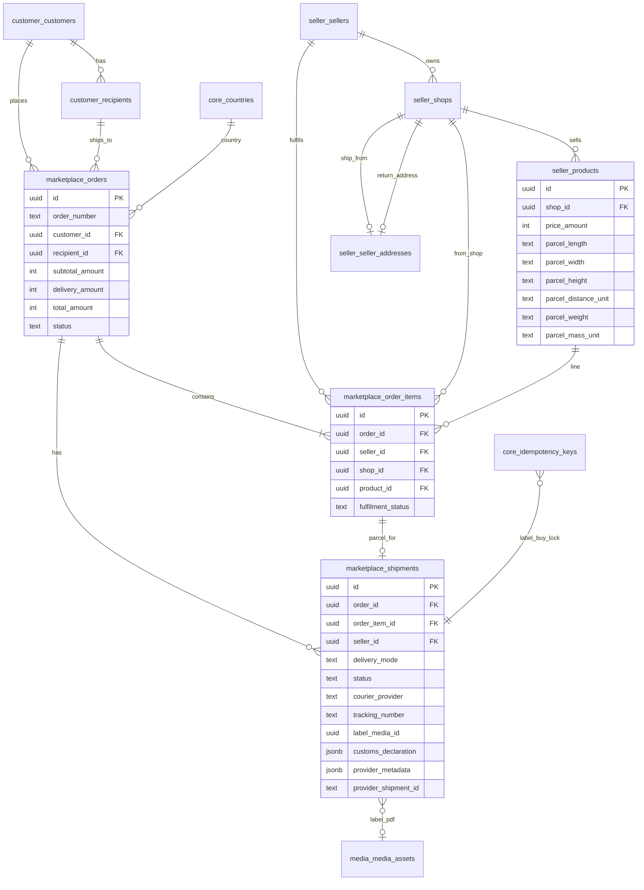
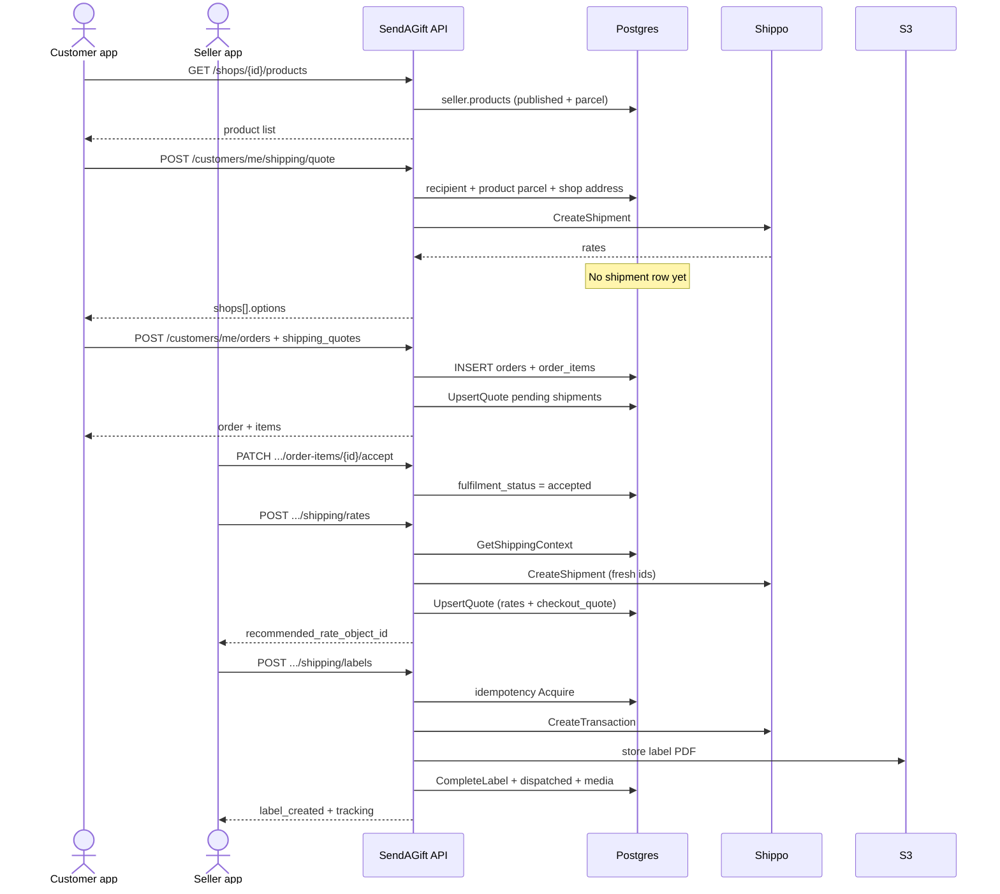
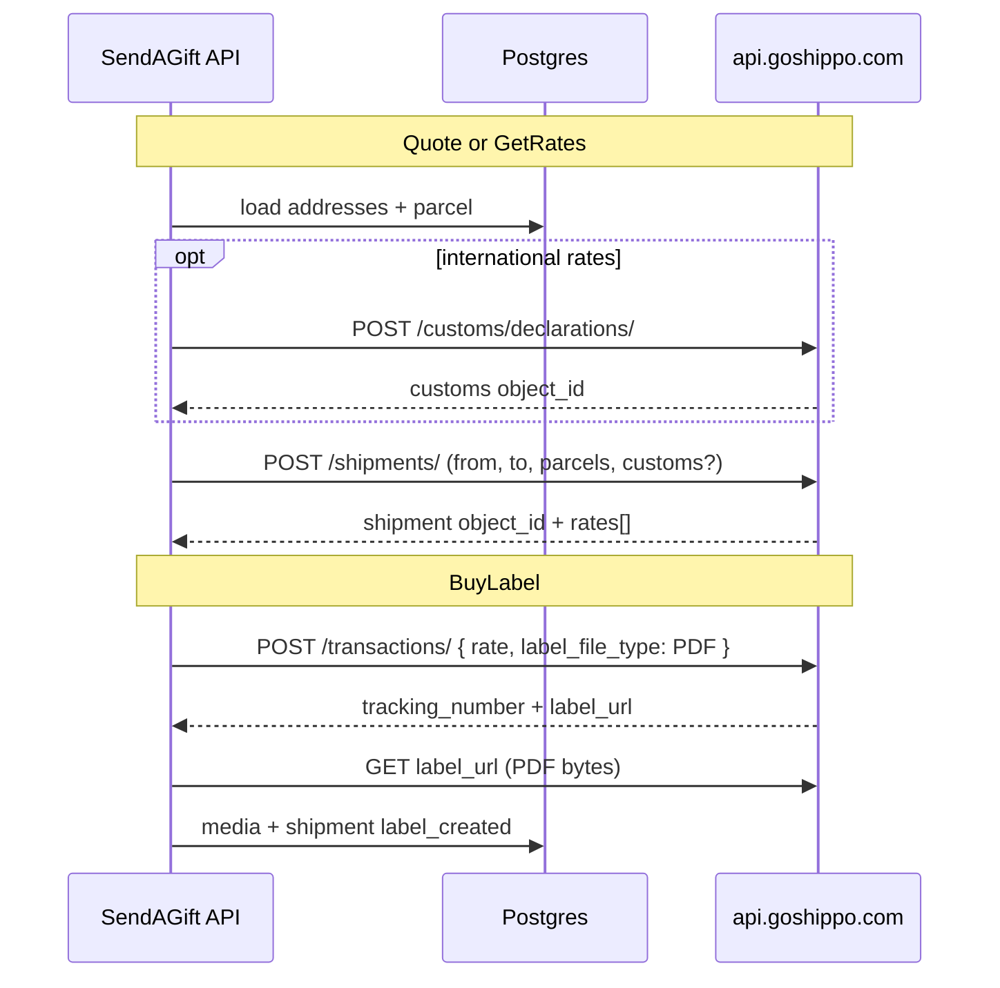

# Shipping & Orders — Full Flow README

Base URL: `http://localhost:8081/api/v1`  
Amounts are **minor units (cents)** unless noted (`4633` = **$46.33**).  
Shippo `rates[].amount` is a decimal string (`"46.33"`).

This document explains:

1. ER diagrams (how tables relate)
2. End-to-end customer → seller label flow
3. Every related route, request/response body
4. What **changes in the DB** on each call
5. Handlers / services / repository functions involved
6. **Full table + column catalog** for every table in this flow
7. **Place-order deep dive** — every function and which columns are written
8. **Function → tables matrix** (read vs write) for the whole path
9. **Shippo APIs** — URLs, auth, how parcel/address data is built and sent (§14)

Companion short API sheet: [`shipping-api.md`](./shipping-api.md)

---

## 1. ER diagram (shipping & orders)



### Key columns

| Table | Column | Role |
|-------|--------|------|
| `seller.products` | `parcel_*` | Package size/weight for Shippo quotes (migration `000028`) |
| `marketplace.orders` | `delivery_amount` | Sum of selected shipping quotes (cents) |
| `marketplace.order_items` | `fulfilment_status` | `pending` → `accepted` → `dispatched` → `delivered` |
| `marketplace.shipments` | `status` | `pending` (quote) → `label_created` → transit → `delivered` |
| `marketplace.shipments` | `provider_metadata` | Checkout courier lock + fresh rates + Shippo txn |
| `core.idempotency_keys` | `scope=shipment_label` | Prevents double-purchase of the same label |

---

## 2. Sequence (who calls what)



---

## 3. End-to-end steps (routes + bodies + DB)

### Step 0 — Seller prepares product (optional but recommended)

| | |
|--|--|
| **URL** | `POST /sellers/me/shops/{shopID}/products` or `PUT /sellers/me/products/{id}` |
| **Auth** | Seller JWT |
| **Handler** | `ProductHandler.Create` / `Update` → `ProductService` |

**Body (parcel snippet):**
```json
{
  "name": "Gift Box USA",
  "price_amount": 32400,
  "currency": "USD",
  "status": "published",
  "parcel": {
    "length": "20",
    "width": "15",
    "height": "10",
    "distance_unit": "cm",
    "weight": "1.200",
    "mass_unit": "kg"
  }
}
```

**DB change:** `INSERT`/`UPDATE` `seller.products` including `parcel_*` columns.

---

### Step 1 — Customer browses shops & products

| | |
|--|--|
| **URL** | `GET /shops` |
| **URL** | `GET /shops/{shopId}/products?customer_type=personal` |
| **URL** | `GET /products/{productId}` |
| **Auth** | Public (no JWT required) |
| **Handler** | `ShopsHandler.ListActiveShops` / `ListShopProducts` / `GetProduct` |

**How data is retrieved**

1. Active shops from `seller.shops`.
2. Published products from `seller.products` for that shop.
3. Parcel fields included when set (used later for Shippo weight/size).

**DB change:** **None** (read-only).

**Response (product shape):**
```json
{
  "id": "d4eb9169-...",
  "shop_id": "2dbc400f-...",
  "name": "Gift Box USA",
  "price_amount": 32400,
  "currency": "USD",
  "status": "published",
  "parcel": {
    "length": "20",
    "width": "15",
    "height": "10",
    "distance_unit": "cm",
    "weight": "1.200",
    "mass_unit": "kg"
  }
}
```

---

### Step 2 — Customer loads recipient

| | |
|--|--|
| **URL** | `GET /customers/me/recipients` |
| **URL** | `GET /customers/me/recipients/{id}` |
| **Auth** | Customer JWT |
| **Handler** | Customer recipient handlers |

**How data is retrieved:** `customer.recipients` + linked address (street, city, country ISO).

**DB change:** **None** (read-only).

Shippo needs a complete address before quote works.

---

### Step 3 — Customer quotes delivery (AliExpress-style options)

| | |
|--|--|
| **URL** | `POST /customers/me/shipping/quote` |
| **Auth** | Customer JWT (`RequireRole("customer")`) |
| **Handler** | `ShippingHandler.QuoteDelivery` |
| **Service** | `ShippingService.QuoteDelivery` |
| **Repo** | `ShipToForRecipient`, `ShipFromForShops`, `OrderRepository.GetCheckoutProduct` |

**Body:**
```json
{
  "recipient_id": "1d4b7fdb-...",
  "delivery_date": "2026-09-25",
  "items": [{ "product_id": "d4eb9169-...", "quantity": 1 }]
}
```

**How it works**

1. Load recipient ship-to address.
2. For each cart line → load product (shop_id, price, **parcel**).
3. Group lines by `shop_id`.
4. Load each shop ship-from (`return_address_id` else `address_id`).
5. Merge parcels per shop → call **Shippo** `CreateShipment`.
6. Map rates into `shops[].options` with `days_available`, mark recommended.

**DB change:** **None.** Quote is JSON only. No `marketplace.shipments` row yet (order does not exist).

**Response `200`:**
```json
{
  "shops": [{
    "shop_id": "2dbc400f-...",
    "shop_name": "Bay Area Gifts",
    "shipment_object_id": "shippo_shipment_xxx",
    "options": [{
      "provider": "USPS",
      "service_name": "First Class Package International Service",
      "amount": 4633,
      "currency": "USD",
      "estimated_days": 6,
      "days_available": 6,
      "recommended": true,
      "rate_object_id": "shippo_rate_checkout_xxx",
      "shipment_object_id": "shippo_shipment_xxx"
    }]
  }],
  "shipments": [{ "...recommended per shop..." }],
  "amount": 4633,
  "currency": "USD",
  "complete": true
}
```

UI: customer picks an option; echo it into `shipping_quotes` on place-order.

---

### Step 4 — Customer places order (creates order + **pending `marketplace.shipments`**)

| | |
|--|--|
| **URL** | `POST /customers/me/orders` |
| **Auth** | Customer JWT |
| **Handler** | `OrderHandler.Create` |
| **Service** | `OrderService.Create` → **`persistCheckoutQuotes`** |
| **Repo** | `OrderRepository.Create`, **`ShipmentRepository.UpsertQuote`** |

**Important:** With `shipping_quotes` in the body, place-order does **three** writes:

1. `marketplace.orders`
2. `marketplace.order_items`
3. **`marketplace.shipments`** (pending courier plan — this is how the seller later sees the customer’s courier)

Without `shipping_quotes`, only (1)+(2) are written (no shipment row until seller `/shipping/rates`).

**Body:**
```json
{
  "country_id": "...",
  "recipient_id": "1d4b7fdb-...",
  "delivery_date": "2026-09-25",
  "customer_type": "personal",
  "items": [{ "product_id": "d4eb9169-...", "quantity": 1 }],
  "shipping_quotes": [{
    "shop_id": "2dbc400f-...",
    "rate_object_id": "shippo_rate_checkout_xxx",
    "shipment_object_id": "shippo_shipment_xxx",
    "provider": "USPS",
    "service_name": "First Class Package International Service",
    "amount": 4633,
    "currency": "USD"
  }]
}
```

**How it works**

1. Validate customer, country, recipient, items.
2. Load each product → build `order_items` (seller_id, shop_id, unit price).
3. `subtotal_amount` = sum of line totals.
4. `delivery_amount` = sum of `shipping_quotes[].amount` (or explicit `delivery_amount`).
5. `total_amount` = subtotal + delivery.
6. **INSERT** `marketplace.orders` + `marketplace.order_items` (transaction).
7. **`persistCheckoutQuotes`**: for each order item whose `shop_id` matches a `shipping_quotes[]` entry → **`UpsertQuote`** into `marketplace.shipments`.

#### Body `shipping_quotes[]` → `marketplace.shipments` columns

| Field in `shipping_quotes[]` | Shipment column / JSON field | Notes |
|------------------------------|------------------------------|--------|
| (from new order) | `order_id` | UUID of inserted order |
| (from new order item) | `order_item_id` | UUID of inserted line for that shop |
| (from order item) | `seller_id` | seller who owns the shop |
| — | `delivery_mode` | always **`courier`** |
| — | `status` | always **`pending`** (label not bought yet) |
| `shipment_object_id` | `provider_shipment_id` | Shippo shipment id from quote (informational; expires) |
| `rate_object_id` | `provider_metadata.rate_object_id` | checkout rate id (expires; do not buy with this) |
| `provider` | `provider_metadata.provider` | e.g. `USPS` — **courier lock** |
| `service_name` | `provider_metadata.service_name` | e.g. First Class… — **courier lock** |
| `amount` | `provider_metadata.amount` | cents customer paid for shipping |
| `currency` | `provider_metadata.currency` | e.g. `USD` |
| — | `provider_metadata.source` | fixed `"checkout_quote"` |
| — | `customs_declaration` | **NULL** (seller fills at `/rates`) |
| — | `is_international` | default `false` until `/rates` |
| — | `courier_provider` | **NULL** until BuyLabel |
| — | `tracking_number` | **NULL** until BuyLabel |
| — | `label_media_id` | **NULL** until BuyLabel |
| — | `provider_tracking_url` | **NULL** until BuyLabel |
| — | `provider_customs_declaration_id` | **NULL** until `/rates` |

Matching rule: `shipping_quotes[].shop_id` == `order_items.shop_id` (one quote per shop in the cart).

**SQL performed:** `ShipmentRepository.UpsertQuote` —

```sql
INSERT INTO marketplace.shipments (
  order_id, order_item_id, seller_id, delivery_mode, status, is_international,
  customs_declaration, provider_shipment_id,
  provider_customs_declaration_id, provider_metadata
) VALUES (...)
ON CONFLICT (order_item_id) WHERE status = 'pending' DO UPDATE SET
  provider_shipment_id = excluded.provider_shipment_id,
  provider_metadata = excluded.provider_metadata,
  ...
```

**Example `provider_metadata` JSON stored at place-order:**

```json
{
  "rate_object_id": "shippo_rate_checkout_xxx",
  "provider": "USPS",
  "service_name": "First Class Package International Service",
  "amount": 4633,
  "currency": "USD",
  "source": "checkout_quote"
}
```

**Example pending shipment row after place-order:**

| Column | Example value |
|--------|----------------|
| `id` | `c625a7e4-…` (new) |
| `order_id` | `4a0900e8-…` |
| `order_item_id` | `5f1d77c8-…` |
| `seller_id` | `303bc6b4-…` |
| `delivery_mode` | `courier` |
| `status` | `pending` |
| `provider_shipment_id` | `shippo_shipment_xxx` |
| `provider_metadata` | JSON above |
| `customs_declaration` | null |
| `courier_provider` | null |
| `tracking_number` | null |
| `label_media_id` | null |

Later:

- Seller **`POST .../shipping/rates`** → **updates the same pending row** (fresh rates + parcel/customs; keeps checkout courier in metadata).
- Seller **`POST .../shipping/labels`** → **updates same row** to `label_created` + tracking + label PDF.

**DB changes summary**

| Table | Action |
|-------|--------|
| `marketplace.orders` | **INSERT** |
| `marketplace.order_items` | **INSERT** (`fulfilment_status = pending`) |
| `marketplace.shipments` | **INSERT/UPSERT pending** (one per item with a matching `shipping_quotes` shop) |

**Response `201`:**
```json
{
  "id": "4a0900e8-...",
  "order_number": "SAG-...",
  "subtotal_amount": 32400,
  "delivery_amount": 4633,
  "total_amount": 37033,
  "currency": "USD",
  "items": [{
    "id": "5f1d77c8-...",
    "product_id": "d4eb9169-...",
    "shop_id": "2dbc400f-...",
    "fulfilment_status": "pending",
    "quantity": 1,
    "unit_amount": 32400,
    "total_amount": 32400
  }]
}
```

Save `items[].id` → **ORDER_ITEM_ID** for the seller. Shipment row is **not** returned in this response; it lives in DB for rates/labels.

See also **§10.1** for the full place-order → shipment write path.

---

### Step 5 — Seller lists & accepts the line

| | |
|--|--|
| **URL** | `GET /sellers/me/order-items` |
| **URL** | `GET /sellers/me/order-items/{orderItemID}` |
| **URL** | `PATCH /sellers/me/order-items/{orderItemID}/accept` |
| **Auth** | Seller JWT |
| **Handler** | `SellerOrderHandler.ListItems` / `GetItem` / `AcceptItem` |

**How data is retrieved:** order items where `seller_id = JWT subject`, joined to order/recipient/product.

**DB change on accept:**

| Table | Action |
|-------|--------|
| `marketplace.order_items` | **UPDATE** `fulfilment_status = 'accepted'` |

Rates/labels require status in `accepted` | `preparing` | `ready`.

---

### Step 6 — Seller gets fresh Shippo rates

| | |
|--|--|
| **URL** | `POST /sellers/me/order-items/{orderItemID}/shipping/rates` |
| **Auth** | Seller JWT |
| **Handler** | `ShippingHandler.GetRates` |
| **Service** | `ShippingService.GetRates` |
| **Repo** | `GetShippingContext`, `UpsertQuote` |

**Body** (parcel often optional if product has parcel; customs required for international):
```json
{
  "parcel": {
    "length": "20", "width": "15", "height": "10",
    "distance_unit": "cm", "weight": "1.200", "mass_unit": "kg"
  },
  "customs_declaration": {
    "contents_type": "MERCHANDISE",
    "non_delivery_option": "RETURN",
    "certify_signer": "Bay Area Gifts",
    "eel_pfc": "NOEEI_30_37_a",
    "incoterm": "DDU",
    "items": [{
      "description": "Gift",
      "quantity": 1,
      "net_weight": "1.200",
      "mass_unit": "kg",
      "value_amount": "324.00",
      "value_currency": "USD",
      "origin_country": "US"
    }]
  }
}
```

**How data is retrieved (`GetShippingContext`)**

1. Order item + fulfilment status.
2. Shop ship-from address (seller warehouse).
3. Order recipient ship-to address.
4. Existing pending shipment (`customs_declaration`, `provider_metadata` with checkout quote) + product parcel columns.
5. Product parcel columns as fallback.

**Parcel priority:** request body → stored shipment parcel → **product.parcel**.

**Then:** Shippo create customs (if intl) + create shipment → map rates → match checkout `provider`+`service_name` → `recommended_rate_object_id`.

**DB changes**

| Table | Action |
|-------|--------|
| `marketplace.shipments` | **UPSERT** same pending row: fresh `provider_shipment_id`, `customs_declaration`, `provider_metadata` |

**`provider_metadata` after rates:**
```json
{
  "rates": [ /* raw Shippo rates */ ],
  "checkout_quote": {
    "provider": "USPS",
    "service_name": "First Class Package International Service",
    "amount": 4633,
    "currency": "USD",
    "source": "checkout_quote"
  },
  "recommended_rate_object_id": "63123e58..."
}
```

**Response `200`:**
```json
{
  "shipment_object_id": "shippo_shipment_fresh_xxx",
  "international": true,
  "rates": [{
    "object_id": "63123e58...",
    "provider": "USPS",
    "service_name": "First Class Package International Service",
    "amount": "46.33",
    "currency": "USD",
    "estimated_days": 6
  }],
  "checkout_selected": {
    "provider": "USPS",
    "service_name": "First Class Package International Service",
    "amount": 4633,
    "amount_major": "46.33",
    "currency": "USD"
  },
  "recommended_rate_object_id": "63123e58...",
  "customer_delivery_amount": 4633,
  "currency": "USD",
  "must_buy_customer_courier": true
}
```

**Important:** Checkout `rate_object_id` expires. Always buy with `recommended_rate_object_id` from the **latest** rates call.

---

### Step 7 — Seller buys shipping label

| | |
|--|--|
| **URL** | `POST /sellers/me/order-items/{orderItemID}/shipping/labels` |
| **Auth** | Seller JWT |
| **Handler** | `ShippingHandler.BuyLabel` |
| **Service** | `ShippingService.BuyLabel` → `buyLabelAfterAcquire` |
| **Repo** | Idempotency `Acquire`/`Complete`/`Fail`, `CompleteLabel`, `MarkOrderItemDispatched`, Media insert |

**Body — Option A (recommended id):**
```json
{
  "rate_object_id": "63123e58...",
  "provider": "USPS",
  "idempotency_key": "label-5f1d77c8-1"
}
```

**Body — Option B (auto customer courier):**
```json
{
  "use_customer_selected": true,
  "idempotency_key": "label-5f1d77c8-1"
}
```

**How it works**

1. Load shipping context + parse `checkout_selected` from metadata.
2. If customer locked a courier:
   - `use_customer_selected` / empty rate id → force `recommended_rate_object_id`.
   - Wrong/stale rate → **409** (must chat customer to change).
3. Acquire idempotency key (`scope = shipment_label`). Validation happens **before** lock so a 409 does not stick the key.
4. Shippo `CreateTransaction` → download PDF → upload S3 → create `media.media_assets`.
5. `CompleteLabel` updates shipment; mark order item `dispatched`.

**DB changes**

| Table | Action |
|-------|--------|
| `core.idempotency_keys` | **INSERT** `processing` → **UPDATE** `completed` (+ response) or `failed` |
| `media.media_assets` | **INSERT** label PDF asset |
| `marketplace.shipments` | **UPDATE**: `status=label_created`, `courier_provider`, `tracking_number`, `label_media_id`, tracking URL, txn metadata |
| `marketplace.order_items` | **UPDATE** `fulfilment_status = 'dispatched'` |

**Success `201`:**
```json
{
  "id": "c625a7e4-...",
  "status": "label_created",
  "courier_provider": "USPS",
  "tracking_number": "LS001847441US",
  "label_media_id": "..."
}
```

**Wrong courier `409`:**
```json
{
  "error": "use the customer-selected courier, or message the customer to agree a change first: customer selected USPS First Class Package International Service (46.33 USD) — message the customer before changing"
}
```

**Missing key `400`:** `idempotency_key is required`

---

### Step 8 — Seller downloads label PDF

| | |
|--|--|
| **URL** | `GET /sellers/me/order-items/{orderItemID}/shipping/label` |
| **Auth** | Seller JWT |
| **Handler** | `ShippingHandler.LabelURL` |
| **Service** | `ShippingService.LabelURL` |

**DB change:** **None** (reads shipment + media, returns short-lived S3 presigned URL).

```json
{
  "url": "https://presigned-s3-link...",
  "mime_type": "application/pdf",
  "expires_in_seconds": 600,
  "tracking_number": "LS001847441US",
  "provider": "USPS"
}
```

---

### Step 9 — Shippo tracking webhook (async)

| | |
|--|--|
| **URL** | `POST /webhooks/shippo/tracking` |
| **Auth** | None (Shippo callback) |
| **Handler** | `ShippingHandler.ShippoWebhook` |
| **Service** | `ShippingService.HandleTrackingWebhook` |

**DB changes**

| Table | Action |
|-------|--------|
| `marketplace.shipments` | **UPDATE** `status` (`in_transit`, `delivered`, …), `delivered_at` |
| `marketplace.order_items` | may **UPDATE** `fulfilment_status = delivered` |
| `marketplace.orders` | may **UPDATE** to `delivered` when all lines done |

---

## 4. DB state machine cheat sheet

### `order_items.fulfilment_status`

```text
pending --accept--> accepted --BuyLabel--> dispatched --webhook--> delivered
   |                     |
   +---- cancel ---------+--------------------------------------> cancelled
```

### `shipments.status`

```text
(no row)
   |
   | place-order shipping_quotes
   v
pending --/shipping/rates--> pending (fresh metadata)
   |
   | /shipping/labels
   v
label_created --webhook--> in_transit --> delivered
```

### When each URL touches the DB

| Method + URL | DB write? | What |
|--------------|-----------|------|
| `GET /shops`, `GET .../products` | No | Read products/shops |
| `POST /customers/me/shipping/quote` | No | Shippo only |
| `POST /customers/me/orders` | **Yes** | orders + items + **pending shipments** |
| `GET /sellers/me/order-items` | No | Read |
| `PATCH .../accept` | **Yes** | `fulfilment_status=accepted` |
| `POST .../shipping/rates` | **Yes** | Upsert pending shipment rates/parcel/customs |
| `POST .../shipping/labels` | **Yes** | Idempotency + media + shipment complete + dispatched |
| `GET .../shipping/label` | No | Presign S3 |
| `POST /webhooks/shippo/tracking` | **Yes** | Tracking status / delivered |

---

## 5. Functions map (code)

### Handlers (`internal/handlers`)

| Function | Route | Role |
|----------|-------|------|
| `ShopsHandler.ListShopProducts` | `GET /shops/{shopId}/products` | Customer product list |
| `ShopsHandler.GetProduct` | `GET /products/{productId}` | Product page |
| `ShippingHandler.QuoteDelivery` | `POST /customers/me/shipping/quote` | Checkout rates |
| `OrderHandler.Create` | `POST /customers/me/orders` | Place order + pending shipments |
| `OrderHandler.Get` / `List` | customer orders | Read order |
| `SellerOrderHandler.ListItems` / `GetItem` | seller order items | Seller inbox |
| `SellerOrderHandler.AcceptItem` | `PATCH .../accept` | Accept line |
| `ShippingHandler.GetRates` | `POST .../shipping/rates` | Fresh Shippo rates |
| `ShippingHandler.BuyLabel` | `POST .../shipping/labels` | Purchase label |
| `ShippingHandler.LabelURL` | `GET .../shipping/label` | PDF link |
| `ShippingHandler.MarkShippedManually` | `POST .../shipping/manual` | No carrier rates |
| `ShippingHandler.StartLocalDelivery` / `CompleteLocalDelivery` | local delivery | Non-courier |
| `ShippingHandler.ShippoWebhook` | `POST /webhooks/shippo/tracking` | Tracking updates |
| `ProductHandler.Create` / `Update` | seller products | Set `parcel` |

### Services (`internal/services`)

| Function | Role |
|----------|------|
| `OrderService.Create` | Validate, price, insert order/items |
| `OrderService.persistCheckoutQuotes` | Write pending `marketplace.shipments` from `shipping_quotes` |
| `ShippingService.QuoteDelivery` | Pre-order Shippo quote by shop |
| `ShippingService.GetRates` | Post-accept Shippo quote; keep checkout lock |
| `ShippingService.BuyLabel` | Courier lock + idempotency + buy |
| `ShippingService.buyLabelAfterAcquire` | Shippo transaction + S3 + CompleteLabel |
| `ShippingService.LabelURL` | Presigned PDF |
| `ShippingService.HandleTrackingWebhook` | Update tracking / delivered |
| `parseCheckoutSelected` | Read customer courier from metadata |
| `recommendedRateIDFromMetadata` / `rateMatchesCheckout` | Match fresh rate to checkout |
| `productParcelStoredJSON` | Prefill parcel from product columns |
| `ShippoClient.CreateShipment` / `CreateTransaction` / `CreateCustomsDeclaration` | External API |

### Repositories (`internal/repository`)

| Function | Role |
|----------|------|
| `OrderRepository.GetCheckoutProduct` | Product + shop + parcel for quote/order |
| `OrderRepository.Create` / `ListItems` | Persist / load order lines |
| `ShipmentRepository.ShipToForRecipient` | Customer recipient address |
| `ShipmentRepository.ShipFromForShops` | Shop warehouse addresses |
| `ShipmentRepository.GetShippingContext` | Full seller rates/label context |
| `ShipmentRepository.UpsertQuote` | Insert/update pending shipment |
| `ShipmentRepository.CompleteLabel` | Mark label bought |
| `ShipmentRepository.MarkOrderItemDispatched` | Line → dispatched |
| `ShipmentRepository.UpdateTrackingStatus` | Webhook status |
| `ShipmentRepository.GetLabelForSeller` | Label media path |
| `IdempotencyRepository.Acquire` / `Complete` / `Fail` | Label buy lock (reclaim failed/stale) |
| `ProductRepository` create/update | Persist `parcel_*` |
| `MediaRepository` | Store label asset row |

### Routes (`internal/routes`)

| File | Mounts |
|------|--------|
| `marketplace_routes.go` | Public shops/products |
| `customer_routes.go` | `POST/GET /customers/me/orders` |
| `shipping_routes.go` | Quote (customer), rates/labels/label/manual/local (seller), webhook |
| `seller_routes.go` | Products, accept order item |

Wiring: `cmd/api/main.go` builds `OrderService` with `shipments` repo so place-order can upsert quotes.

---

## 6. Customer JWT vs seller JWT

| Role | How identified | Typical calls |
|------|----------------|---------------|
| **Customer** | `Authorization: Bearer <customer token>` from `POST /customers/login` | Quote, place order, list own orders |
| **Seller** | Bearer from `POST /sellers/login` | Accept, rates, labels, products |

JWT `sub` = customer_id or seller_id; middleware `RequireRole("customer"|"seller")` gates routes.

**How customer data reaches the seller path**

1. Customer places order with `recipient_id` → stored on `marketplace.orders`.
2. Seller rates/labels call `GetShippingContext(sellerID, orderItemID)`:
   - Ensures the order item belongs to that seller.
   - Joins order → recipient → address for **ship-to**.
   - Joins shop → address for **ship-from**.
   - Joins pending shipment for **checkout courier lock**.

Seller never calls quote; they inherit the customer's choice from `provider_metadata`.

---

## 7. Frontend rules (do not skip)

1. After quote, echo the chosen option into `shipping_quotes` on create order.
2. After accept, always call `/shipping/rates` before `/labels` (ids expire).
3. Buy with `recommended_rate_object_id` **or** `use_customer_selected: true`.
4. Always send a unique `idempotency_key` per real purchase.
5. On **409**, show once → re-rates and buy recommended, or chat the customer.
6. Display money as `amount / 100` for API cents fields.

---

## 8. Quick mental model

```text
GET product          → read seller.products (+ parcel)
POST quote           → Shippo JSON only (no DB shipment yet)
POST orders          → INSERT orders + order_items
                     + INSERT pending marketplace.shipments (from shipping_quotes)
                       locks provider/service/amount in provider_metadata
PATCH accept         → item accepted
POST rates           → UPDATE same pending shipment (fresh Shippo ids + parcel)
POST labels          → UPDATE same row → label_created + dispatched
GET label            → PDF link
webhook              → in_transit / delivered
```

---

## 9. All database tables & columns (shipping / orders)

Tables touched by browse → quote → place order → accept → rates → label → webhook.

### 9.1 `customer.customers` (who places the order)

| Column | Type | Used how |
|--------|------|----------|
| `id` | uuid PK | JWT `sub`; `orders.customer_id` |
| `email`, `password_hash`, … | | login only |

**Functions:** `CustomerRepository.GetByID` (read on place-order).

---

### 9.2 `customer.recipients` (gift recipient)

| Column | Type | Used how |
|--------|------|----------|
| `id` | uuid PK | `orders.recipient_id`; quote `recipient_id` |
| `customer_id` | uuid FK | ownership check |
| `name` | text | Shippo ship-to name |
| `email`, `phone` | | Shippo contact |
| `default_address_id` | uuid FK | preferred ship-to address |

**Functions:** `GetRecipientByID`, `ShipToForRecipient`.

---

### 9.3 `customer.recipient_addresses` (ship-to street)

| Column | Type | Used how |
|--------|------|----------|
| `id` | uuid PK | linked from recipient |
| `recipient_id` | uuid FK | |
| `line1`, `line2`, `city`, `region`, `postal_code` | text | Shippo `to` address |
| `country_id` | uuid FK → `core.countries` | ISO2 via join |
| `is_default` | bool | fallback if no `default_address_id` |

**Functions:** `ShipToForRecipient`, `GetShippingContext` (seller rates/labels).

---

### 9.4 `core.countries`

| Column | Type | Used how |
|--------|------|----------|
| `id` | uuid PK | `orders.country_id`; address `country_id` |
| `iso_code` | text | Shippo country (e.g. `US`, `AU`) |
| `name`, `default_currency`, … | | admin / display |

**Functions:** country validate on place-order; ISO join in shipping context.

---

### 9.5 `seller.sellers`

| Column | Type | Used how |
|--------|------|----------|
| `id` | uuid PK | JWT seller; denormalized on `order_items.seller_id`, `shipments.seller_id` |
| `trading_name` / `legal_name` | text | Shippo ship-from name |
| `email`, `phone` | | Shippo from contact |

**Functions:** `GetShippingContext`, seller order list filters by `seller_id`.

---

### 9.6 `seller.seller_addresses` (warehouse / return)

| Column | Type | Used how |
|--------|------|----------|
| `id` | uuid PK | `shops.address_id` / `return_address_id` |
| `seller_id` | uuid FK | |
| `line1`, `line2`, `city`, `region`, `postal_code` | text | Shippo **from** |
| `country_id` | uuid FK | from-country ISO |

**Functions:** `ShipFromForShops`, `GetShippingContext` (`coalesce(return_address_id, address_id)`).

---

### 9.7 `seller.shops`

| Column | Type | Used how |
|--------|------|----------|
| `id` | uuid PK | `products.shop_id`, `order_items.shop_id` |
| `seller_id` | uuid FK | who owns the line |
| `name` | text | quote `shop_name` |
| `status` | text | must be `active` to buy |
| `address_id` | uuid FK | main ship-from |
| `return_address_id` | uuid FK | preferred ship-from if set |

**Functions:** `GetCheckoutProduct`, quote grouping, `GetShippingContext`.

---

### 9.8 `seller.products` (+ parcel from migration `000028`)

| Column | Type | Used how |
|--------|------|----------|
| `id` | uuid PK | cart `product_id`, `order_items.product_id` |
| `shop_id` | uuid FK | shop grouping |
| `name`, `slug`, `description` | text | catalog |
| `price_amount` | int | **snapshotted** into `order_items.unit_amount` |
| `currency` | text | order currency (all lines must match) |
| `status` | text | must be `published` to order |
| `customer_type_visibility` | text | `personal` / `corporate` / `both` |
| `parcel_length` | text | Shippo length |
| `parcel_width` | text | |
| `parcel_height` | text | |
| `parcel_distance_unit` | text | e.g. `cm` |
| `parcel_weight` | text | |
| `parcel_mass_unit` | text | e.g. `kg` |

**Functions:** list/get product; `GetCheckoutProduct`; quote parcel merge; rates parcel fallback.

---

### 9.9 `marketplace.orders` (order header)

| Column | Type | Written on place-order |
|--------|------|------------------------|
| `id` | uuid PK | generated |
| `order_number` | text UNIQUE | `SAG-YYYYMMDD-…` |
| `customer_id` | uuid FK | from JWT |
| `recipient_id` | uuid FK | from body |
| `country_id` | uuid FK | from body |
| `customer_type` | text | `personal` / `corporate` |
| `delivery_date` | date | from body |
| `status` | text | starts `pending_payment` |
| `subtotal_amount` | int | sum of line totals |
| `delivery_amount` | int | sum of `shipping_quotes[].amount` |
| `total_amount` | int | subtotal + delivery |
| `currency` | text | from products |
| `gift_message` | text | optional |
| `media_greeting_id` | uuid | optional |
| `created_at`, `updated_at` | timestamptz | |

---

### 9.10 `marketplace.order_items` (one row per product line / seller)

| Column | Type | Written on place-order |
|--------|------|------------------------|
| `id` | uuid PK | **ORDER_ITEM_ID** sellers use |
| `order_id` | uuid FK | parent order |
| `seller_id` | uuid FK | from product's shop |
| `shop_id` | uuid FK | from product |
| `product_id` | uuid FK | from cart |
| `quantity` | int | from body |
| `unit_amount` | int | product `price_amount` snapshot |
| `total_amount` | int | unit × qty |
| `fulfilment_status` | text | starts `pending` → later `accepted` / `dispatched` / `delivered` |
| `created_at`, `updated_at` | timestamptz | |

---

### 9.11 `marketplace.shipments` (parcel / label lifecycle)

| Column | Type | Place-order | `/rates` | `/labels` | Webhook |
|--------|------|-------------|----------|-----------|---------|
| `id` | uuid PK | generated | same | same | |
| `order_id` | uuid FK | set | | | |
| `order_item_id` | uuid FK | set | | | |
| `seller_id` | uuid FK | set | | | |
| `delivery_mode` | text | `courier` | | | |
| `status` | text | `pending` | stays `pending` | `label_created` | `in_transit` / `delivered` / … |
| `is_international` | bool | false default | set from countries | | |
| `customs_declaration` | jsonb | null | intl customs JSON | kept | |
| `provider_shipment_id` | text | checkout Shippo shipment id | **fresh** Shippo shipment id | may update | |
| `provider_customs_declaration_id` | text | | Shippo customs id | | |
| `provider_metadata` | jsonb | **checkout_quote** lock | rates + checkout_quote + recommended id | Shippo transaction | |
| `courier_provider` | text | null | | e.g. `USPS` | |
| `tracking_number` | text | null | | set | lookup key |
| `label_media_id` | uuid | null | | media asset id | |
| `provider_tracking_url` | text | null | | set | |
| `delivered_at` | timestamptz | | | | when delivered |
| `created_at`, `updated_at` | | | | | |

**Unique rule:** one `pending` shipment per `order_item_id` → `UpsertQuote` updates in place.

**`provider_metadata` after place-order:**
```json
{
  "rate_object_id": "shippo_rate_checkout_xxx",
  "provider": "USPS",
  "service_name": "First Class Package International Service",
  "amount": 4633,
  "currency": "USD",
  "source": "checkout_quote"
}
```

**After `/rates`:** adds `rates[]`, nested `checkout_quote`, `recommended_rate_object_id`.

---

### 9.12 `core.idempotency_keys` (label buy lock)

| Column | Type | On `/labels` |
|--------|------|--------------|
| `id` | uuid PK | |
| `key` | text UNIQUE | client `idempotency_key` |
| `scope` | text | `shipment_label` |
| `status` | text | `processing` → `completed` or `failed` |
| `response_body` | jsonb | cached `Shipment` on success (replay) |
| `created_at`, `updated_at` | | stale `processing` can be reclaimed |

**Functions:** `IdempotencyRepository.Acquire` / `Complete` / `Fail`.

---

### 9.13 `media.media_assets` (label PDF)

| Column | Type | On successful BuyLabel |
|--------|------|------------------------|
| `id` | uuid PK | stored as `shipments.label_media_id` |
| `owner_type` | text | `system` |
| `asset_type` | text | `label` |
| `bucket`, `object_path` | text | S3 location |
| `mime_type` | text | `application/pdf` |
| `processing_status` | text | `ready` |
| `moderation_status` | text | `approved` |

---

## 10. Place order deep dive (`POST /customers/me/orders`)

### Call stack

```text
OrderHandler.Create
  +- OrderService.Create
       |- customers.GetByID                    READ  customer.customers
       |- countries.GetByID                    READ  core.countries
       |- customers.GetRecipientByID           READ  customer.recipients (+ addresses)
       |- for each item:
       |    orders.GetCheckoutProduct          READ  seller.products + seller.shops
       |- orders.Create (transaction)          WRITE marketplace.orders + order_items
       +- persistCheckoutQuotes
            +- shipments.UpsertQuote            WRITE marketplace.shipments (pending)
```

### Step-by-step inside `OrderService.Create`

| # | What happens | Tables | Columns / notes |
|---|--------------|--------|-----------------|
| 1 | Auth customer exists | `customer.customers` | `id` = JWT sub |
| 2 | Validate `country_id` | `core.countries` | must exist |
| 3 | Validate `recipient_id` belongs to customer | `customer.recipients` | `id`, `customer_id` |
| 4 | For each cart line, load product snapshot | `seller.products` JOIN `seller.shops` | `price_amount`, `currency`, `status`, `customer_type_visibility`, `shop_id`, `seller_id`, parcel cols |
| 5 | Reject if product not `published` or shop not `active` | same | |
| 6 | Reject mixed currencies / wrong visibility | same | |
| 7 | Build in-memory `OrderItem`s | — | `unit_amount` = price snapshot; `fulfilment_status=pending` |
| 8 | Sum `subtotal`; sum quote amounts → `delivery_amount` | — | quotes keyed by `shop_id` |
| 9 | **INSERT** order | `marketplace.orders` | all header columns; `status=pending_payment` |
| 10 | **INSERT** each item | `marketplace.order_items` | returns new `id` per line |
| 11 | For each item with matching `shipping_quotes[shop_id]` | `marketplace.shipments` | **UPSERT** pending courier plan |

### Exact columns written on place-order

**`marketplace.orders` INSERT**

```text
order_number, customer_id, recipient_id, country_id, customer_type,
delivery_date, status='pending_payment',
subtotal_amount, delivery_amount, total_amount, currency,
gift_message, media_greeting_id
```

**`marketplace.order_items` INSERT (per line)**

```text
order_id, seller_id, shop_id, product_id, quantity,
unit_amount, total_amount, fulfilment_status='pending'
```

**`marketplace.shipments` UPSERT (per quoted shop line)** — via `persistCheckoutQuotes` → `UpsertQuote`

```text
order_id, order_item_id, seller_id,
delivery_mode='courier', status='pending', is_international=false,
customs_declaration=null,
provider_shipment_id = shipping_quotes.shipment_object_id,
provider_customs_declaration_id=null,
provider_metadata = {
  "rate_object_id": shipping_quotes.rate_object_id,
  "provider":       shipping_quotes.provider,
  "service_name":   shipping_quotes.service_name,
  "amount":         shipping_quotes.amount,
  "currency":       shipping_quotes.currency,
  "source":         "checkout_quote"
}
-- courier_provider, tracking_number, label_media_id, provider_tracking_url stay NULL
```

Parcel/customs/tracking are **not** filled at place-order; seller `/rates` and `/labels` fill those on the **same** row.

### 10.1 Place-order creates `marketplace.shipments` (detail)

This is the bridge from checkout → seller shipping.

```text
POST /customers/me/shipping/quote     → Shippo rates in JSON only (no DB shipment)
         |
         | customer picks option
         v
POST /customers/me/orders
   + shipping_quotes[]                → persistCheckoutQuotes
         |
         v
marketplace.shipments  (status=pending, delivery_mode=courier)
   provider_metadata locks provider + service_name + amount
         |
         | seller accept + POST .../shipping/rates
         v
same row UPDATED (fresh Shippo rates, parcel, customs; checkout_quote kept)
         |
         | POST .../shipping/labels
         v
same row UPDATED (status=label_created, tracking, label_media_id)
```

**Function:** `OrderService.persistCheckoutQuotes` (`order_service.go`)

| Input | Source |
|-------|--------|
| `orderID` | just-created `marketplace.orders.id` |
| `items[]` | just-created `marketplace.order_items` (need `id`, `shop_id`, `seller_id`) |
| `quotesByShop` | map of `shipping_quotes[]` keyed by `shop_id` |

**Loop logic:**

1. If `shipments` repo is nil or `shipping_quotes` empty → **skip** (no shipment rows).
2. For each `order_item`:
   - Look up quote by `item.ShopID`.
   - If no quote for that shop → skip that line.
   - Build `provider_metadata` JSON with `source: "checkout_quote"`.
   - Set `ProviderShipmentID` from `shipment_object_id` if present.
   - Call `shipments.UpsertQuote(shipment)`.

**Why it matters for the seller**

| Later API | Reads this shipment for |
|-----------|-------------------------|
| `POST .../shipping/rates` | `provider_metadata` → `checkout_selected` + `must_buy_customer_courier` |
| `POST .../shipping/labels` | same lock → must buy matching courier or `use_customer_selected` |

**If frontend omits `shipping_quotes`:** order still creates, but **no** pending shipment → seller `/rates` creates the first pending row without a customer courier lock.

### Tables **not** written on place-order

| Table | Why |
|-------|-----|
| `seller.products` | only read (price/parcel snapshot) |
| `seller.inventory` | stock not decremented today |
| `core.idempotency_keys` | only on BuyLabel |
| `media.media_assets` | only when label PDF stored |
| Shippo | not called again on place-order |

### Example after one gift order

```text
customer.customers          (existing)
customer.recipients         (existing)
customer.recipient_addresses(existing)
core.countries              (existing)
seller.products / shops     (existing)

marketplace.orders          ← 1 new row
marketplace.order_items     ← 1+ new rows (one per product)
marketplace.shipments       ← 1 pending row per item that had a shipping_quote
```

---

## 11. Function → tables matrix (entire flow)

Legend: **R** = read, **W** = write/update.

### Handlers → services (entry points)

| Handler function | Service | HTTP |
|------------------|---------|------|
| `ShopsHandler.ListShopProducts` | shop/product list | `GET /shops/{id}/products` |
| `ShopsHandler.GetProduct` | one product | `GET /products/{id}` |
| `ShippingHandler.QuoteDelivery` | `ShippingService.QuoteDelivery` | `POST .../shipping/quote` |
| `OrderHandler.Create` | `OrderService.Create` | `POST .../orders` |
| `OrderHandler.Get` / `List` | `OrderService.Get` / `List` | GET orders |
| `SellerOrderHandler.ListItems` / `GetItem` | seller order service | GET order-items |
| `SellerOrderHandler.AcceptItem` | accept | `PATCH .../accept` |
| `ShippingHandler.GetRates` | `GetRates` | `POST .../rates` |
| `ShippingHandler.BuyLabel` | `BuyLabel` | `POST .../labels` |
| `ShippingHandler.LabelURL` | `LabelURL` | `GET .../label` |
| `ShippingHandler.ShippoWebhook` | `HandleTrackingWebhook` | webhook |
| `ProductHandler.Create` / `Update` | product + parcel | seller products |

### Service / repository functions and tables

| Function | customers | recipients / recip_addr | countries | sellers | seller_addresses | shops | products | orders | order_items | shipments | idempotency | media |
|----------|-----------|-------------------------|-----------|---------|------------------|-------|----------|--------|-------------|-----------|-------------|-------|
| `GetByID` (customer) | R | | | | | | | | | | | |
| `GetRecipientByID` | | R | | | | | | | | | | |
| `countries.GetByID` | | | R | | | | | | | | | |
| `GetCheckoutProduct` | | | | | | R | R | | | | | |
| `OrderRepository.Create` | | | | | | | | **W** | **W** | | | |
| `persistCheckoutQuotes` / `UpsertQuote` | | | | | | | | R ids | R ids | **W** | | |
| `QuoteDelivery` | | R | R iso | | R | R | R | | | | | |
| `ShipToForRecipient` | | R | R | | | | | | | | | |
| `ShipFromForShops` | | | R | R | R | R | | | | | | |
| `ListItems` / `GetItem` (seller) | | R | | | | R | R | R | R | | | |
| `AcceptItem` | | | | | | | | | **W** status | | | |
| `GetShippingContext` | | R | R | R | R | R | R | R | R | R pending | | |
| `GetRates` + `UpsertQuote` | | R | R | R | R | R | R | R | R | **W** | | |
| `BuyLabel` + `Acquire` | | R | R | R | R | R | R | R | R | R | **W** | |
| `buyLabelAfterAcquire` + `CompleteLabel` | | | | | | | | | **W** dispatched | **W** label | **W** complete | **W** |
| `LabelURL` / `GetLabelForSeller` | | | | | | | | | R | R | | R |
| `HandleTrackingWebhook` | | | | | | | | maybe **W** | maybe **W** | **W** status | | |
| `Product Create/Update` | | | | | | R | **W** + parcel | | | | | |

### Place-order only (narrow view)

| Function | Tables READ | Tables WRITE |
|----------|-------------|--------------|
| `OrderHandler.Create` | — | — (delegates) |
| `OrderService.Create` | `customers`, `countries`, `recipients`, `products`, `shops` | via repos below |
| `OrderRepository.GetCheckoutProduct` | `seller.products`, `seller.shops` | — |
| `OrderRepository.Create` | — | `marketplace.orders`, `marketplace.order_items` |
| `OrderService.persistCheckoutQuotes` | in-memory items + quotes | — |
| `ShipmentRepository.UpsertQuote` | — | `marketplace.shipments` |

---

## 12. How customer data reaches the seller (join path)

When seller calls rates/labels, **one SQL** (`GetShippingContext`) joins:

```text
marketplace.order_items oi
  JOIN marketplace.orders o              → customer order, delivery_amount, recipient_id
  JOIN seller.sellers se                 → from name/email/phone
  JOIN seller.shops s                    → address_id / return_address_id
  JOIN seller.products p                 → parcel_* fallback
  LEFT JOIN marketplace.shipments sh     → pending quote + checkout metadata
  LEFT JOIN seller.seller_addresses sa   → ship-from (coalesce return, main)
  LEFT JOIN customer.recipients r        → ship-to person
  LEFT JOIN customer.recipient_addresses ra → ship-to street
  LEFT JOIN core.countries fc, tc        → from/to ISO codes
WHERE oi.id = :orderItemID AND oi.seller_id = :jwtSellerID
```

So the seller never needs the customer JWT: ownership is enforced by `oi.seller_id`, and the recipient address comes from the order the customer already placed.

---

## 14. Shippo APIs — how parcel data is loaded and sent

Config: `SHIPPO_API_KEY` in `.env` (use `shippo_test_…` in development).  
Client: `internal/services/shippo_client.go` (`ShippoClient`).  
Base URL: **`https://api.goshippo.com`**

### 14.1 Auth header (every Shippo call)

```http
Authorization: ShippoToken <SHIPPO_API_KEY>
Content-Type: application/json
```

Our code sets this in `ShippoClient.do`.

### 14.2 Shippo URLs we call

| Our Go method | HTTP | Full URL | When |
|---------------|------|----------|------|
| `CreateCustomsDeclaration` | `POST` | `https://api.goshippo.com/customs/declarations/` | International rates only |
| `CreateShipment` | `POST` | `https://api.goshippo.com/shipments/` | Customer quote + seller rates |
| `GetShipment` | `GET` | `https://api.goshippo.com/shipments/{object_id}/` | Rare / debug |
| `CreateTransaction` | `POST` | `https://api.goshippo.com/transactions/` | Buy label |
| (HTTP GET) | `GET` | `{txn.label_url}` | Download PDF after buy |
| Shippo → us | `POST` | `http://localhost:8081/api/v1/webhooks/shippo/tracking` | Tracking updates |

Our **app** URLs that trigger those Shippo calls:

| App URL | Shippo calls |
|---------|----------------|
| `POST /api/v1/customers/me/shipping/quote` | `POST /shipments/` (no customs in quote path today) |
| `POST /api/v1/sellers/me/order-items/{id}/shipping/rates` | optional `POST /customs/declarations/` then `POST /shipments/` |
| `POST /api/v1/sellers/me/order-items/{id}/shipping/labels` | `POST /transactions/` then GET `label_url` |
| `POST /api/v1/webhooks/shippo/tracking` | inbound from Shippo (no outbound) |



---

### 14.3 Where parcel data comes from (priority)

Parcel = box size + weight sent inside Shippo’s `parcels[]`.

#### A) Customer quote (`QuoteDelivery`)

```text
cart items
  -> OrderRepository.GetCheckoutProduct
       reads seller.products.parcel_length/width/height/distance_unit/weight/mass_unit
  -> parcelFromCheckoutProduct(product, quantity)
       missing dims? -> defaultDomesticParcel() = 20x15x10 cm, 1.200 kg
       qty > 1? -> weight *= quantity
  -> mergeParcels(all lines in same shop)
       max(length,width,height) across lines; sum weights
  -> parcelToShippo(parcel)
  -> Shippo POST /shipments/
```

**DB columns used:** `seller.products.parcel_*` (migration `000028`).

#### B) Seller rates (`GetRates`)

```text
priority (first non-empty wins):
  1. POST body.parcel
  2. seller.products.parcel_* via GetShippingContext
  3. defaultDomesticParcel() for domestic if still empty
```

Code: `mergeShippingInput(posted, firstNonEmptyJSON(sc.StoredParcel, productParcelJSON), …)`.

International **requires** a real parcel (validation fails otherwise).

#### C) Buy label

Does **not** re-send parcel. Shippo already has it on the shipment from `/rates`.  
Buy only sends `rate` = fresh `rate_object_id`.

---

### 14.4 Address data sent to Shippo

| Field | From (quote) | From (seller rates/labels) |
|-------|--------------|----------------------------|
| **address_from** | `ShipFromForShops` → shop `return_address_id` else `address_id` → `seller.seller_addresses` + country ISO | same via `GetShippingContext` |
| **address_to** | `ShipToForRecipient` → recipient + `recipient_addresses` + country ISO | order.recipient → same tables |
| name / phone / email | seller trading name / recipient name | same |

Mapped into `ShippoAddressInput`: `name`, `street1`, `street2`, `city`, `state`, `zip`, `country` (ISO2), `phone`, `email`, `is_residential` (to).

---

### 14.5 Shippo request / response bodies

#### 1) Customs (international rates only)

**URL:** `POST https://api.goshippo.com/customs/declarations/`

Built by `customsToShippo` from seller POST body (or stored customs on pending shipment).

```json
{
  "contents_type": "MERCHANDISE",
  "non_delivery_option": "RETURN",
  "certify": true,
  "certify_signer": "Bay Area Gifts",
  "eel_pfc": "NOEEI_30_37_a",
  "incoterm": "DDU",
  "items": [{
    "description": "Gift",
    "quantity": 1,
    "net_weight": "1.200",
    "mass_unit": "kg",
    "value_amount": "324.00",
    "value_currency": "USD",
    "origin_country": "US"
  }]
}
```

**Response (used fields):** `{ "object_id": "customs_xxx", "status": "…" }`  
We store `object_id` on `shipments.provider_customs_declaration_id` and pass it into the next call.

---

#### 2) Create shipment + get rates

**URL:** `POST https://api.goshippo.com/shipments/`

```json
{
  "address_from": {
    "name": "Bay Area Gifts",
    "street1": "215 Clayton St",
    "city": "San Francisco",
    "state": "CA",
    "zip": "94117",
    "country": "US",
    "phone": "+14155550100",
    "email": "seller@shop.test"
  },
  "address_to": {
    "name": "Recipient Name",
    "street1": "…",
    "city": "…",
    "state": "…",
    "zip": "…",
    "country": "AU",
    "is_residential": true
  },
  "parcels": [{
    "length": "20",
    "width": "15",
    "height": "10",
    "distance_unit": "cm",
    "weight": "1.200",
    "mass_unit": "kg"
  }],
  "async": false,
  "customs_declaration": "customs_xxx"
}
```

`customs_declaration` omitted for domestic / customer quote path.

**Response (used fields):**

```json
{
  "object_id": "shippo_shipment_xxx",
  "status": "SUCCESS",
  "rates": [{
    "object_id": "shippo_rate_xxx",
    "provider": "USPS",
    "amount": "46.33",
    "currency": "USD",
    "estimated_days": 6,
    "servicelevel": { "name": "First Class Package International Service" }
  }],
  "messages": []
}
```

We map `servicelevel.name` → `service_name` in our API.  
`object_id` of shipment → `provider_shipment_id` / `shipment_object_id`.  
Each rate `object_id` → `rate_object_id` (expires; refresh via seller `/rates`).

---

#### 3) Buy label (transaction)

**URL:** `POST https://api.goshippo.com/transactions/`

```json
{
  "rate": "63123e58b83a443d9632bbadbe58d6ae",
  "label_file_type": "PDF",
  "async": false
}
```

`rate` must be a **fresh** rate id from the latest `/shipments/` response (our `recommended_rate_object_id`).

**Response (used fields):**

```json
{
  "object_id": "txn_xxx",
  "status": "SUCCESS",
  "tracking_number": "LS001847441US",
  "tracking_url_provider": "https://tools.usps.com/…",
  "label_url": "https://deliver.goshippo.com/…pdf",
  "rate": "63123e58…"
}
```

Then:

1. `GET label_url` → PDF bytes  
2. Upload to S3 (`SHIPPO_LABEL_BUCKET` / `S3_BUCKET`)  
3. Insert `media.media_assets`  
4. `CompleteLabel` on `marketplace.shipments`

---

### 14.6 Parcel mapping helpers (code)

| Function | File | Role |
|----------|------|------|
| `parcelFromCheckoutProduct` | `shipping_service.go` | product parcel cols → `ParcelInput`; scale weight by qty |
| `mergeParcels` | `shipping_service.go` | multi-item shop: max dims, sum weight |
| `defaultDomesticParcel` | `shipping_inputs.go` | `20×15×10 cm`, `1.200 kg` |
| `productParcelStoredJSON` | `shipping_service.go` | product cols → JSON for rates merge |
| `parcelToShippo` | `shipping_inputs.go` | `ParcelInput` → Shippo `parcels[0]` |
| `customsToShippo` | `shipping_inputs.go` | our customs DTO → Shippo customs body |
| `CreateShipment` | `shippo_client.go` | `POST /shipments/` |
| `CreateCustomsDeclaration` | `shippo_client.go` | `POST /customs/declarations/` |
| `CreateTransaction` | `shippo_client.go` | `POST /transactions/` |
| `mapShippoRates` | `shippo_client.go` | raw rates → API `ShippoRate` |

**`parcelToShippo` shape:**

```go
// ParcelInput (ours)          -> shippoParcelInput (Shippo JSON)
length, width, height          -> length, width, height
distance_unit                  -> distance_unit   // "cm" | "in" | …
weight                         -> weight
mass_unit                      -> mass_unit       // "kg" | "lb" | …
```

---

### 14.7 End-to-end data path (parcel → Shippo → DB)

```text
seller.products.parcel_*
        |
        |  quote: parcelFromCheckoutProduct + mergeParcels
        |  rates: body > product.parcel > default
        v
ParcelInput  --parcelToShippo-->  { length, width, height, distance_unit, weight, mass_unit }
        |
        +-- addresses from DB --+
        v
POST https://api.goshippo.com/shipments/
        |
        v
rates[] + shipment object_id
        |
        |  stored in marketplace.shipments.provider_metadata / provider_shipment_id
        |  (customs only persisted on shipment at rates)
        v
POST https://api.goshippo.com/transactions/  { rate: recommended_rate_object_id }
        |
        v
tracking + label_url PDF -> S3 + media.media_assets + shipments.label_created
```

### 14.8 Env vars for Shippo

| Env | Purpose |
|-----|---------|
| `SHIPPO_API_KEY` | `ShippoToken` auth (`shippo_test_…` or `shippo_live_…`) |
| `SHIPPO_LABEL_BUCKET` | S3 bucket for label PDFs (defaults / falls back to `S3_BUCKET`) |
| `S3_BUCKET` + AWS keys | store/download label PDF |

Official Shippo docs: [https://docs.goshippo.com/](https://docs.goshippo.com/)

---

## 15. Related files

```text
internal/routes/shipping_routes.go
internal/routes/customer_routes.go
internal/routes/marketplace_routes.go
internal/routes/seller_routes.go
internal/handlers/shipping_handler.go
internal/handlers/order_handler.go
internal/handlers/shops_handler.go
internal/handlers/seller_order_handler.go
internal/services/shipping_service.go
internal/services/shipping_inputs.go      # parcelToShippo, customsToShippo, defaults
internal/services/shippo_client.go        # HTTPS calls to api.goshippo.com
internal/services/order_service.go
internal/repository/shipment_repository.go
internal/repository/order_repository.go
internal/repository/idempotency_repository.go
internal/models/product.go
internal/models/shipment.go
internal/database/migrations/000012_create_orders.up.sql
internal/database/migrations/000014_create_shipments.up.sql
internal/database/migrations/000021_shipment_shipping_details.up.sql
internal/database/migrations/000028_product_shipping_parcel.up.sql
DATABASE_SCHEMA.md
docs/shipping-api.md
```
