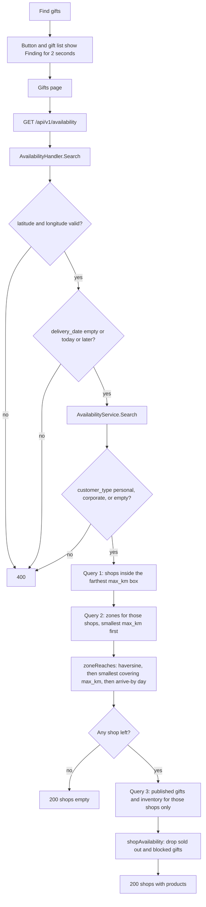
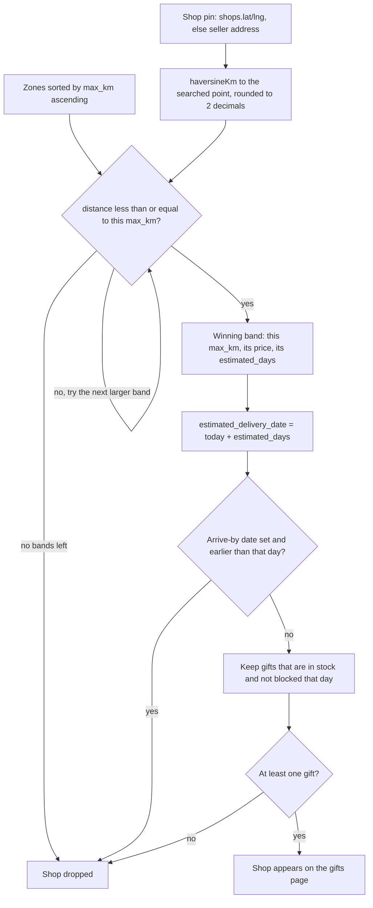
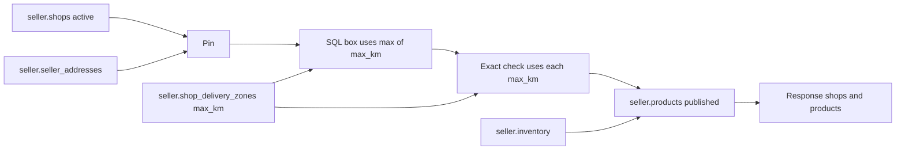

# Find gifts availability

Public search used by **Find gifts**. It answers one question: which published gifts can a shop deliver to this map point, by this day, using that shop's delivery zones.

There is no request body. The address is already a latitude and longitude when the shopper picks a place.

```http
GET /api/v1/availability?latitude=37.77&longitude=-122.42&delivery_date=2026-10-02&customer_type=personal
```

`delivery_date` and `customer_type` are optional. Leave `delivery_date` off for **Any day**.

## Diagrams

One Find gifts click. The button waits about 2 seconds, then the gifts page calls this route once.



How one shop's `max_km` is chosen. The box uses only the largest band. The price uses the smallest band that still covers the straight-line distance.



Which table each step reads.



Call order for one search:

```text
RegisterAvailabilityRoutes
  AvailabilityHandler.Search
    parseCoordinates
    AvailabilityService.Search
      normalizeCustomerType
      AvailabilityRepository.ListShopsInReach     -- SQL box, then load zones
        buildSellerDeliveryOption                 -- called from zoneReaches
          haversineKm
      zoneReaches                                 -- exact max_km + date
      AvailabilityRepository.ListPublishedGifts   -- SQL, only kept shops
      shopAvailability                            -- same zone pick, then gifts
        buildSellerDeliveryOption
        giftCanBeSent
        lowStockLeft
```

| Function | File | What it does |
| --- | --- | --- |
| `RegisterAvailabilityRoutes` | `internal/routes/availability_routes.go` | Mounts public `GET /availability`. No auth. |
| `NewAvailabilityHandler` | `internal/handlers/availability_handler.go` | Stores the service on the handler. |
| `AvailabilityHandler.Search` | same | Reads the query, rejects a bad request, writes JSON. |
| `parseCoordinates` | same | Requires both numbers, latitude −90..90, longitude −180..180. |
| `NewAvailabilityService` | `internal/services/availability_service.go` | Stores the repository. `now` is `time.Now`. |
| `AvailabilityService.Search` | same | Box filter, exact zone, then gifts for the shops that remain. |
| `normalizeCustomerType` | `internal/services/shop_marketplace_service.go` | Empty becomes `personal`. Anything else except `corporate` is an error. |
| `zoneReaches` | `availability_service.go` | True only when a zone covers the point and can arrive in time. |
| `shopAvailability` | same | Builds one shop object, or nil when the shop or all of its gifts fail. |
| `giftCanBeSent` | same | Drops sold-out gifts and gifts blocked on the arrival day. |
| `lowStockLeft` | same | Sets `stock_left` only when sellable stock is at or below the threshold. |
| `buildSellerDeliveryOption` | `internal/services/seller_delivery.go` | Haversine distance, then the smallest `max_km` that still covers it. |
| `haversineKm` | same | Straight-line kilometres between two points. |
| `NewAvailabilityRepository` | `internal/repository/availability_repository.go` | Stores the database pool. |
| `ListShopsInReach` | same | Two queries: shops inside the box, then their zones. |
| `ListPublishedGifts` | same | One query: published gifts and inventory for those shop ids. |

The gifts page calls this once, after the Find gifts button finishes its short wait. The button itself does not call the API.

---

## Query

| Query | Required | Example | What it is |
| --- | --- | --- | --- |
| `latitude` | yes | `37.77` | Destination latitude, −90 to 90. Comes from the picked address. |
| `longitude` | yes | `-122.42` | Destination longitude, −180 to 180. |
| `delivery_date` | no | `2026-10-02` | Arrive-by day, `yyyy-mm-dd`, today or later. Empty means any day. |
| `customer_type` | no | `personal` | `personal` or `corporate`. Empty is treated as `personal`. |

| Status | When |
| --- | --- |
| `400` | Missing or invalid coordinates, bad date, date in the past, or bad `customer_type`. |
| `500` | The database check failed. Body: `could not check gift availability`. |
| `200` | Check finished. `shops` may be an empty array. An empty array means no shop can deliver there. |

---

## Tables the search reads

The shop's pin is `shops.latitude` / `shops.longitude` when those are set. If they are null, the search uses the seller address on `coalesce(address_id, return_address_id)`.

| Table | Rows kept | Columns used | Why |
| --- | --- | --- | --- |
| `seller.shops` | `status = 'active'` | `id`, `name`, `latitude`, `longitude`, `address_id`, `return_address_id`, `status` | The shop that might deliver. Inactive shops are skipped. |
| `seller.seller_addresses` | the shop's address | `id`, `latitude`, `longitude` | Backup pin when the shop row has no coordinates. |
| `seller.shop_delivery_zones` | every zone of a shop that passed the box | `shop_id`, `max_km`, `price_amount`, `currency`, `estimated_days` | The distance bands. `max_km` is the farthest that band reaches. |
| `seller.products` | `status = 'published'`, visibility matches the customer type | `id`, `shop_id`, `name`, `slug`, `description`, `price_amount`, `currency`, `image_url`, `occasion_tags`, `customer_type_visibility` | Gifts to show. Loaded only for shops the zone check kept. |
| `seller.inventory` | left join, so a gift with no stock row is still listed | `available_qty`, `reserved_qty`, `low_stock_threshold`, `unavailable_dates` | Sold-out gifts and blocked days are dropped. Low stock is returned as `stock_left`. |

`is_free` is not a column. It is `true` when `price_amount` is `0`.

### `seller.shop_delivery_zones`

| Column | Meaning |
| --- | --- |
| `max_km` | Upper edge of the band, in kilometres. Must be greater than 0. Unique per shop. |
| `price_amount` | Delivery price in minor units (cents). `5000` with `USD` is $50.00. `0` is free. |
| `currency` | ISO currency code for that price. |
| `estimated_days` | How many days the shop needs. `0` is same day. Default is `1`. |

Example rows for one shop:

| max_km | price_amount | currency | estimated_days | Meaning |
| --- | --- | --- | --- | --- |
| 5 | 0 | USD | 0 | Up to 5 km, free, same day |
| 20 | 5000 | USD | 1 | Up to 20 km, $50, arrives tomorrow |
| 2000 | 12000 | USD | 3 | Up to 2000 km, $120, arrives in 3 days |

---

## How `max_km` is chosen

Distance is a straight line (haversine) from the shop pin to the searched point, rounded to 2 decimals. Earth radius used is 6371 km.

Zones are walked from the **smallest** `max_km` to the largest. The first band where `distance_km <= max_km` wins. That band's price and `estimated_days` are the ones returned.

```text
Shop pin → searched address = 12.40 km

5 km band    12.40 <= 5?    no
20 km band   12.40 <= 20?   yes  → this band
2000 km band                not used

Result: max_km 20, price_amount 5000, estimated_days 1
```

If the distance is past every band, the shop is left out.

```text
distance 2500 km, largest max_km 2000 → shop is not in the response
```

Arrive-by uses the winning band, not the shop as a whole:

```text
estimated_delivery_date = today + estimated_days
```

If the shopper asked for a `delivery_date` and that date is **before** `estimated_delivery_date`, the shop is left out. **Any day** (no `delivery_date`) only checks the distance.

| Distance | Winning `max_km` | Arrive by | Kept? |
| --- | --- | --- | --- |
| 4 km | 5 (same day) | today | yes |
| 12 km | 20 (1 day) | today | no, needs tomorrow |
| 12 km | 20 (1 day) | tomorrow, or Any day | yes |
| 2500 km | none | any | no |

---

## Two-step distance check

Checking every shop with haversine is unnecessary. The search drops far shops in SQL first, then measures the rest exactly.

**1. Bounding box (`ListShopsInReach`).**  
Each shop's farthest zone is `max(max_km)`. One degree of latitude is about 111 km. Longitude degrees get shorter by `cos(latitude)`. The box is 2% larger than that circle so a shop the exact check would keep is not dropped here. Shops with no pin or no zones never enter the box.

**2. Exact zone (`zoneReaches` / `buildSellerDeliveryOption`).**  
Haversine distance, then the smallest covering `max_km`, then the arrive-by date.

Products are queried only for shops that passed step 2.

---

## Which gifts are returned

A shop that can deliver still needs at least one gift that can be sent. Otherwise the shop is omitted.

| Gift | Listed? |
| --- | --- |
| Published, visibility `both` or the requested customer type | yes, if the other rows pass |
| Draft, archived, or the other customer type | no |
| No inventory row | yes (stock was never set) |
| `available_qty - reserved_qty` is 0 or less | no |
| `unavailable_dates` contains the arrival day | no |
| Sellable quantity is at or below `low_stock_threshold` | yes, and `stock_left` is that quantity |
| Sellable quantity is above the threshold | yes, and `stock_left` is omitted |

The arrival day used for blocked dates is `delivery_date` when the shopper set one, otherwise the zone's `estimated_delivery_date`.

---

## Response

```json
{
  "latitude": 37.77,
  "longitude": -122.42,
  "delivery_date": "2026-10-02",
  "shops": [
    {
      "shop_id": "…",
      "shop_name": "Bay Area Gifts",
      "distance_km": 0.8,
      "max_km": 2000,
      "price_amount": 12000,
      "currency": "USD",
      "is_free": false,
      "estimated_days": 3,
      "estimated_delivery_date": "2026-10-03",
      "product_ids": ["…"],
      "products": [
        {
          "id": "…",
          "shop_id": "…",
          "name": "Gift Box USA",
          "slug": "gift-box-usa",
          "description": null,
          "price_amount": 32400,
          "currency": "USD",
          "image_url": null,
          "occasion_tags": [],
          "status": "published",
          "stock_left": 2
        }
      ]
    }
  ]
}
```

| Field | Where it comes from |
| --- | --- |
| `latitude`, `longitude`, `delivery_date` | Echo of the query. `delivery_date` is omitted when Any day. |
| `distance_km` | Haversine from the shop pin to the query point. |
| `max_km` | The winning zone, the smallest band that still covers `distance_km`. |
| `price_amount`, `currency`, `estimated_days` | That same zone row. |
| `is_free` | `price_amount == 0`. |
| `estimated_delivery_date` | Today plus `estimated_days`. |
| `products` | Published gifts of that shop that can be sent. |
| `product_ids` | The same gifts, ids only. |
| `stock_left` | Sellable quantity, only when it is at or below `low_stock_threshold`. |

`shops: []` is a successful search. The address is outside every zone, the arrival day is too soon, or every reachable gift is sold out or blocked that day.

---

## Every function

### `RegisterAvailabilityRoutes`

Mounts `GET /availability` on the public router. The handler is created in `cmd/api/main.go` as `NewAvailabilityHandler(NewAvailabilityService(NewAvailabilityRepository(pool)))`.

### `AvailabilityHandler.Search`

| Step | Check | Result |
| --- | --- | --- |
| 1 | `parseCoordinates(latitude, longitude)` | `400` `latitude and longitude are required` when either is missing, not a number, or out of range. |
| 2 | `delivery_date` if present | Must parse as `2006-01-02`. `400` `delivery_date must be yyyy-mm-dd`. |
| 3 | That day vs today | Compared as `yyyy-mm-dd` strings. `400` `delivery_date must be today or later`. |
| 4 | `AvailabilityService.Search` | `400` if `customer_type` is invalid. `500` `could not check gift availability` on any other error. |
| 5 | Success | `200` and the `GiftAvailability` JSON. |

`parseCoordinates` returns false when either string is empty, `ParseFloat` fails, latitude is outside −90..90, or longitude is outside −180..180.

### `normalizeCustomerType`

| Input | Output |
| --- | --- |
| empty or spaces | `personal` |
| `personal` | `personal` |
| `corporate` | `corporate` |
| anything else | `ErrInvalidCustomerType` → HTTP 400 |

### `AvailabilityService.Search`

| Step | Call | What is kept |
| --- | --- | --- |
| 1 | `ListShopsInReach(latitude, longitude)` | Active shops whose farthest zone might cover the point, each with zones sorted by `max_km` ascending. |
| 2 | `zoneReaches` on each shop | Shops the exact distance and the arrive-by day both allow. |
| 3 | `ListPublishedGifts(reachable shop ids, customer type)` | Published gifts for those shops only. No ids means this query is skipped and returns `[]`. |
| 4 | Group gifts by `shop_id` | |
| 5 | `shopAvailability` on each reachable shop | A shop is appended only when the function returns non-nil. |

`GiftAvailability.Shops` starts as an empty slice, so a search with no match encodes as `"shops": []`, not `null`.

### `zoneReaches`

Calls `buildSellerDeliveryOption` with the shop pin, the query point, and the shop's zones.

| `buildSellerDeliveryOption` result | `zoneReaches` |
| --- | --- |
| nil or `Available == false` | false. Shop is dropped before any product query. |
| `delivery_date` set and `EstimatedDeliveryDate` is after that day | false. String compare works because both values are `yyyy-mm-dd`. |
| otherwise | true |

### `buildSellerDeliveryOption` — how `max_km` is calculated

Zones must already be sorted by `max_km` ascending. The repository query does that.

| Step | Rule | Fields set |
| --- | --- | --- |
| No zones | Stop. | `Available` false, reason `shop has no delivery zones`. |
| Shop latitude or longitude is nil | Stop. | reason `shop location (latitude/longitude) is not set`. |
| Destination latitude or longitude is nil | Stop. | reason `recipient address has no latitude/longitude`. |
| Both points exist | `distance_km = round(haversineKm(...) × 100) / 100`. | `DistanceKm`, `FarthestKm` = last zone's `max_km`. |
| Walk zones | First zone with `distance_km <= max_km` wins. Loop returns immediately. | `Available` true, `MaxKm`, `PriceAmount`, `Currency`, `IsFree` (`price_amount == 0`), `EstimatedDays`, `EstimatedDeliveryDate` = `now + estimated_days` as `yyyy-mm-dd`. |
| No zone covers the distance | Stop after the loop. | `Available` false. Reason includes the distance and `FarthestKm`. |

Worked numbers. Shop zones are 5 km, 20 km, and 2000 km. Distance rounds to 12.40.

| Zone `max_km` | `12.40 <= max_km` | Used? |
| --- | --- | --- |
| 5 | no | skipped |
| 20 | yes | winner: price and days from this row |
| 2000 | not visited | a larger band never overrides a smaller one that already fits |

`estimated_delivery_date` uses `AddDate(0, 0, estimated_days)` on the service clock. `estimated_days` 0 is the same calendar day. `estimated_days` 1 is the next calendar day. It does not look at the time of day.

`shopAvailability` calls `buildSellerDeliveryOption` again with the same inputs, so the price on the response is the same band `zoneReaches` already accepted. It then filters gifts. If every gift fails `giftCanBeSent`, it returns nil and the shop is omitted even though the zone reached.

### `haversineKm`

Great-circle distance. Earth radius is the constant `6371.0` km.

```text
dLat = radians(lat2 - lat1)
dLng = radians(lng2 - lng1)
a = sin(dLat/2)^2 + cos(radians(lat1)) * cos(radians(lat2)) * sin(dLng/2)^2
km = 6371 * 2 * atan2(sqrt(a), sqrt(1-a))
```

This is a straight line on the globe, not a driving route. Rounding to 2 decimals happens in `buildSellerDeliveryOption`, not inside `haversineKm`.

### `giftCanBeSent`

The day passed in is `delivery_date` when the shopper set one, otherwise the winning zone's `estimated_delivery_date`.

| Condition | Result |
| --- | --- |
| Inventory row exists and `available_qty - reserved_qty <= 0` | false |
| No inventory row | still allowed |
| Day is empty | true (no blocked-day check) |
| One `unavailable_dates` value, formatted UTC `yyyy-mm-dd`, equals that day | false |
| otherwise | true |

### `lowStockLeft`

| Condition | `stock_left` |
| --- | --- |
| No inventory row | omitted |
| `sellable = max(0, available_qty - reserved_qty)` is above `low_stock_threshold` | omitted |
| `sellable` is less than or equal to the threshold | that number, including 0 |

Reserved quantity and the threshold are not returned.

---

## Repository queries

`ListShopsInReach` runs two statements. `ListPublishedGifts` runs one, and only after the exact zone check.

### Query 1 — shops inside the farthest-zone box

```sql
with origins as (
    select s.id, s.name,
           coalesce(s.latitude, sa.latitude)::float8 as lat,
           coalesce(s.longitude, sa.longitude)::float8 as lng
    from seller.shops s
    left join seller.seller_addresses sa
      on sa.id = coalesce(s.address_id, s.return_address_id)
    where s.status = 'active'
      and coalesce(s.latitude, sa.latitude) is not null
      and coalesce(s.longitude, sa.longitude) is not null
),
reach as (
    select shop_id, max(max_km)::float8 as farthest_km
    from seller.shop_delivery_zones
    group by shop_id
)
select o.id, o.name, o.lat, o.lng
from origins o
inner join reach r on r.shop_id = o.id
where abs(o.lat - $1) <= (r.farthest_km / 111.0) * 1.02
  and least(abs(o.lng - $2), 360 - abs(o.lng - $2))
      <= (r.farthest_km / greatest(111.0 * abs(cos(radians($1))), 1.0)) * 1.02
order by o.name asc
```

| Placeholder | Value |
| --- | --- |
| `$1` | Destination latitude. |
| `$2` | Destination longitude. |

| Piece | Why it is there |
| --- | --- |
| `coalesce(s.latitude, sa.latitude)` | Shop pin first. If that is null, the address on `address_id`, then `return_address_id`. |
| `status = 'active'` | Inactive shops never match. |
| Both coordinates not null | A shop with no pin cannot be measured, so it is dropped in SQL. |
| `reach.farthest_km = max(max_km)` | The widest band. A shop with no zone rows has no `reach` row, and the inner join drops it. |
| `abs(lat difference) <= (farthest_km / 111) * 1.02` | Latitude box. 111 km is about one degree of latitude. `1.02` makes the box 2% larger than the circle so the exact check is the one that rejects a near miss. |
| `least(abs(lng delta), 360 - abs(lng delta))` | Shortest way around the globe, so a shop near ±180 is not treated as half a world away. |
| `farthest_km / greatest(111 * abs(cos(radians(dest lat))), 1)` | Longitude degrees shrink toward the poles. The `greatest(..., 1)` avoids dividing by a tiny cosine. |
| `order by o.name` | Stable shop order before gifts are attached. |

This box does **not** pick the winning `max_km`. It only answers "could the largest band possibly reach?" A shop 100 km away with a 20 km band is removed here and never gets a haversine call.

### Query 2 — zones for the shops the box kept

Runs only when query 1 returned at least one shop.

```sql
select z.id, z.shop_id, z.max_km::float8, z.price_amount, z.currency,
       z.estimated_days, z.created_at, z.updated_at
from seller.shop_delivery_zones z
where z.shop_id = any($1)
order by z.shop_id, z.max_km asc
```

| Placeholder | Value |
| --- | --- |
| `$1` | UUID array of shop ids from query 1. |

`order by max_km asc` is required. `buildSellerDeliveryOption` takes the first band that fits, so the smallest covering band must be first. After the scan, Go sets `IsFree` when `price_amount` is 0 and appends each zone onto its shop.

### Query 3 — gifts for shops the exact check kept

Skipped entirely when `zoneReaches` kept nobody. The function returns an empty slice and does not hit the database.

```sql
select p.id, p.shop_id, p.name, p.slug, p.description, p.price_amount, p.currency,
       p.image_url, p.occasion_tags,
       i.available_qty, i.reserved_qty, i.low_stock_threshold, i.unavailable_dates
from seller.products p
inner join seller.shops s on s.id = p.shop_id
left join seller.inventory i on i.product_id = p.id
where p.shop_id = any($1)
  and s.status = 'active'
  and p.status = 'published'
  and (p.customer_type_visibility = 'both' or p.customer_type_visibility = $2)
order by p.created_at desc
```

| Placeholder | Value |
| --- | --- |
| `$1` | UUID array of shops that passed `zoneReaches`. |
| `$2` | `personal` or `corporate` from `normalizeCustomerType`. |

| Join / filter | Effect |
| --- | --- |
| `inner join seller.shops` and `s.status = 'active'` | Gift rows for an inactive shop cannot appear. |
| `p.status = 'published'` | Drafts and other statuses stay out. |
| `customer_type_visibility = 'both' or = $2` | A personal shopper does not see corporate-only gifts, and the reverse. |
| `left join seller.inventory` | A published gift with no inventory row is still returned. `HasInventory` stays false, so stock does not remove it. |
| Inventory columns null | `available_qty`, `reserved_qty`, and `low_stock_threshold` are scanned as pointers. A non-null `available_qty` marks `HasInventory`. |

`giftCanBeSent` and `lowStockLeft` run in Go after this query. SQL does not filter sold-out rows or blocked days.

---

## Code for each function

The blocks below are the functions this search actually runs. Products are selected in Go (`ListPublishedGifts` and `shopAvailability`). The gifts page only flattens `shops[].products` into cards.

### Wire-up — `cmd/api/main.go`

```go
availabilityService := services.NewAvailabilityService(repository.NewAvailabilityRepository(pool))
availabilityHandler := handlers.NewAvailabilityHandler(availabilityService)
```

`routes.New` receives `availabilityHandler`. Inside the `/api/v1` group, `internal/routes/router.go` calls:

```go
RegisterAvailabilityRoutes(r, availability)
```

### `RegisterAvailabilityRoutes` — `internal/routes/availability_routes.go`

```go
func RegisterAvailabilityRoutes(r chi.Router, availability *handlers.AvailabilityHandler) {
	r.Get("/availability", availability.Search)
}
```

### `AvailabilityHandler.Search` and `parseCoordinates` — `internal/handlers/availability_handler.go`

```go
func (h *AvailabilityHandler) Search(w http.ResponseWriter, r *http.Request) {
	query := r.URL.Query()
	lat, lng, ok := parseCoordinates(query.Get("latitude"), query.Get("longitude"))
	if !ok {
		utils.Error(w, http.StatusBadRequest, "latitude and longitude are required")
		return
	}
	deliveryDate := query.Get("delivery_date")
	if deliveryDate != "" {
		day, err := time.Parse("2006-01-02", deliveryDate)
		if err != nil {
			utils.Error(w, http.StatusBadRequest, "delivery_date must be yyyy-mm-dd")
			return
		}
		today := time.Now().Format("2006-01-02")
		if day.Format("2006-01-02") < today {
			utils.Error(w, http.StatusBadRequest, "delivery_date must be today or later")
			return
		}
	}

	result, err := h.availability.Search(r.Context(), services.GiftAvailabilityQuery{
		Latitude:     lat,
		Longitude:    lng,
		DeliveryDate: deliveryDate,
		CustomerType: query.Get("customer_type"),
	})
	if err != nil {
		if errors.Is(err, services.ErrInvalidCustomerType) {
			utils.Error(w, http.StatusBadRequest, "customer_type must be personal or corporate")
			return
		}
		log.Printf("gift availability error: %v", err)
		utils.Error(w, http.StatusInternalServerError, "could not check gift availability")
		return
	}
	utils.JSON(w, http.StatusOK, result)
}

func parseCoordinates(latRaw, lngRaw string) (float64, float64, bool) {
	if latRaw == "" || lngRaw == "" {
		return 0, 0, false
	}
	lat, errLat := strconv.ParseFloat(latRaw, 64)
	lng, errLng := strconv.ParseFloat(lngRaw, 64)
	if errLat != nil || errLng != nil || lat < -90 || lat > 90 || lng < -180 || lng > 180 {
		return 0, 0, false
	}
	return lat, lng, true
}
```

### `normalizeCustomerType` — `internal/services/shop_marketplace_service.go`

```go
func normalizeCustomerType(customerType string) (string, error) {
	customerType = strings.TrimSpace(strings.ToLower(customerType))
	if customerType == "" {
		return "personal", nil
	}
	if customerType != "personal" && customerType != "corporate" {
		return "", ErrInvalidCustomerType
	}
	return customerType, nil
}
```

### `AvailabilityService.Search` — `internal/services/availability_service.go`

```go
func (s *AvailabilityService) Search(ctx context.Context, q GiftAvailabilityQuery) (*GiftAvailability, error) {
	customerType, err := normalizeCustomerType(q.CustomerType)
	if err != nil {
		return nil, err
	}
	candidates, err := s.repo.ListShopsInReach(ctx, q.Latitude, q.Longitude)
	if err != nil {
		return nil, err
	}

	now := s.now()
	reachable := make([]repository.ShopForAvailability, 0, len(candidates))
	reachableIDs := make([]uuid.UUID, 0, len(candidates))
	for _, shop := range candidates {
		if !zoneReaches(shop, q, now) {
			continue
		}
		reachable = append(reachable, shop)
		reachableIDs = append(reachableIDs, shop.ID)
	}

	gifts, err := s.repo.ListPublishedGifts(ctx, reachableIDs, customerType)
	if err != nil {
		return nil, err
	}
	byShop := map[uuid.UUID][]repository.GiftStock{}
	for _, gift := range gifts {
		byShop[gift.ShopID] = append(byShop[gift.ShopID], gift)
	}

	out := &GiftAvailability{
		Latitude:     q.Latitude,
		Longitude:    q.Longitude,
		DeliveryDate: q.DeliveryDate,
		Shops:        []ShopGiftAvailability{},
	}
	for _, shop := range reachable {
		matched := shopAvailability(shop, byShop[shop.ID], q, now)
		if matched != nil {
			out.Shops = append(out.Shops, *matched)
		}
	}
	return out, nil
}
```

### `zoneReaches`

```go
func zoneReaches(shop repository.ShopForAvailability, q GiftAvailabilityQuery, now time.Time) bool {
	opt := buildSellerDeliveryOption(shop.Latitude, shop.Longitude, &q.Latitude, &q.Longitude, shop.Zones, now)
	if opt == nil || !opt.Available {
		return false
	}
	if q.DeliveryDate != "" && opt.EstimatedDeliveryDate > q.DeliveryDate {
		return false
	}
	return true
}
```

### `shopAvailability` — attaches that shop's products

```go
func shopAvailability(shop repository.ShopForAvailability, gifts []repository.GiftStock, q GiftAvailabilityQuery, now time.Time) *ShopGiftAvailability {
	opt := buildSellerDeliveryOption(shop.Latitude, shop.Longitude, &q.Latitude, &q.Longitude, shop.Zones, now)
	if opt == nil || !opt.Available {
		return nil
	}
	if q.DeliveryDate != "" && opt.EstimatedDeliveryDate > q.DeliveryDate {
		return nil
	}
	on := q.DeliveryDate
	if on == "" {
		on = opt.EstimatedDeliveryDate
	}

	ids := make([]string, 0, len(gifts))
	products := make([]AvailableProduct, 0, len(gifts))
	for _, gift := range gifts {
		if !giftCanBeSent(gift, on) {
			continue
		}
		ids = append(ids, gift.ID.String())
		tags := gift.OccasionTags
		if tags == nil {
			tags = []string{}
		}
		products = append(products, AvailableProduct{
			ID:           gift.ID.String(),
			ShopID:       gift.ShopID.String(),
			Name:         gift.Name,
			Slug:         gift.Slug,
			Description:  gift.Description,
			PriceAmount:  gift.PriceAmount,
			Currency:     gift.Currency,
			ImageURL:     gift.ImageURL,
			OccasionTags: tags,
			Status:       "published",
			StockLeft:    lowStockLeft(gift),
		})
	}
	if len(ids) == 0 {
		return nil
	}
	return &ShopGiftAvailability{
		ShopID:                shop.ID.String(),
		ShopName:              shop.Name,
		DistanceKm:            opt.DistanceKm,
		MaxKm:                 opt.MaxKm,
		PriceAmount:           opt.PriceAmount,
		Currency:              opt.Currency,
		IsFree:                opt.IsFree,
		EstimatedDays:         opt.EstimatedDays,
		EstimatedDeliveryDate: opt.EstimatedDeliveryDate,
		ProductIDs:            ids,
		Products:              products,
	}
}
```

### `giftCanBeSent` and `lowStockLeft`

```go
func giftCanBeSent(gift repository.GiftStock, on string) bool {
	if gift.HasInventory && gift.AvailableQty-gift.ReservedQty <= 0 {
		return false
	}
	if on == "" {
		return true
	}
	for _, blocked := range gift.UnavailableDates {
		if blocked.UTC().Format("2006-01-02") == on {
			return false
		}
	}
	return true
}

func lowStockLeft(gift repository.GiftStock) *int {
	if !gift.HasInventory {
		return nil
	}
	sellable := gift.AvailableQty - gift.ReservedQty
	if sellable < 0 {
		sellable = 0
	}
	if sellable > gift.LowStockThreshold {
		return nil
	}
	left := sellable
	return &left
}
```

### `buildSellerDeliveryOption` and `haversineKm` — `internal/services/seller_delivery.go`

```go
func buildSellerDeliveryOption(fromLat, fromLng, toLat, toLng *float64, zones []models.ShopDeliveryZone, now time.Time) *SellerDeliveryOption {
	opt := &SellerDeliveryOption{Mode: SellerDeliveryModeName}
	if len(zones) == 0 {
		opt.Reason = "shop has no delivery zones"
		return opt
	}
	opt.FarthestKm = zones[len(zones)-1].MaxKm
	if fromLat == nil || fromLng == nil {
		opt.Reason = "shop location (latitude/longitude) is not set"
		return opt
	}
	if toLat == nil || toLng == nil {
		opt.Reason = "recipient address has no latitude/longitude"
		return opt
	}
	km := math.Round(haversineKm(*fromLat, *fromLng, *toLat, *toLng)*100) / 100
	opt.DistanceKm = &km
	for _, z := range zones {
		if km <= z.MaxKm {
			opt.Available = true
			opt.MaxKm = z.MaxKm
			opt.PriceAmount = z.PriceAmount
			opt.Currency = z.Currency
			opt.IsFree = z.PriceAmount == 0
			opt.EstimatedDays = z.EstimatedDays
			opt.EstimatedDeliveryDate = now.AddDate(0, 0, z.EstimatedDays).Format("2006-01-02")
			return opt
		}
	}
	opt.Reason = fmt.Sprintf("recipient is %.2f km away; the farthest delivery zone is %.2f km", km, opt.FarthestKm)
	return opt
}

func haversineKm(lat1, lng1, lat2, lng2 float64) float64 {
	const earthRadiusKm = 6371.0
	toRad := func(d float64) float64 { return d * math.Pi / 180 }
	dLat := toRad(lat2 - lat1)
	dLng := toRad(lng2 - lng1)
	a := math.Sin(dLat/2)*math.Sin(dLat/2) +
		math.Cos(toRad(lat1))*math.Cos(toRad(lat2))*math.Sin(dLng/2)*math.Sin(dLng/2)
	return earthRadiusKm * 2 * math.Atan2(math.Sqrt(a), math.Sqrt(1-a))
}
```

### `ListShopsInReach` — `internal/repository/availability_repository.go`

```go
func (r *AvailabilityRepository) ListShopsInReach(ctx context.Context, destLat, destLng float64) ([]ShopForAvailability, error) {
	rows, err := r.db.Query(ctx, `
		with origins as (
			select s.id, s.name,
			       coalesce(s.latitude, sa.latitude)::float8 as lat,
			       coalesce(s.longitude, sa.longitude)::float8 as lng
			from seller.shops s
			left join seller.seller_addresses sa on sa.id = coalesce(s.address_id, s.return_address_id)
			where s.status = 'active'
			  and coalesce(s.latitude, sa.latitude) is not null
			  and coalesce(s.longitude, sa.longitude) is not null
		),
		reach as (
			select shop_id, max(max_km)::float8 as farthest_km
			from seller.shop_delivery_zones
			group by shop_id
		)
		select o.id, o.name, o.lat, o.lng
		from origins o
		inner join reach r on r.shop_id = o.id
		where abs(o.lat - $1) <= (r.farthest_km / 111.0) * 1.02
		  and least(abs(o.lng - $2), 360 - abs(o.lng - $2))
		      <= (r.farthest_km / greatest(111.0 * abs(cos(radians($1))), 1.0)) * 1.02
		order by o.name asc`, destLat, destLng)
	if err != nil {
		return nil, err
	}
	defer rows.Close()

	shops := []ShopForAvailability{}
	index := map[uuid.UUID]int{}
	for rows.Next() {
		var shop ShopForAvailability
		if err := rows.Scan(&shop.ID, &shop.Name, &shop.Latitude, &shop.Longitude); err != nil {
			return nil, err
		}
		shop.Zones = []models.ShopDeliveryZone{}
		index[shop.ID] = len(shops)
		shops = append(shops, shop)
	}
	if err := rows.Err(); err != nil {
		return nil, err
	}
	if len(shops) == 0 {
		return shops, nil
	}

	ids := make([]uuid.UUID, len(shops))
	for i := range shops {
		ids[i] = shops[i].ID
	}
	zoneRows, err := r.db.Query(ctx, `
		select z.id, z.shop_id, z.max_km::float8, z.price_amount, z.currency, z.estimated_days, z.created_at, z.updated_at
		from seller.shop_delivery_zones z
		where z.shop_id = any($1)
		order by z.shop_id, z.max_km asc`, ids)
	if err != nil {
		return nil, err
	}
	defer zoneRows.Close()
	for zoneRows.Next() {
		var z models.ShopDeliveryZone
		if err := zoneRows.Scan(&z.ID, &z.ShopID, &z.MaxKm, &z.PriceAmount, &z.Currency, &z.EstimatedDays, &z.CreatedAt, &z.UpdatedAt); err != nil {
			return nil, err
		}
		z.IsFree = z.PriceAmount == 0
		if i, ok := index[z.ShopID]; ok {
			shops[i].Zones = append(shops[i].Zones, z)
		}
	}
	return shops, zoneRows.Err()
}
```

### `ListPublishedGifts` — products for the shops that passed

```go
func (r *AvailabilityRepository) ListPublishedGifts(ctx context.Context, shopIDs []uuid.UUID, customerType string) ([]GiftStock, error) {
	if len(shopIDs) == 0 {
		return []GiftStock{}, nil
	}
	rows, err := r.db.Query(ctx, `
		select p.id, p.shop_id, p.name, p.slug, p.description, p.price_amount, p.currency, p.image_url,
		       p.occasion_tags,
		       i.available_qty, i.reserved_qty, i.low_stock_threshold, i.unavailable_dates
		from seller.products p
		inner join seller.shops s on s.id = p.shop_id
		left join seller.inventory i on i.product_id = p.id
		where p.shop_id = any($1)
		  and s.status = 'active'
		  and p.status = 'published'
		  and (p.customer_type_visibility = 'both' or p.customer_type_visibility = $2)
		order by p.created_at desc`, shopIDs, customerType)
	if err != nil {
		return nil, err
	}
	defer rows.Close()

	items := []GiftStock{}
	for rows.Next() {
		var item GiftStock
		var available, reserved, threshold *int
		var blocked []time.Time
		if err := rows.Scan(
			&item.ID, &item.ShopID, &item.Name, &item.Slug, &item.Description, &item.PriceAmount, &item.Currency, &item.ImageURL,
			&item.OccasionTags, &available, &reserved, &threshold, &blocked,
		); err != nil {
			return nil, err
		}
		if item.OccasionTags == nil {
			item.OccasionTags = []string{}
		}
		if available != nil {
			item.HasInventory = true
			item.AvailableQty = *available
			if reserved != nil {
				item.ReservedQty = *reserved
			}
			if threshold != nil {
				item.LowStockThreshold = *threshold
			}
			item.UnavailableDates = blocked
		}
		items = append(items, item)
	}
	return items, rows.Err()
}
```

### Frontend — one request, then draw `shops[].products`

`src/api/availability.ts` does not load `/shops/{id}/products`. It only calls availability:

```ts
export function searchGiftAvailability(input: {
  latitude: number
  longitude: number
  deliveryDate?: string
  customerType?: 'personal' | 'corporate'
}) {
  const query = new URLSearchParams({
    latitude: String(input.latitude),
    longitude: String(input.longitude),
  })
  if (input.deliveryDate) query.set('delivery_date', input.deliveryDate)
  if (input.customerType) query.set('customer_type', input.customerType)
  return api<GiftAvailability>(`/availability?${query.toString()}`, { auth: false })
}
```

`src/pages/products-page.tsx` turns each embedded product into a card. Occasion and name filters run on this list only.

```ts
searchGiftAvailability({
  latitude,
  longitude,
  deliveryDate: arrivalDate,
}).then((result) => {
  const matched = result.shops.flatMap((shop) =>
    (shop.products ?? []).map((gift) => productFromSearch(shop, gift)),
  )
  registerCatalogProducts(matched)
  setCatalog(matched)
})
```

```ts
function productFromSearch(shop: ShopGiftAvailability, gift: AvailabilityProduct): CatalogProduct {
  const product: Product = {
    id: gift.id,
    shop_id: gift.shop_id,
    name: gift.name,
    slug: gift.slug,
    description: gift.description,
    product_type: 'gift',
    price_amount: gift.price_amount,
    currency: gift.currency,
    status: 'published',
    occasion_tags: gift.occasion_tags ?? [],
    customer_type_visibility: 'both',
    points_display_enabled: false,
    prep_minutes: 0,
    created_at: '',
    updated_at: '',
    image_url: gift.image_url,
    stock_left: gift.stock_left,
  }
  const shopCard: Shop = {
    id: shop.shop_id,
    seller_id: shop.shop_id,
    name: shop.shop_name,
    slug: '',
    status: 'active',
    created_at: '',
    updated_at: '',
  }
  return catalogProductFromApi(product, shopCard)
}
```
