# Login with a one-time code, and gift reviews

This document covers two features that share the same machinery:

1. **Login (and sign-up) with a one-time code (OTP)** sent by SMS or email.
2. **Gift reviews:** when an order is delivered, the buyer and the recipient are
   told, and the recipient can review the gift by signing in with an OTP, with an
   account made for them if they have none.

Backend: `SendAGift_GO` (Go, chi, pgx, Postgres). Frontend: `send-agift-frontend`
(React, Vite, react-router).

---

## 1. The big picture

```
Seller marks delivered
        │
        ▼
orders.status = 'delivered'
        │   (background job, every minute)
        ▼
GiftRecipientService.NotifyDelivered
   ├─ email the BUYER      → "Delivered, review your order"      (link: /orders/{id})
   ├─ email the RECIPIENT  → "X sent you a gift"                 (link: review link)
   └─ SMS  the RECIPIENT   → "X sent you a gift, review it here" (link: review link)
        │
        ▼
Recipient opens  /login?review=<token>&next=/account/gifts?order=<orderId>
        │   login page opens on the "One-time code" tab
        ▼
POST /gift-reviews/{token}/code    →  OTP sent to the address the link was sent to
POST /gift-reviews/{token}/verify  →  OTP checked, account found or created, JWT returned
        │
        ▼
/account/gifts?order=<orderId>  →  review form opens for the first unreviewed item
        │
        ▼
POST /customers/me/order-items/{id}/reviews   (existing review API)
```

Everything sent (email and SMS) goes through an **outbox table** and is delivered
by a background loop, so a slow or failing provider never blocks a request.

---

## 2. Database

All changes for the OTP work are in
`internal/database/migrations/000064_customer_login_codes.up.sql` (and `.down.sql`).

### `customer.customers`: new columns

| Column | Meaning |
|---|---|
| `phone_e164` | The phone in E.164 form (`+94771234567`). |
| `phone_verified_at` | Set when the owner proved the phone with a code. |
| `email_verified_at` | Set when the owner proved the email with a code. |

A partial unique index `customers_verified_phone_uq` makes a verified number belong
to **one live account**. A phone only signs you in once it has been verified.

### `core.login_codes`: the live OTP per destination

One row per `(channel, destination, purpose)`.

| Column | Meaning |
|---|---|
| `channel` | `email` or `sms` |
| `destination` | normalised email, or E.164 phone |
| `purpose` | `login` or `verify_phone` |
| `customer_id` | set for `verify_phone` (the code belongs to that customer) |
| `code_hash` | bcrypt hash of the 6-digit code. Empty once spent. |
| `expires_at` | codes live 5 minutes |
| `sent_at` | last send, used for the 60-second cooldown |
| `window_start`, `send_count`, `attempts` | daily counters (see limits below) |

### `core.sms_outbox`: texts waiting to be sent

`kind`, `dedupe_key` (unique), `to_phone`, `body`, `status`
(`pending`/`sent`/`failed`), `attempts`, `last_error`, `next_attempt_at`, `sent_at`.

### `core.email_outbox` (existing, migration 000054)

Same idea for emails: rendered subject, HTML and text are stored, then sent.

### `marketplace.orders` (existing columns used)

| Column | Meaning |
|---|---|
| `recipient_customer_id` | The recipient's account, once linked. Lets them see and review the gift. |
| `recipient_notified_at` | Set when the delivered notices were sent, so they go out once. |

### Reviews (existing)

`marketplace.product_reviews`, one review per `order_item_id`. Only the **buyer**
(`orders.customer_id`) or the **recipient** (`orders.recipient_customer_id`) may
review an item, and only when `fulfilment_status = 'delivered'`.

### Which migration created what (nothing new was added for the review feature)

| Table or column | Migration | Status |
|---|---|---|
| `core.login_codes` | `000064_customer_login_codes` | part of the OTP work, **untracked in git, commit it** |
| `core.sms_outbox` | `000064_customer_login_codes` | same |
| `customer.customers.phone_e164`, `phone_verified_at`, `email_verified_at` | `000064_customer_login_codes` | same |
| `customers_verified_phone_uq` (unique index) | `000064_customer_login_codes` | same |
| `core.email_outbox` | `000054_email_notifications` | existing |
| `marketplace.orders.recipient_customer_id`, `recipient_notified_at` | `000054_email_notifications` | existing |
| `marketplace.product_reviews` (+ media tables) | `000027_create_product_reviews` | existing |
| `customer.recipients` (name, email, phone) | `000010_create_recipients` | existing |

The gift review feature added **no table and no migration**. The review link is a signed
JWT, so nothing about the link is stored. Migrations run automatically at startup
(`MigrateUp` in `cmd/api/main.go`), so `000064` is applied the first time the API starts.

---

## 3. Login with OTP

### Routes (`internal/routes/login_code_routes.go`)

| Method and path | Auth | Handler | What it does |
|---|---|---|---|
| `POST /api/v1/customers/login/code` | none, 10/min per IP | `LoginCodeHandler.RequestCode` | Sends a code to an email or phone. Same answer whether or not an account exists. |
| `POST /api/v1/customers/login/code/verify` | none, 10/min per IP | `LoginCodeHandler.VerifyCode` | Checks the code. Returns `signed_in` + JWT, or `needs_signup` + a short-lived sign-up token. |
| `POST /api/v1/customers/me/phone/code` | customer JWT | `RequestPhoneCode` | Sends a code to a phone the signed-in customer wants to verify. |
| `POST /api/v1/customers/me/phone/verify` | customer JWT | `VerifyPhone` | Confirms that phone. |

Request body for the first two: `{ "channel": "email" | "sms", "destination": "...", "code": "123456" }`.

### Files

| Layer | File |
|---|---|
| Routes | `internal/routes/login_code_routes.go` (mounted in `internal/routes/router.go`) |
| Handler | `internal/handlers/login_code_handler.go` |
| Service | `internal/services/login_code_service.go` |
| OTP storage | `internal/repository/login_code_repository.go` |
| Phone parsing | `internal/services/phone.go` (`NormalizePhone` → E.164, `maskPhone`) |
| Customer lookups | `internal/repository/customer_repository.go` (`CustomerIDByVerifiedPhone`, `SetVerifiedPhone`, `MarkEmailVerified`) |
| Sign-up with a verified code | `internal/services/customer_service.go` (`Register` accepts `signup_token`) |

### How a code is issued (`LoginCodeService.issue`)

1. Look up the live code row. Enforce: 60 s cooldown, max **5 sends/day**,
   max **10 wrong tries/day** (counted from `window_start`, so resending does not
   give new guesses).
2. Generate a 6-digit code, **hash it** (bcrypt), save the hash with a 5-minute expiry.
3. Queue the email or SMS (see section 5). The code itself is never stored in plain
   text in `login_codes`.

### How a code is checked (`LoginCodeService.check`)

Right length → row exists → not locked → not expired → bcrypt compare. A wrong
code increments `attempts`. A right code is **consumed** (hash cleared), so it
works once.

### After a correct code (`VerifyLoginCode`)

- Account found (by email, or by verified phone): mark that address verified,
  return a customer JWT (`status: "signed_in"`).
- No account: return a **sign-up token** (JWT with `use: code_signup`, 20 minutes,
  no role so it can never act as a session) and `status: "needs_signup"`. The
  frontend sends the person to `/register` with the phone or email already proven
  and locked; `Register` reads the token and marks it verified.

### Frontend for OTP login

| File | Role |
|---|---|
| `src/api/auth.ts` | `requestLoginCode`, `verifyLoginCode`, `requestPhoneCode`, `verifyPhoneCode` |
| `src/features/auth/code-login-panel.tsx` | Phone/Email buttons, send code, enter code, resend timer |
| `src/features/auth/login-form.tsx` | Password / One-time code toggle; on `signed_in` calls `login(token)`, on `needs_signup` navigates to `/register` with the proof in router state |
| `src/features/auth/customer-register-form.tsx` | Pre-fills and locks the proven phone/email, sends `signup_token` to `POST /customers/register` |
| `src/features/account/verify-phone-card.tsx` | "Verify phone" on the profile page |

---

## 4. Gift review feature

### Step A: the seller marks delivered

The seller's delivered action (for example
`POST /sellers/me/orders/{orderID}/shops/{shopID}/shipping/local/delivered`)
sets the order items and, once every shop is done, the order to `delivered`.

### Step B: the delivered notice (`internal/services/gift_recipient_service.go`)

`RunDeliveredNotices` runs **every minute** (started in `cmd/api/main.go`, guarded by
a Postgres advisory lock so only one server does it). It picks orders where
`status = 'delivered' AND recipient_notified_at IS NULL` and, for each:

| Who | Channel | Content | Code |
|---|---|---|---|
| Buyer | Email | "Your gift has reached X", button **Review your order** → `/orders/{orderId}`. Skipped if buyer and recipient are the same person. | `EmailService.SendOrderDelivered`, template `renderOrderDelivered` |
| Recipient (if they have an email) | Email | "X sent you a gift", button → review link | `EmailService.SendGiftDelivered`, template `renderGiftDelivered` |
| Recipient (if they have a phone) | SMS | "X sent you a gift on SendAGift and it has been delivered! Review it here: <link>" | `SMSService.SendGiftDelivered` |

Then `recipient_notified_at` is set so it never repeats. Dedupe keys
(`order_delivered:<id>`, `gift_delivered:<id>`, `gift_delivered:<id>:<phone>`)
protect against duplicates if a run is retried. A failed order is left unmarked and
retried next minute. A phone that cannot be parsed is logged and skipped.

### Step C: the review link

`GiftRecipientService.reviewLink` builds:

```
{APP_WEB_URL}/login?review=<token>&next=/account/gifts?order=<orderId>
```

`<token>` is a signed JWT (`internal/services/gift_review_service.go`):
`{use: "gift_review", order_id, channel, destination}`, valid **60 days**, signed
with the server's JWT secret, with **no role**, so it cannot be used as a session. It proves
"this order was sent to this email or phone". It does not by itself log anyone in.

### Step D: sign in with a code from the link

Routes (`internal/routes/gift_review_routes.go`, public, 10/min per IP):

| Method and path | Handler | What it does |
|---|---|---|
| `GET /api/v1/gift-reviews/{token}` | `GiftReviewHandler.Preview` | Gift summary: order number, sender, items, channel, **masked** destination (`a***@x.com`, `+947*****567`). |
| `POST /api/v1/gift-reviews/{token}/code` | `GiftReviewHandler.RequestCode` | Sends an OTP to the address **inside the token** (the client cannot choose another). |
| `POST /api/v1/gift-reviews/{token}/verify` | `GiftReviewHandler.Verify` | Checks the OTP, finds or creates the account, links the order, returns a customer JWT. |

`GiftReviewService.Verify` does:

1. Parse the token; `LoginCodeService.VerifyDestination` checks and spends the OTP.
2. `accountFor` picks the account:
   - the order's `recipient_customer_id` if already linked; else
   - an existing account for that email / verified phone; else
   - **creates one** (country from the order, display name from the recipient,
     random password the person never sees, `password_change_required = true`).
     For an email recipient the account uses that email. For a phone-only recipient
     it uses a placeholder `<digits>@phone.sendagift.invalid` (cannot receive mail)
     and the verified phone.
3. Marks the email/phone verified, links the order (`SetRecipientCustomer`), and
   signs the customer JWT.

Such an account has no usable password: the person signs in with a code. They can
set a password later through the existing password-reset flow.

If a phone-only recipient later verifies their number any other way
(login, sign-up or profile), `CustomerRepository.ClaimGiftsByPhone` links any
delivered orders addressed to that number to the account.

### Step E: add the review

After `verify` returns a JWT, the frontend stores it and goes to
`/account/gifts?order=<orderId>`. That page moves the order to the top and **opens the
review form** for its first unreviewed, delivered item. The form posts to the
existing review API (`internal/routes/product_review_routes.go`):

```
POST /api/v1/customers/me/order-items/{orderItemId}/reviews   (customer JWT)
```

`ProductReviewService.Create` calls `OrderRepository.GetItemForReviewer`, which only
returns the item if the caller is the **buyer or the recipient**, and rejects items
that are not `delivered`. One review per item (a second returns "already exists").

### Frontend for the review link

| File | Role |
|---|---|
| `src/features/auth/login-form.tsx` | Opens on the One-time code tab when the URL has `?review=` and passes the token to the panel |
| `src/features/auth/code-login-panel.tsx` | **Review mode:** loads `GET /gift-reviews/{token}` to show the masked destination, sends the code via `/gift-reviews/{token}/code`, verifies via `/gift-reviews/{token}/verify`, then calls `login(jwt)` |
| `src/features/auth/auth-context.tsx` | `login()` stores the session and navigates to `?next=` |
| `src/features/auth/protected-route.tsx` | `GuestRoute` also honours `?next=` so an already signed-in customer who clicks the link still reaches the gift |
| `src/app/router.tsx` | `/review/:token` redirects to the login page's code tab (or straight to `/account/gifts` if signed in) |
| `src/pages/customer-received-gifts-page.tsx` | Reads `?order=`, shows that order first, auto-opens the form |
| `src/features/reviews/review-order-item-button.tsx` | `defaultOpen` prop opens the dialog; submits to the review API |
| `src/api/reviews.ts` | `createReview(orderItemId, body)` |

---

## 5. How email and SMS are sent

### The outbox pattern (same for both)

```
service.queue(...)  →  INSERT into core.email_outbox / core.sms_outbox   (dedupe_key unique)
                    →  Wake() the delivery loop
delivery loop       →  SELECT due rows (status='pending', next_attempt_at <= now())
                    →  call the provider
                    →  success: status='sent'   failure: retry later, or 'failed'
```

The loops are started in `cmd/api/main.go` and run on one server at a time using a
Postgres advisory lock (`internal/database/lock.go`: `LockEmailDelivery`,
`LockSMSDelivery`, `LockGiftDeliveryNotices`).

### Email: `internal/services/email_service.go`

- Provider: **ZeptoMail** (`ZeptoMailSender`). Subject, HTML and plain-text are
  rendered by `internal/services/email_templates.go` and stored in the outbox.
- Retries: up to 6 attempts, backing off 1, 4, 9, 16, 25 minutes. A rejected
  request (4xx) is not retried; throttling and auth errors are.
- OTP email: `SendLoginCode`. Gift emails: `SendOrderDelivered`, `SendGiftDelivered`.
- Links in emails use `APP_WEB_URL`.

### SMS: `internal/services/sms_service.go`

- Provider: **textbee.dev** (`TextBeeSender`): `POST {TEXTBEE_API_BASE}/gateway/devices/{deviceId}/send-sms`
  with header `x-api-key`. Messages leave from your Android phone's SIM.
- Retries: up to 3 attempts, 30 s apart. A 4xx (except 429) is permanent.
- Without `TEXTBEE_API_KEY`, messages still queue in `core.sms_outbox` and are
  sent once a key is set.
- OTP text: `SendLoginCode`. Gift text: `SendGiftDelivered`.
- `repository/sms_repository.go` holds the outbox queries.

### Configuration (`.env`, read by `internal/config/config.go`)

| Variable | Purpose |
|---|---|
| `APP_WEB_URL` | Base URL for links in emails and SMS (e.g. `http://localhost:5173`) |
| `TEXTBEE_API_KEY`, `TEXTBEE_DEVICE_ID` | Both set, or neither. Enables real SMS. |
| `TEXTBEE_API_BASE` | Defaults to `https://api.textbee.dev/api/v1` |
| `TEXTBEE_SIM_SUBSCRIPTION_ID` | Optional, to pick a SIM |
| `TEXTBEE_DEFAULT_COUNTRY_CODE` | Reads local numbers (`0771234567`) as E.164. Check this matches your market (`+94` Sri Lanka, `+61` Australia). |
| ZeptoMail token and sender settings | Existing email configuration |

> The service currently prints each OTP to the API log
> (`log.Printf("OTP %s to %s: %s", ...)` in `LoginCodeService.issue`). That is handy
> locally but **must be removed before production**.

---

## 6. Wiring (`cmd/api/main.go`)

```
emailService  → delivery loop
smsService    → delivery loop
giftRecipientService.SendSMSWith(smsService, APP_WEB_URL, defaultCountryCode)
giftRecipientService.UseReviewLinks(JWT_SECRET)
loginCodeService   = NewLoginCodeService(codes, customers, email, sms, ...)
customerService.UseCodeSignups(loginCodeService)
giftReviewService  = NewGiftReviewService(orders, customers, loginCodeService, ...)
routes.New(..., loginCodeHandler, giftReviewHandler, jwtSecret)
```

---

## 7. Security notes

- Codes are stored hashed, expire in 5 minutes, work once, and are rate limited per
  destination and per IP.
- The "send code" answer never reveals whether an account exists.
- The sign-up token and review token have **no role**, so `RequireRole("customer")`
  rejects them if one is ever sent as a session (see section 10.4).
- The review link only lets you request a code for the address in the token, so
  holding the link alone is not enough to sign in. You still need the code.
- Only the buyer or the recipient of an order can review its items.
- Phone-only accounts use a placeholder `.invalid` email until the person adds a
  real one.

## 8. API reference: requests and responses

Base URL: `http://localhost:8080/api/v1` (port from `APP_PORT`). All bodies are JSON.
Errors always look like `{ "error": "message" }`. Handlers write them with
`utils.Error` (see `internal/utils/response.go`).

### 8.1 Request a login code

`POST /customers/login/code` (no auth)

```json
// request, by SMS
{ "channel": "sms", "destination": "0771234567" }

// request, by email
{ "channel": "email", "destination": "alex@example.com" }
```

```json
// 202 Accepted: same answer whether or not an account exists
{ "message": "If that is yours, a code is on its way." }
```

| Status | `error` | Why |
|---|---|---|
| 400 | `choose phone or email` | `channel` is not `sms` or `email` |
| 400 | `enter a valid phone number` | the phone cannot be parsed |
| 400 | `enter a valid email` | no `@` |
| 429 | `wait a minute before asking for another code` | asked again within 60 s |
| 429 | `too many codes sent here today. Try again tomorrow` | 5 sends in the 24-hour window |
| 429 | `too many wrong codes. Try again tomorrow or contact support` | 10 wrong tries in the window |

### 8.2 Verify the code (sign in, or start sign-up)

`POST /customers/login/code/verify` (no auth)

```json
// request
{ "channel": "sms", "destination": "0771234567", "code": "325217" }
```

```json
// 200: the number or email belongs to an account
{ "status": "signed_in", "token": "<customer JWT>", "role": "customer" }
```

```json
// 200: nobody uses it yet. The code proved they hold it.
{
  "status": "needs_signup",
  "signup_token": "<JWT, 20 minutes, no role>",
  "channel": "sms",
  "destination": "+94771234567"
}
```

| Status | `error` | Why |
|---|---|---|
| 422 | `that code is not right` | wrong digits (counts toward the 10-try limit) |
| 422 | `that code has expired. Send a new one` | older than 5 minutes, already used, or never sent |
| 429 | `too many wrong codes...` | locked for the window |

The `token` is sent as `Authorization: Bearer <token>` on later calls.

### 8.3 Finish sign-up after `needs_signup`

`POST /customers/register` (no auth). The frontend adds `signup_token`, and the
server then marks that email or phone as verified.

```json
{
  "country_id": "0b6f…",
  "email": "alex@example.com",
  "password": "at-least-8-chars",
  "phone": "+94771234567",
  "display_name": "Alex",
  "signup_token": "<from needs_signup>"
}
```

A token that is expired or does not match the email returns
`400 your sign-up session expired. Ask for a new code`. A phone someone else already
verified returns `422 this phone number is already verified on another account`.

### 8.4 Verify a phone on the profile

Both need `Authorization: Bearer <customer JWT>`.

```json
// POST /customers/me/phone/code      →  202 { "message": "Code sent." }
{ "phone": "0771234567" }

// POST /customers/me/phone/verify    →  200 { "message": "Phone verified." }
{ "phone": "0771234567", "code": "325217" }
```

`409 this phone number is already verified on another account` if another live
account verified it first.

### 8.5 Gift review link

No auth. `{token}` is the signed review token from the email or SMS.

**`GET /gift-reviews/{token}`**

```json
// 200
{
  "order_number": "SAG-10042",
  "sender_name": "test",
  "channel": "email",
  "destination": "a***@example.com",
  "items": [
    {
      "id": "6c1e…",
      "product_id": "91ad…",
      "product_name": "chech preparing time 6 hours",
      "product_image_url": "https://…",
      "shop_name": "KANDY SHOP",
      "quantity": 1,
      "fulfilment_status": "delivered",
      "review_id": null
    }
  ]
}
```

**`POST /gift-reviews/{token}/code`** (no body)

```json
// 202
{ "message": "A code is on its way." }
```

The code always goes to the address inside the token, never to an address the client
supplies.

**`POST /gift-reviews/{token}/verify`**

```json
// request
{ "code": "325217" }

// 200
{ "token": "<customer JWT>", "role": "customer", "account_created": true }
```

| Status | `error` | Why |
|---|---|---|
| 404 | `this review link is not valid any more` | bad, tampered, expired (60 days) or unknown-order token |
| 409 | `this email belongs to another kind of account. Sign in to review your gift` | the email is a seller or admin login |
| 422 / 429 | same as 8.2 | wrong or expired code, or rate limit |

### 8.6 Add the review

`POST /customers/me/order-items/{orderItemId}/reviews` with
`Authorization: Bearer <customer JWT>`.

```json
{
  "rating": 5,
  "product_quality_rating": 5,
  "shipping_rating": 4,
  "seller_service_rating": 5,
  "title": "Lovely",
  "body": "Arrived on time and was beautifully packed.",
  "is_anonymous": false,
  "media": []
}
```

`201` returns the saved review. `400 order item must be delivered and belong to you`
if the caller is neither the buyer nor the recipient, or the item is not delivered.
A second review of the same item is refused as a duplicate.

### 8.7 What the notices contain

| Message | Sent to | Link |
|---|---|---|
| Email "Your gift has reached X" | buyer | `{APP_WEB_URL}/orders/{orderId}` |
| Email "X sent you something special" | recipient | `{APP_WEB_URL}/login?review=<token>&next=%2Faccount%2Fgifts%3Forder%3D<orderId>` |
| SMS "X sent you a gift on SendAGift and it has been delivered! Review it here: <link>" | recipient | the same login link |
| OTP email "Your sign-in code" / SMS "325217 is your SendAGift code. It expires in 5 minutes. Never share it." | whoever asked | none |

---

## 9. Code walkthrough

Each snippet is the real code, shortened where marked. The explanation follows it.

### 9.1 Issuing a code: `LoginCodeService.issue` (`login_code_service.go`)

```go
func (s *LoginCodeService) issue(ctx context.Context, channel, dest, purpose string, customerID *uuid.UUID) error {
	now := time.Now().UTC()
	cur, err := s.codes.Get(ctx, channel, dest, purpose)
	switch {
	case err == nil:
		fresh := now.Sub(cur.WindowStart) >= loginCodeWindow
		if now.Sub(cur.SentAt) < loginCodeCooldown {
			return ErrLoginCodeWait          // 60 second cooldown
		}
		if !fresh && cur.Attempts >= loginCodeDailyWrong {
			return ErrLoginCodeLocked        // 10 wrong tries today
		}
		if !fresh && cur.SendCount >= loginCodeDailySends {
			return ErrLoginCodeTooMany       // 5 sends today
		}
	case !errors.Is(err, repository.ErrLoginCodeNotFound):
		return err
	}

	code, err := newEmailCode()              // 6 random digits from crypto/rand
	hash, err := utils.HashPassword(code)    // bcrypt: only the hash is stored
	err = s.codes.Save(ctx, channel, dest, purpose, customerID, hash, now.Add(loginCodeTTL))

	if channel == ChannelSMS {
		return s.sms.SendLoginCode(ctx, dest, code, loginCodeTTL)
	}
	return s.email.SendLoginCode(ctx, dest, code, loginCodeTTL)
}
```

- The `window_start` makes the limits per day: resending does not reset the wrong-try
  counter, so asking for a new code is not a way to get more guesses.
- `newEmailCode` uses `crypto/rand`, so codes cannot be predicted.
- The plain code exists only in memory and in the outgoing email or SMS. The
  database holds the bcrypt hash.
- The `log.Printf("OTP ...")` line in this function is for local development. Remove it for production.

### 9.2 Checking a code: `LoginCodeService.check`

```go
func (s *LoginCodeService) check(ctx context.Context, channel, dest, purpose, code string, customerID *uuid.UUID) error {
	code = strings.TrimSpace(code)
	if len(code) != emailCodeLength { return ErrLoginCodeWrong }

	cur, err := s.codes.Get(ctx, channel, dest, purpose)
	if errors.Is(err, repository.ErrLoginCodeNotFound) { return ErrLoginCodeExpired }

	now := time.Now().UTC()
	if cur.Attempts >= loginCodeDailyWrong && now.Sub(cur.WindowStart) < loginCodeWindow {
		return ErrLoginCodeLocked
	}
	if cur.CodeHash == "" || !cur.ExpiresAt.After(now) { return ErrLoginCodeExpired }

	wrongOwner := customerID != nil && (cur.CustomerID == nil || *cur.CustomerID != *customerID)
	if wrongOwner || !utils.CheckPassword(code, cur.CodeHash) {
		n, _ := s.codes.AddAttempt(ctx, channel, dest, purpose)   // count the miss
		if n >= loginCodeDailyWrong { return ErrLoginCodeLocked }
		return ErrLoginCodeWrong
	}

	ok, _ := s.codes.Consume(ctx, channel, dest, purpose, cur.CodeHash)
	if !ok { return ErrLoginCodeExpired }   // someone else spent it first
	return nil
}
```

- An empty `CodeHash` means the code was already used, so it reads as expired.
- `wrongOwner` stops one customer using a phone-verification code that was issued to
  another customer.
- `Consume` is an `UPDATE ... SET code_hash = '' WHERE code_hash = $hash`, so two
  requests with the same code cannot both succeed.

### 9.3 After a correct code: `VerifyLoginCode`

```go
customer, err := s.findCustomer(ctx, channel, dest)
if errors.Is(err, repository.ErrCustomerNotFound) {
	signup, _ := s.signupToken(channel, dest)
	return &CodeLoginResult{Status: "needs_signup", SignupToken: signup, Channel: channel, Destination: dest}, nil
}
...
token, _ := utils.GenerateJWT(customer.ID.String(), customer.Email, "customer", s.jwtSecret, s.jwtExpiry)
return &CodeLoginResult{Status: "signed_in", Token: token, Role: "customer"}, nil
```

- `findCustomer` looks up by email, or for a phone by `phone_e164` where
  `phone_verified_at` is set.
- The sign-up token is a short JWT: `{use: "code_signup", channel, destination}`.
  It has no `role`, so the auth middleware never accepts it as a login.

### 9.4 Phone normalisation (`phone.go`)

```go
func NormalizePhone(raw, defaultCountryCode string) (string, error) {
	raw = strings.TrimSpace(raw)
	if strings.HasPrefix(raw, "00") { raw = "+" + raw[2:] }
	cc, _ := strconv.Atoi(strings.TrimPrefix(strings.TrimSpace(defaultCountryCode), "+"))
	num, err := phonenumbers.Parse(raw, phonenumbers.GetRegionCodeForCountryCode(cc))
	if err != nil || !phonenumbers.IsValidNumber(num) { return "", ErrInvalidPhone }
	return phonenumbers.Format(num, phonenumbers.E164), nil
}
```

`0771234567` with default `+94` becomes `+94771234567`. Every phone is stored and
compared in this one form, so `077 123 4567` and `+94 77 123 4567` are the same person.

### 9.5 The outbox: queueing a message (`sms_service.go`, email is the same)

```go
func (s *SMSService) queue(ctx context.Context, kind, dedupeKey, toPhone, body string) error {
	added, err := s.repo.Enqueue(ctx, &repository.OutboxSMS{Kind: kind, DedupeKey: dedupeKey, ToPhone: toPhone, Body: body})
	if added { s.Wake() }   // wake the delivery loop now
	return err
}
```

```sql
insert into core.sms_outbox (kind, dedupe_key, to_phone, body)
values ($1, $2, $3, $4)
on conflict (dedupe_key) do nothing
```

`dedupe_key` is unique. An OTP uses `login_code:<phone>:<nanoseconds>` so every
resend is delivered. A gift notice uses `gift_delivered:<orderId>:<phone>`, so it
is sent at most once.

### 9.6 The delivery loop and textbee

```go
func (s *SMSService) DeliverDue(ctx context.Context, limit int) (int, error) {
	due, _ := s.repo.Due(ctx, limit)         // status='pending' and next_attempt_at <= now()
	for _, m := range due {
		if err := s.sender.Send(ctx, m); err == nil {
			s.repo.MarkSent(ctx, m.ID)
			continue
		}
		// permanent errors give up; others retry after 30s, 60s ...
	}
}
```

```go
// TextBeeSender.Send
payload := map[string]any{"recipients": []string{m.ToPhone}, "message": m.Body}
req, _ := http.NewRequestWithContext(ctx, http.MethodPost, t.url, bytes.NewReader(body))
req.Header.Set("x-api-key", t.apiKey)
```

`RunDeliveryLoop` calls `DeliverDue` on a 5-second tick and whenever `Wake()` fires.
It runs inside `exclusive.run(...)`, which takes a Postgres advisory lock, so with
several API servers only one sends.

### 9.7 The delivered notice: `GiftRecipientService.notifyDelivered`

```go
func (s *GiftRecipientService) notifyDelivered(ctx context.Context, orderID uuid.UUID) error {
	summary, _ := s.orders.OrderEmailSummary(ctx, orderID)

	// The buyer is asked to review too, unless they sent the gift to themselves.
	if !sameEmail(summary.CustomerEmail, summary.RecipientEmail) {
		s.email.SendOrderDelivered(ctx, summary)
	}
	if summary.RecipientEmail != nil {
		// make sure the recipient has an account linked to the order, then:
		s.email.SendGiftDelivered(ctx, summary, "", s.reviewLink(summary, ChannelEmail, email))
	}
	s.textRecipient(ctx, summary)            // SMS if there is a phone
	return s.orders.MarkRecipientNotified(ctx, orderID)   // never repeat
}
```

If any step returns an error, `recipient_notified_at` is not set, so the next
minute's run tries again. The dedupe keys make that safe: a message already queued is not queued twice.

### 9.8 The review link and token

```go
// gift_recipient_service.go
func (s *GiftRecipientService) reviewLink(o *repository.OrderEmailSummary, channel, dest string) string {
	t, _ := newGiftReviewToken(s.reviewKey, o.OrderID, channel, dest)
	return s.webURL + "/login?" + url.Values{
		"review": {t},
		"next":   {"/account/gifts?order=" + o.OrderID.String()},
	}.Encode()
}
```

```go
// gift_review_service.go
type giftReviewClaims struct {
	Use         string `json:"use"`          // "gift_review"
	OrderID     string `json:"order_id"`
	Channel     string `json:"channel"`      // email | sms
	Destination string `json:"destination"`  // the address the link was sent to
	jwt.RegisteredClaims                      // expires in 60 days
}
```

The token is signed with HS256 using the server's JWT secret. It cannot be edited,
and it has no `role`, so it cannot be used as a login session. It only tells the
server which order and which address the link is for.

### 9.9 Verifying from the link: `GiftReviewService.Verify` and `accountFor`

```go
func (s *GiftReviewService) Verify(ctx context.Context, raw, code string) (*GiftReviewSession, error) {
	claims, orderID, err := s.parse(raw)                                   // 1. token valid?
	err = s.codes.VerifyDestination(ctx, claims.Channel, claims.Destination, code) // 2. OTP right?
	summary, _ := s.orders.OrderEmailSummary(ctx, orderID)

	customer, created, err := s.accountFor(ctx, summary, claims.Channel, claims.Destination) // 3. find or make
	s.orders.SetRecipientCustomer(ctx, orderID, customer.ID)               // 4. link the gift
	token, _ := utils.GenerateJWT(customer.ID.String(), customer.Email, "customer", s.secret, s.expiry)
	return &GiftReviewSession{Token: token, Role: "customer", AccountCreated: created}, nil
}
```

```go
func (s *GiftReviewService) accountFor(ctx context.Context, o *repository.OrderEmailSummary, channel, dest string) (*models.Customer, bool, error) {
	if o.RecipientCustomerID != nil {                       // already linked
		c, err := s.customers.GetByID(ctx, o.RecipientCustomerID.String())
		return c, false, err
	}
	if c, err := s.codes.findCustomer(ctx, channel, dest); err == nil {   // existing account
		s.markVerified(ctx, c, channel, dest)
		return c, false, nil
	}
	email := dest
	if channel == ChannelSMS {                              // phone-only recipient
		email = strings.TrimPrefix(dest, "+") + "@phone.sendagift.invalid"
	}
	hash, _ := utils.HashPassword(uuid.NewString())         // random: nobody knows it
	c := &models.Customer{CountryID: o.CountryID, Email: email, PasswordHash: hash,
		CustomerType: "individual", Status: "active", PasswordChangeRequired: true}
	s.customers.Create(ctx, c)
	s.markVerified(ctx, c, channel, dest)
	return c, true, nil
}
```

- Steps 1 and 2 are the whole security check: a valid link plus the code sent to the
  address in it.
- `created == true` is returned to the frontend as `account_created`.
- The `.invalid` domain is reserved and can never receive mail. It is a placeholder
  because `customers.email` is required.

### 9.10 Who may review: `GetItemForReviewer`

```sql
select ... from marketplace.order_items oi
inner join marketplace.orders o on o.id = oi.order_id
where oi.id = $1 and (o.customer_id = $2 or o.recipient_customer_id = $2)
```

`$2` is the signed-in customer. Only the buyer or the linked recipient matches, which is
why linking the order in step 4 above is what gives the recipient permission.
`ProductReviewService.Create` then requires `fulfilment_status = 'delivered'`.

### 9.11 Frontend: review mode in the code panel (`code-login-panel.tsx`)

```tsx
// load the gift behind the link: shows the masked address and picks the channel
useEffect(() => {
  if (!reviewToken) return
  api<ReviewTarget>(`/gift-reviews/${reviewToken}`, { auth: false })
    .then((p) => { setTarget(p); setChannel(p.channel) })
}, [reviewToken])

async function sendCode() {
  if (reviewToken) {
    await api(`/gift-reviews/${reviewToken}/code`, { method: 'POST', auth: false })
    ...
  }
  await requestLoginCode({ channel, destination })        // normal login
}

async function verify() {
  if (reviewToken) {
    const session = await api<{ token: string; role: 'customer' }>(
      `/gift-reviews/${reviewToken}/verify`,
      { method: 'POST', body: { code: code.trim() }, auth: false })
    onResult({ status: 'signed_in', token: session.token, role: session.role })
    return
  }
  onResult(await verifyLoginCode({ channel, destination, code }))
}
```

In review mode the panel never lets the person type an address, and it uses the
`/gift-reviews/...` endpoints instead of the generic login ones. Because those
endpoints create the account, the result is always `signed_in`, so the
`/register` detour in the normal flow does not happen.

### 9.12 Frontend: from login to the open review form

```tsx
// login-form.tsx: open on the code tab when the link carries ?review=
const [mode, setMode] = useState<'password' | 'code'>(() =>
  searchParams.get('review') ? 'code' : 'password')

<CodeLoginPanel
  reviewToken={searchParams.get('review') ?? undefined}
  onResult={(result) => {
    if (result.status === 'signed_in') login(result.token, 'customer', remember)  // goes to ?next=
    else navigate('/register', { state: { codeSignup: result } })
  }}
/>
```

`login()` in `auth-context.tsx` stores the JWT and navigates to the `next` query value,
here `/account/gifts?order=<orderId>`.

```tsx
// customer-received-gifts-page.tsx
const focusOrder = useSearchParams()[0].get('order')
const autoOpenItemId = useMemo(() => {
  if (!focusOrder || reviewsLoading) return null
  const gift = (gifts ?? []).find((g) => g.order_id === focusOrder)
  const item = gift?.items.find(
    (it) => it.fulfilment_status === 'delivered' && !it.review_id && !byOrderItem.has(it.id))
  return item?.id ?? null
}, [gifts, focusOrder, reviewsLoading, byOrderItem])

<ReviewOrderItemButton orderItemId={item.id} defaultOpen={item.id === autoOpenItemId} ... />
```

```tsx
// review-order-item-button.tsx
const [open, setOpen] = useState(defaultOpen)
useEffect(() => { if (defaultOpen) setOpen(true) }, [defaultOpen])
```

The page moves the linked order to the top, finds its first delivered item with no
review yet, and tells that item's button to open its dialog. It waits until the
customer's existing reviews have loaded, so it never reopens a review that is done.

---

## 10. Tokens: how each one is generated and checked

Three kinds of JWT are used. All are **HS256**, signed with the same server secret
(`JWT_SECRET` in `.env`, passed around as `cfg.JWTSecret`). A JWT is three base64url
parts: `header.payload.signature`. Anyone can read the payload, but nobody can change
it without the secret, because the signature would no longer match.

| | Session token | Sign-up token | Review token |
|---|---|---|---|
| Purpose | "this is customer X" for every API call | "this email/phone was just proven by a code, you may sign up with it" | "this order was sent to this address" |
| Created in | `utils.GenerateJWT` (`internal/utils/jwt.go`) | `LoginCodeService.signupToken` | `newGiftReviewToken` (`gift_review_service.go`) |
| Created when | after a correct OTP (`VerifyLoginCode`, `GiftReviewService.Verify`) or a password login | after a correct OTP when no account exists | when the delivered notice is built |
| Lifetime | `JWT_EXPIRY_MINUTES` (default 24 h) | 20 minutes | 60 days |
| Sent in | `Authorization: Bearer …` header | request body `signup_token` | URL `?review=…` |
| `role` claim | `customer` | none | none |
| Checked by | `middleware.RequireAuth` + `RequireRole("customer")` | `LoginCodeService.ReadSignupToken` | `GiftReviewService.parse` |

### 10.1 Session token

```go
// internal/utils/jwt.go
type Claims struct {
	Email string `json:"email"`
	Role  string `json:"role"`
	jwt.RegisteredClaims            // sub, exp, iat
}

func GenerateJWT(adminID, email, role, secret string, ttl time.Duration) (string, error) {
	claims := Claims{
		Email: email, Role: role,
		RegisteredClaims: jwt.RegisteredClaims{
			Subject:   adminID,                                   // the customer's id
			ExpiresAt: jwt.NewNumericDate(time.Now().Add(ttl)),
			IssuedAt:  jwt.NewNumericDate(time.Now()),
		},
	}
	return jwt.NewWithClaims(jwt.SigningMethodHS256, claims).SignedString([]byte(secret))
}
```

Decoded payload of a customer session token:

```json
{ "email": "alex@example.com", "role": "customer",
  "sub": "0b6f1c7e-…-customer-uuid", "iat": 1791468000, "exp": 1791554400 }
```

Every protected request goes through `RequireAuth`:

```go
header := r.Header.Get("Authorization")                 // "Bearer eyJ…"
claims, err := utils.ParseJWT(tokenStr, secret)         // checks HS256, signature, exp
ctx := context.WithValue(r.Context(), UserIDContextKey, claims.Subject)  // customer id
ctx = context.WithValue(ctx, RoleContextKey, claims.Role)                // "customer"
```

`RequireRole("customer")` then compares the role. Handlers read the customer id from the
context (`r.Context().Value(middleware.UserIDContextKey)`) and pass it to the service.
The id comes from the signed token, never from the request body, which is why one
customer cannot act as another.

### 10.2 Sign-up token

```go
type codeSignupClaims struct {
	Use         string `json:"use"`          // "code_signup"
	Channel     string `json:"channel"`      // "email" | "sms"
	Destination string `json:"destination"`  // normalised email or E.164 phone
	jwt.RegisteredClaims                      // exp: now + 20 minutes
}
```

```json
{ "use": "code_signup", "channel": "sms", "destination": "+94771234567", "exp": 1791469200 }
```

`ReadSignupToken` rejects the token unless the signature is valid, it has not expired,
`use == "code_signup"` and `destination` is set. `CustomerService.Register` then trusts
the destination: an email token must match the email in the form, and a phone token
supplies the phone, so the person cannot register with an address they did not prove.

### 10.3 Review token

```go
type giftReviewClaims struct {
	Use         string `json:"use"`          // "gift_review"
	OrderID     string `json:"order_id"`
	Channel     string `json:"channel"`
	Destination string `json:"destination"`
	jwt.RegisteredClaims                      // exp: now + 60 days
}
```

```json
{ "use": "gift_review", "order_id": "7d3a…-order-uuid",
  "channel": "email", "destination": "alex@example.com", "exp": 1796652000 }
```

It is created per order and per address: an order with both a recipient email and
phone produces two different tokens (one in the email, one in the SMS). The `use`
claim keeps the types apart, so a sign-up token is rejected by `GiftReviewService.parse`
(there is a unit test for this) and the other way round.

### 10.4 Why the sign-up and review tokens cannot act as a login

They are signed with the same secret, so `ParseJWT` can read them. They are refused
because they have **no `role` claim** and no `sub`: `RequireRole("customer")` rejects an empty
role. Every customer route in this feature is wrapped in `RequireRole`. Keep it that
way for any new route, since `RequireAuth` on its own only checks signature and expiry.

---

## 11. Email and phone: how they are stored and matched

| | Email | Phone |
|---|---|---|
| Column | `customer.customers.email` (`citext`, unique) | `phone` (as typed) and `phone_e164` (normalised) |
| Normalised by | `normalizeEmail`: trim and lowercase | `NormalizePhone`: trim, `00`→`+`, parse with the default country code, validate, format E.164 |
| "Verified" flag | `email_verified_at` | `phone_verified_at` (+ unique index on `phone_e164` for live accounts) |
| Set when | a correct OTP to that email (login, review link, sign-up token) | a correct OTP to that phone (login, review link, sign-up token, profile verify) |
| Used to sign in | any account email | only a **verified** `phone_e164` |

Rules that follow from this:

- Sign-in by phone matches `phone_e164` where `phone_verified_at IS NOT NULL`
  (`CustomerIDByVerifiedPhone`). A phone typed at sign-up but never verified cannot be
  used to open the account, so nobody can claim someone else's number.
- Changing the phone on the profile clears `phone_e164` and `phone_verified_at`, so
  the new number must be verified again.
- A recipient's phone on an order lives in `customer.recipients.phone`
  (as the buyer typed it). `AccountsByPhoneTail` and `ClaimGiftsByPhone` compare the
  **last 9 digits**, which tolerates `0771234567` versus `+94771234567`.
- A phone-only recipient gets `<digits>@phone.sendagift.invalid` as a placeholder
  email because `customers.email` is `NOT NULL`. Seller and admin emails cannot be
  reused for a recipient account (`EmailUsedByStaffOrSeller` checks `seller.sellers`
  and `admin.admin_users`).

---

## 12. Database diagrams

### 12.1 Tables and relations

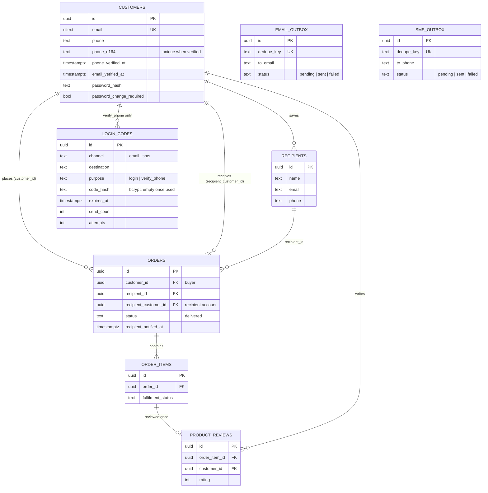

Schemas: `customer.customers`, `customer.recipients`, `marketplace.orders`,
`marketplace.order_items`, `marketplace.product_reviews`, `core.login_codes`,
`core.email_outbox`, `core.sms_outbox`. `LOGIN_CODES`, `EMAIL_OUTBOX` and `SMS_OUTBOX`
have no foreign key to a customer (a code is for an address, not an account), except
`login_codes.customer_id` for phone verification.

### 12.2 OTP login: what happens to the data

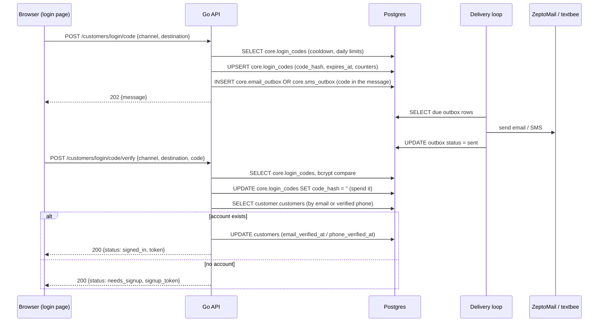

### 12.3 Delivered, notice, and review

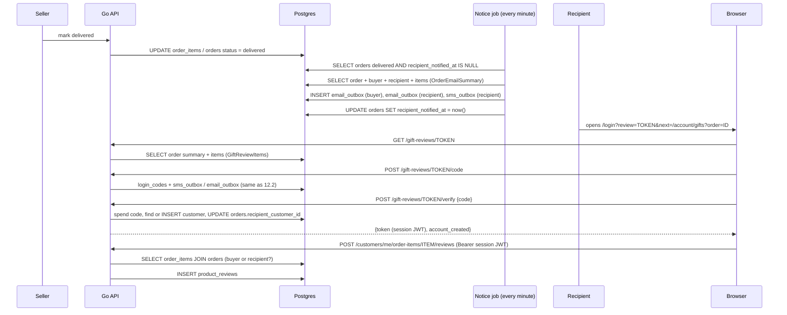

---

## 13. Repositories: how data comes from which table

The layers are strictly: **handler** (HTTP, JSON) → **service** (rules) → **repository**
(SQL only, pgx). A repository never decides policy; a service never writes SQL.

```
Browser ──HTTP──► handler ──► service ──► repository ──► Postgres
                  parses      checks      runs SQL       tables
                  body,       limits,
                  writes      tokens,
                  status      sends
```

### 13.1 Repository method to table

| Repository (file) | Method | What it does | Tables |
|---|---|---|---|
| `LoginCodeRepository` (`login_code_repository.go`) | `Get` | read the live code row | `core.login_codes` |
| | `Save` | upsert a new code hash, keep or reset the daily counters | `core.login_codes` |
| | `AddAttempt` | `attempts = attempts + 1`, returns the count | `core.login_codes` |
| | `Consume` | `code_hash = ''` only if the hash still matches | `core.login_codes` |
| `SMSRepository` (`sms_repository.go`) | `Enqueue` | insert, ignore if `dedupe_key` exists | `core.sms_outbox` |
| | `Due` / `MarkSent` / `MarkAttemptFailed` | pick due rows, then record the result | `core.sms_outbox` |
| `EmailRepository` (`email_repository.go`) | `Enqueue`, `Due`, `MarkSent`, `MarkAttemptFailed` | same, for email | `core.email_outbox` |
| `CustomerRepository` (`customer_repository.go`) | `GetByEmail`, `GetByID` | load an account (`GetByID` includes `phone_verified_at`) | `customer.customers` |
| | `CustomerIDByVerifiedPhone` | account whose `phone_e164` is verified and live | `customer.customers` |
| | `AccountsByPhoneTail` | accounts matching the last 9 digits of a phone, from the customer's own phone or a recipient row linked to that account's email | `customer.customers`, `customer.recipients` |
| | `Create` | insert an account | `customer.customers` |
| | `SetVerifiedPhone` | store phone + E.164 + `phone_verified_at`, then `ClaimGiftsByPhone` | `customer.customers`, `marketplace.orders` |
| | `MarkEmailVerified` | `email_verified_at = coalesce(email_verified_at, now())` | `customer.customers` |
| | `EmailUsedByStaffOrSeller` | is this email a seller or admin login? | `seller.sellers`, `admin.admin_users` |
| `OrderRepository` (`gift_recipient_repository.go`, `gift_review_repository.go`) | `DueRecipientNotices` | delivered orders not yet announced | `marketplace.orders` |
| | `OrderEmailSummary` | one order with buyer, recipient (name, email, phone, city), recipient account and items | `marketplace.orders`, `customer.customers` (twice: buyer and recipient account), `customer.recipients`, `customer.recipient_addresses`, `marketplace.order_items`, `seller.products`, `seller.shops` |
| | `SetRecipientCustomer` | link `orders.recipient_customer_id` | `marketplace.orders` |
| | `MarkRecipientNotified` | set `recipient_notified_at` once | `marketplace.orders` |
| | `GiftReviewItems` | the lines of an order, with any existing review id | `marketplace.order_items`, `seller.products`, `seller.shops`, `marketplace.product_reviews` |
| | `ListReceivedGifts` | the gifts page: delivered orders where the customer is the recipient | `marketplace.orders`, `customer.customers`, `marketplace.order_items`, `seller.products`, `seller.shops`, `marketplace.product_reviews` |
| | `GetItemForReviewer` | the permission check: buyer **or** linked recipient | `marketplace.order_items`, `marketplace.orders` |
| `ProductReviewRepository` | `Create` | save the review and its media | `marketplace.product_reviews`, media assets |

### 13.2 Example: where the review page's data comes from

`GET /gift-reviews/{token}` builds its answer from two repository calls:

```go
summary, _ := s.orders.OrderEmailSummary(ctx, orderID)   // order_number, buyer name
items, _   := s.orders.GiftReviewItems(ctx, orderID)     // the product lines
```

| JSON field | Comes from |
|---|---|
| `order_number` | `marketplace.orders.order_number` |
| `sender_name` | first word of `customer.customers.display_name` of the buyer (`orders.customer_id`) |
| `channel`, `destination` | the **token** (destination masked in code), not the database |
| `items[].product_name`, `product_image_url` | `seller.products` |
| `items[].shop_name` | `seller.shops` |
| `items[].quantity`, `fulfilment_status` | `marketplace.order_items` |
| `items[].review_id` | `marketplace.product_reviews.id` (null until reviewed) |

### 13.3 Example: what `Verify` changes in the database

For a new phone-only recipient, one request writes, in order:

1. `core.login_codes`: `code_hash` set to `''` (code spent).
2. `customer.customers`: new row (placeholder email, random password hash, `status = 'active'`).
3. `customer.customers`: `phone`, `phone_e164`, `phone_verified_at` set (`SetVerifiedPhone`),
   and `marketplace.orders.recipient_customer_id` set for any other delivered order sent to that number.
4. `marketplace.orders`: `recipient_customer_id` set to the new account for this order.

Nothing is written for the JWT it returns: session tokens are stateless, so the server
keeps no table of them. A token is valid until it expires.

---

## 14. A diagram for each API

Each diagram follows the real code path: handler → service → repository → table, with the
error exits and their HTTP status. Green is success, red is an error response.
Rate limiting (10 requests/minute/IP on every route here) happens before the handler
and answers `429` when exceeded; it is left out of the diagrams.

### 14.1 `POST /customers/login/code`: send a sign-in code

Files: `login_code_handler.go` → `login_code_service.go` (`RequestLoginCode`, `issue`) →
`login_code_repository.go`, `sms_repository.go` / `email_repository.go`.

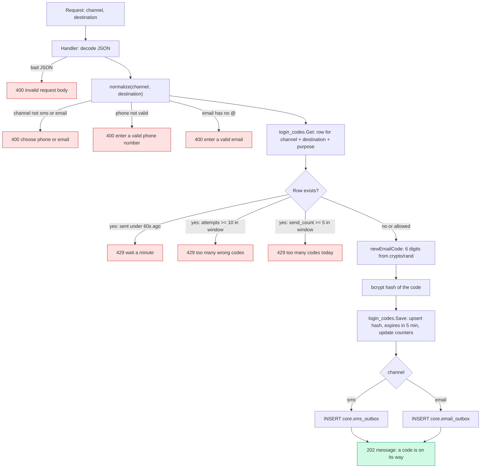

### 14.2 `POST /customers/login/code/verify`: check the code

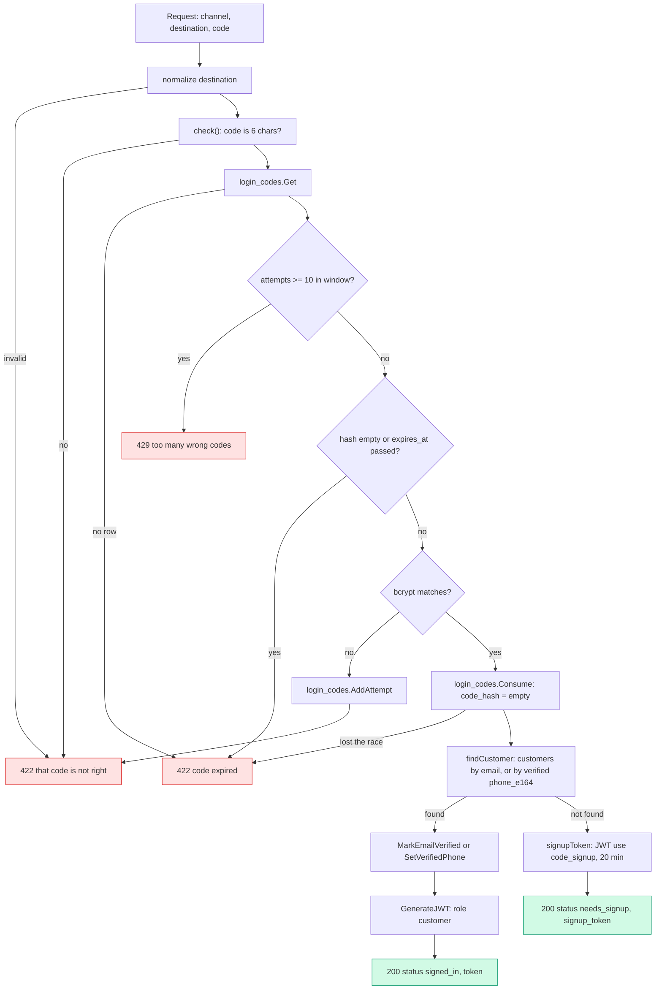

### 14.3 `POST /customers/register`: sign up after `needs_signup`

Files: `customer_handler.go` → `customer_service.go` (`Register`) → `customer_repository.go`.

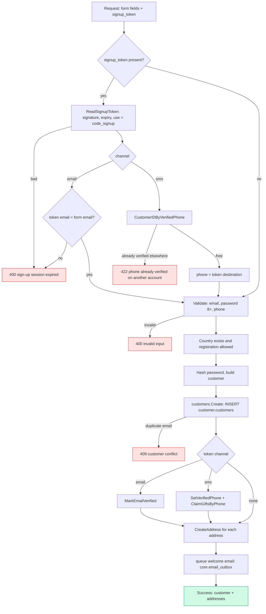

After registering, the frontend signs in with the password just chosen
(`loginCustomer`), and the session token is issued by the normal password login.

### 14.4 `POST /customers/me/phone/code`: send a code to verify a profile phone

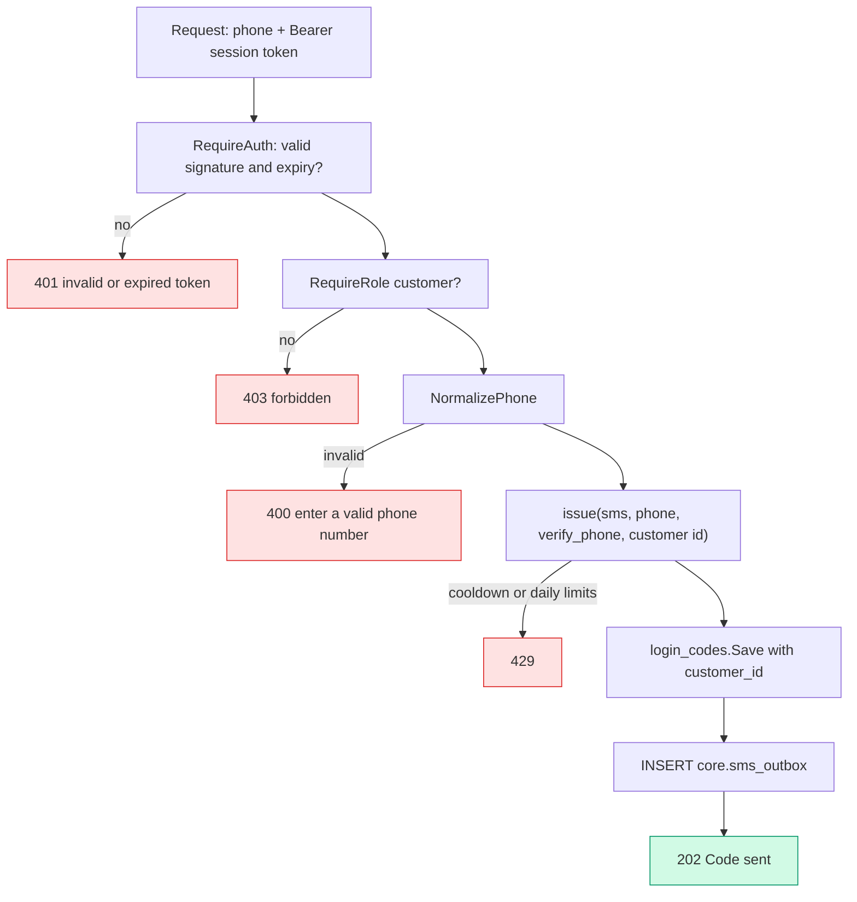

### 14.5 `POST /customers/me/phone/verify`: confirm the profile phone

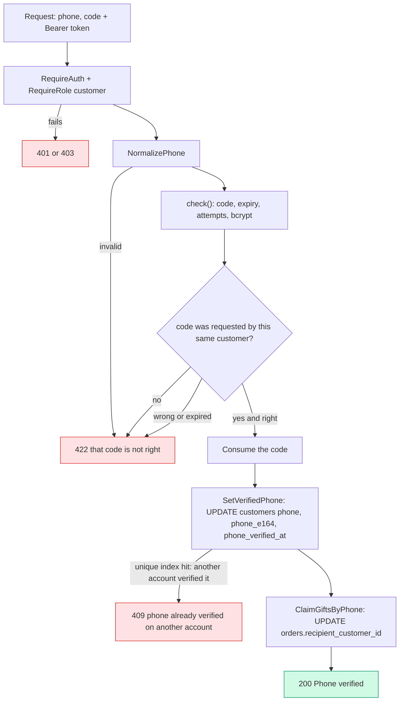

### 14.6 `GET /gift-reviews/{token}`: the gift behind the link

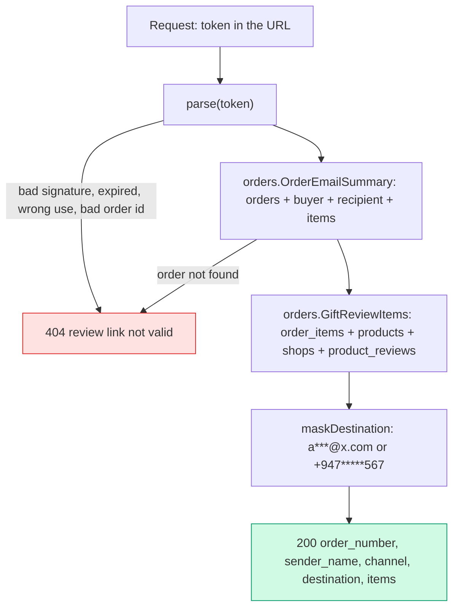

### 14.7 `POST /gift-reviews/{token}/code`: send the code from the link

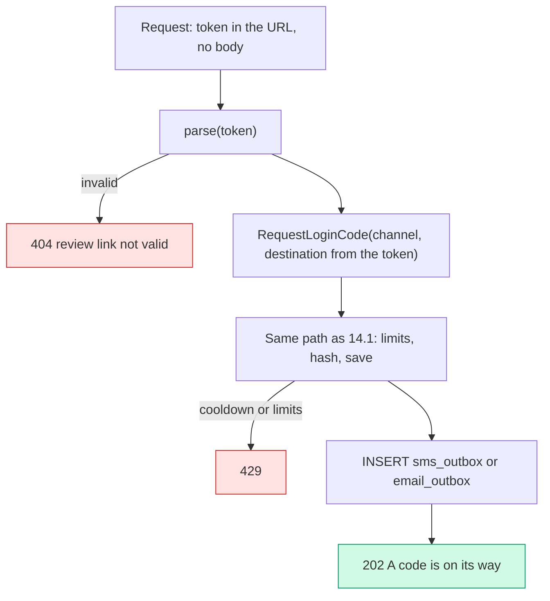

The client never sends an address. It is read from the signed token.

### 14.8 `POST /gift-reviews/{token}/verify`: sign in and create the account

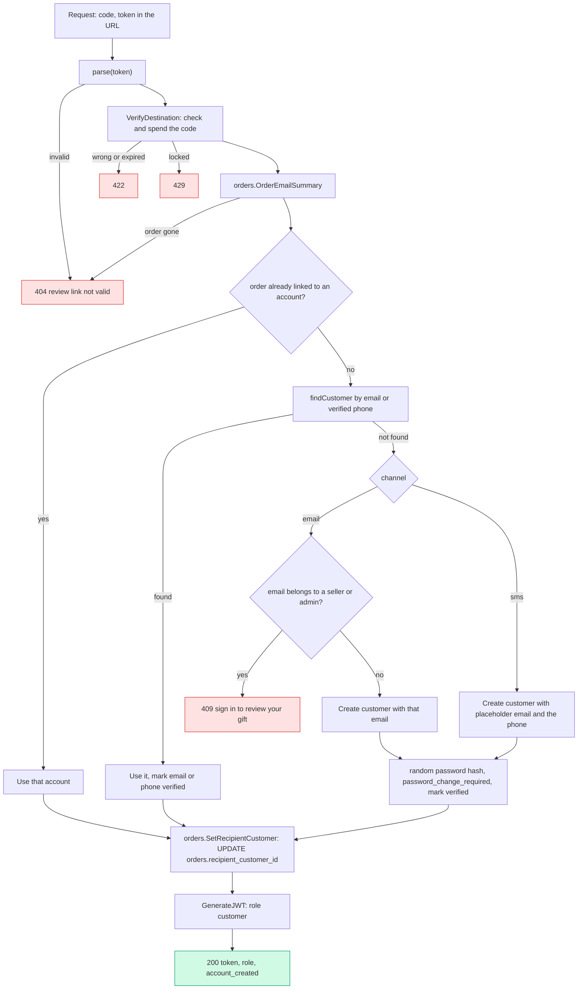

### 14.9 `POST /customers/me/order-items/{orderItemId}/reviews`: add the review

Files: `product_review_handler.go` → `product_review_service.go` (`Create`) →
`order_repository` (`GetItemForReviewer`) and `product_review_repository.go`.

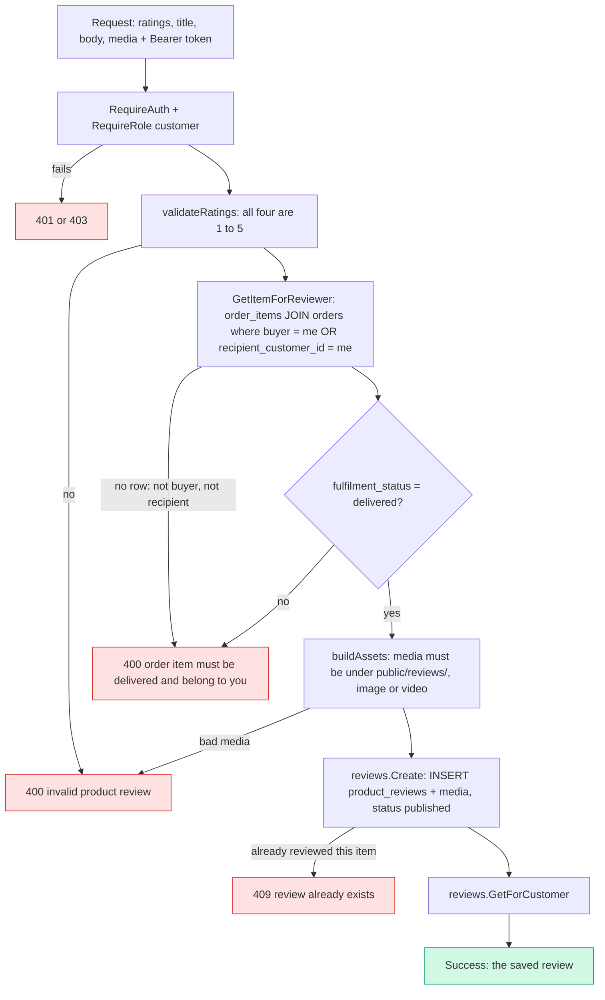

### 14.10 Not an API: the delivered-notice job

It has no URL. It runs every minute (`GiftRecipientService.RunDeliveredNotices`) and is
what produces the links used by 14.6 to 14.8.

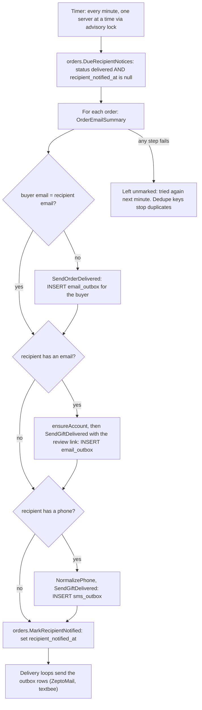

---

## 15. What changes in the database on each API call

How to read this: for each call, **READ** means a `SELECT`, **WRITE** means a row is
inserted or changed. The example follows one gift so you can see the same rows change
step by step:

> Sam (`sam@example.com`) bought a gift, order **SAG-10042**, for Alex. Alex has no
> account. The buyer typed Alex's phone as `0771234567` (default country `+94`).

### 15.0 Before anything: the seller marks delivered

| | Table | Change |
|---|---|---|
| WRITE | `marketplace.order_items` | `fulfilment_status` becomes `delivered` |
| WRITE | `marketplace.shipments` | `status` becomes `delivered`, `delivered_at` set |
| WRITE | `marketplace.orders` | `status`: → `delivered` once every shop has delivered |

`orders.recipient_notified_at` is still `NULL` and `recipient_customer_id` is still `NULL`.

### 15.1 The notice job (about a minute later, no API call)

| | Table | Change |
|---|---|---|
| READ | `marketplace.orders` and joins | finds orders that are `delivered` with `recipient_notified_at IS NULL` |
| WRITE | `core.email_outbox` | **new row** for Sam: `kind = order_delivered`, `dedupe_key = order_delivered:<orderId>`, `status = pending` |
| WRITE | `core.sms_outbox` | **new row** for Alex: `kind = gift_delivered`, `to_phone = +94771234567`, body contains the review link, `status = pending` |
| WRITE | `marketplace.orders` | `recipient_notified_at = now()` |

Alex's account is **not** created here (phone only). If Alex had an email, an account
would be created at this step and `orders.recipient_customer_id` set.

Then the delivery loops (every 5 to 15 seconds) change the outbox rows:
`status pending → sent`, `sent_at` set, `attempts = 1`. On failure `attempts` goes up,
`last_error` is filled and `next_attempt_at` moves later.

### 15.2 `POST /customers/login/code`

| | Table | Change |
|---|---|---|
| READ | `core.login_codes` | the row for (channel, destination, `login`), to enforce cooldown and limits |
| WRITE | `core.login_codes` | first time: **new row** `code_hash = <bcrypt>`, `expires_at = now + 5 min`, `send_count = 1`, `attempts = 0`. Resend: same row, new hash and expiry, `sent_at = now`, `send_count + 1` |
| WRITE | `core.sms_outbox` or `core.email_outbox` | **new row**, `status = pending`, the 6-digit code is in the message body |

Nothing in `customer.customers` changes. The response is the same whether or not the
person has an account.

### 15.3 `POST /customers/login/code/verify`

| Case | Changes |
|---|---|
| Wrong code | `core.login_codes.attempts + 1`. After 10, locked for the day. |
| Right code, account exists | `core.login_codes.code_hash = ''` (code spent). `customer.customers.email_verified_at` set (email), or `phone`, `phone_e164`, `phone_verified_at` set (phone). Returns a session JWT. |
| Right code, no account | Only `core.login_codes.code_hash = ''`. **No customer row is created.** Returns a sign-up token. |

### 15.4 `POST /customers/register`

| | Table | Change |
|---|---|---|
| READ | `core.countries` | the country exists and sign-up is allowed |
| WRITE | `customer.customers` | **new row**: email, bcrypt password hash, phone, `status = active` |
| WRITE | `customer.customers` | with a sign-up token: `email_verified_at`, or `phone_e164` + `phone_verified_at`, set |
| WRITE | `marketplace.orders` | with a phone token: `recipient_customer_id` set on delivered orders sent to that number (`ClaimGiftsByPhone`) |
| WRITE | `customer.customer_addresses` | one **new row** per address |
| WRITE | `core.email_outbox` | **new row**: welcome email |

### 15.5 `POST /customers/me/phone/code`

| | Table | Change |
|---|---|---|
| READ/WRITE | `core.login_codes` | same as 15.2 but `purpose = verify_phone` and `customer_id` = the signed-in customer |
| WRITE | `core.sms_outbox` | **new row** |

### 15.6 `POST /customers/me/phone/verify`

| | Table | Change |
|---|---|---|
| WRITE | `core.login_codes` | `code_hash = ''` |
| WRITE | `customer.customers` | `phone`, `phone_e164`, `phone_verified_at` set. Fails with 409 if another live account already verified this number (unique index). |
| WRITE | `marketplace.orders` | `recipient_customer_id` set for delivered, unlinked orders sent to that number |

### 15.7 `GET /gift-reviews/{token}`

**No writes.** It only reads `marketplace.orders`, `customer.customers` (the buyer),
`customer.recipients`, `marketplace.order_items`, `seller.products`, `seller.shops` and
`marketplace.product_reviews`.

### 15.8 `POST /gift-reviews/{token}/code`

Same changes as 15.2, with the channel and address taken from the token: a
`core.login_codes` row and a new `core.sms_outbox` (or `core.email_outbox`) row.

### 15.9 `POST /gift-reviews/{token}/verify`

| Case | Changes |
|---|---|
| Wrong code | `core.login_codes.attempts + 1` only |
| Right code, **new phone-only recipient** (Alex) | `core.login_codes.code_hash = ''`; **new** `customer.customers` row (placeholder email `94771234567@phone.sendagift.invalid`, random password hash, `password_change_required = true`, country from the order); that row's `phone`, `phone_e164`, `phone_verified_at` set; `marketplace.orders.recipient_customer_id` = the new customer id |
| Right code, new email recipient | same, with the real email and `email_verified_at` set |
| Right code, account already exists | no new customer row; `email_verified_at` or phone fields set; `orders.recipient_customer_id` linked |
| Right code, order already linked | no customer or order change except marking the address verified |

The response is a session JWT. Nothing is stored for it.

Alex's rows after this call:

```
customer.customers
  id           = 5e1c…            (new)
  email        = 94771234567@phone.sendagift.invalid
  phone_e164   = +94771234567     phone_verified_at = 2026-10-08 14:20
  password_change_required = true

marketplace.orders  (SAG-10042)
  customer_id           = <Sam>
  recipient_customer_id = 5e1c…   (was NULL)
```

### 15.10 `POST /customers/me/order-items/{id}/reviews`

| | Table | Change |
|---|---|---|
| READ | `marketplace.order_items` JOIN `marketplace.orders` | is this customer the buyer or `recipient_customer_id`? is the item `delivered`? |
| WRITE | `marketplace.product_reviews` | **new row**: ratings, title, body, `status = published`, `customer_id` = the reviewer, `order_item_id` |
| WRITE | media tables | with media: **new** media asset rows and `marketplace.product_review_media` rows linking them to the review |

A second review for the same `order_item_id` is refused (409). After this call
`GET /gift-reviews/{token}` and the gifts page show a `review_id` for that item.

### 15.11 Quick summary: who writes to which table

| Table | Written by |
|---|---|
| `core.login_codes` | 15.2, 15.3, 15.5, 15.6, 15.8, 15.9 |
| `core.sms_outbox` / `core.email_outbox` | 15.1, 15.2, 15.4, 15.5, 15.8, and the delivery loops (status updates) |
| `customer.customers` | 15.3, 15.4, 15.6, 15.9 |
| `marketplace.orders` | seller delivered (15.0), 15.1, 15.4, 15.6, 15.9 |
| `marketplace.product_reviews` | 15.10 |
| Read-only | 15.7 |

---

## 16. Tests

- `internal/services/phone_test.go`: phone normalisation.
- `internal/services/gift_review_service_test.go`: review token round trip, wrong-key
  and sign-up-token rejection, masking.
- `internal/services/email_templates_test.go`: renders every email, including
  `order_delivered` and `gift_delivered`.
- `internal/routes/router_smoke_test.go`: the router builds.
- `internal/services/gift_recipient_integration_test.go`: needs a database.

Try it locally: run the API and frontend, mark a test order delivered, wait up to a
minute, then read the OTP from the API log (or `core.sms_outbox` / `core.email_outbox`).
